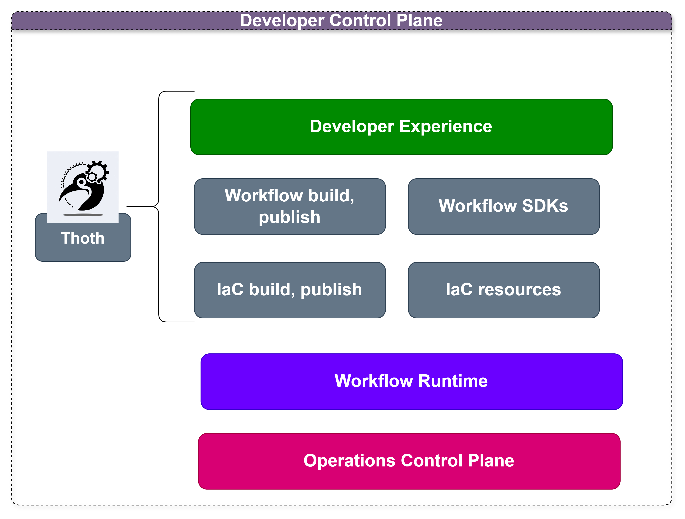

[](https://github.com/thothforge/thothctl/actions/workflows/python-publish.yml)
# Thoth Framework


Thoth Framework is a framework to create and manage the [Internal Developer Platform](https://internaldeveloperplatform.org/what-is-an-internal-developer-platform/) tasks for infrastructure, devops, devsecops, software developers, and platform engineering teams aligned with the business objectives:

1. [x] Minimize mistakes.
2. [x] Increase velocity
3. [x] Improve products
4. [x] Enforce compliance
5. [x] Reduce lock-in

## Mapping Mechanisms 
| Business Objective | Mechanism          | Implementation |
|-------------------|--------------------|----------------|
| Minimize mistakes | Meaninful defaults | Templates      |
| Increase velocity | Automation         | IaC Scripts    |
| Improve products | Fill product gaps  | New components |
| Enforce compliance | Restrict choinces  | Wrappers       |
| Reduce lock-in | Abstraction        | Service layers |

Thoth allows you to extend and operate your Developer Control Plane, and enable the developer experience with the internal developer platform trough command line.



# Tools

## ThothCTL

Package for accelerating the adoption of Internal Frameworks, enable reusing and interaction with the Internal Developer Platform. 

# Use cases
- **[Template Engine](template_engine/template_engine.md)**:
  - Build and configure any kind of template
  - Handling templates to create, add, remove or update components
  - Code generation
  
- **Automate tasks**:
  - Create and bootstrap local development environment
  - Extend CI/CD pull request workflow
  - Create documentation for projects (IaC), Generative AI doc generation

- **Check and compliance**:
  - Check project structure
    - DevSecOps for IaC (Terraform, tofu)
      - Scan your IaC terraform,tofu templates
      - Generate reports 
      - Manage inventory and dependencies
      - Review IaC changes and make suggestions (Generative AI)
      - **AWS Cost Analysis** - Estimate infrastructure costs from Terraform plans
        - Offline pricing estimates (regularly updated)
        - Service-by-service cost breakdown
        - Optimization recommendations
        - Support for 14 AWS services (EC2, RDS, S3, Lambda, EKS, ECS, etc.)
      - **Drift Detection** - Detect infrastructure drift between IaC and live cloud
        - Compares terraform state against actual cloud resources
        - Severity-based classification (critical/high/medium/low)
        - IaC coverage percentage tracking and trending over time
        - Tag-based filtering, `.driftignore`, and `.driftpolicy` support
- **🤖 AI Agent for IaC Security** *(NEW)*:
  - Multi-agent orchestrator with specialized Security, Architecture, Fix, and Decision agents
  - Auto-decision engine for PRs (approve/reject/request-changes) with safety controls
  - Code improvement & auto-fix generation for Checkov/KICS/Trivy findings
  - Multi-provider support: OpenAI, AWS Bedrock, Azure OpenAI, Ollama (local models)
  - Adaptive memory: local filesystem or S3 (auto-detects Bedrock AgentCore runtime)
  - MCP integration for AI assistant interoperability
      
- **Internal Developer Platform CLI**
  - Create projects from your templates
  - Source control setup
  - Scaffold - quickly set up the structure of a project.
  


# Getting Started

```bash
$ thothctl --help
Usage: thothctl [OPTIONS] COMMAND [ARGS]...

  ThothForge CLI - The Internal Developer Platform CLI

Options:
  --version                  Show the version and exit.
  --debug                    Enable debug mode
  -d, --code-directory PATH  Configuration file path
  --help                     Show this message and exit.

Commands:
  ai-review  AI-powered security analysis and code review for IaC
  check      Initialize and setup project configurations
  document   Initialize and setup project configurations
  generate   Generate IaC from rules, use cases, and components
  init       Initialize and setup project configurations
  inventory  Create Inventory for the iac composition.
  list       List Projects and Spaces managed by thothctl locally
  mcp        Model Context Protocol (MCP) server for ThothCTL
  project    Convert, clean up and manage the current project
  remove     Remove Projects manage by thothctl
  scan       Scan infrastructure code for security issues.
  upgrade    Upgrade thothctl to the latest version

## 💰 AWS Cost Analysis

ThothCTL includes comprehensive AWS cost analysis capabilities:

```bash
# Analyze Terraform plan costs
thothctl check iac -type cost-analysis --recursive

# Features:
# ✅ 14 AWS services supported (EC2, RDS, S3, Lambda, EKS, ECS, etc.)
# ✅ Monthly/annual cost projections
# ✅ Service-by-service breakdown
# ✅ Optimization recommendations
# ✅ No AWS credentials required
# ✅ Works offline
```

**Supported Services**: EC2, RDS, S3, Lambda, ELB/ALB/NLB, VPC, EBS, DynamoDB, CloudWatch, EKS, ECS, Secrets Manager, API Gateway, Bedrock


## 🔍 Drift Detection

ThothCTL can detect infrastructure drift between your IaC definitions and live cloud resources:

```bash
# Detect drift across all stacks
thothctl check iac -type drift --recursive

# Filter by environment tags
thothctl check iac -type drift --recursive --filter-tags "env=prod"

# With AI-powered analysis
thothctl check iac -type drift --recursive --ai-provider ollama

# Post drift results to a PR
thothctl check iac -type drift --recursive --post-to-pr

# Features:
# ✅ Parses tfplan.json or runs live plans
# ✅ Severity classification (critical/high/medium/low)
# ✅ IaC coverage percentage and trending over time
# ✅ Tag-based filtering (--filter-tags "env=prod,team=*")
# ✅ Policy-based drift response (.driftpolicy)
# ✅ AI-powered risk assessment and remediation guidance
# ✅ .driftignore support
# ✅ Reports: console, JSON, HTML, markdown
# ✅ Multi-cloud: AWS, GCP, Azure
```

## 🤖 AI Agent for IaC Security

ThothCTL includes a multi-agent AI system for automated security analysis, code review, and PR decisions on Infrastructure as Code projects.

### Architecture

```
                    ┌──────────────────────┐
                    │  AgentOrchestrator   │
                    │  (builds context,    │
                    │   dispatches agents) │
                    └──────┬───────────────┘
           ┌───────────────┼───────────────┐
           ▼               ▼               ▼
    ┌─────────────┐ ┌─────────────┐ ┌─────────────┐
    │  Security   │ │Architecture │ │    Fix      │
    │   Agent     │ │   Agent     │ │   Agent     │
    └──────┬──────┘ └──────┬──────┘ └──────┬──────┘
           └───────────────┼───────────────┘
                           ▼
                    ┌─────────────┐
                    │  Decision   │
                    │   Agent     │
                    └─────────────┘
```

### Quick Start

```bash
# Analyze a Terraform project
thothctl ai-review analyze -d ./terraform -p ollama

# Generate code fixes for scan findings
thothctl ai-review improve -d ./terraform --severity high -o fixes.json

# Apply fixes with backup
thothctl ai-review apply-fix --fixes-file fixes.json --dry-run

# Run multi-agent orchestrated review
thothctl ai-review orchestrate -d ./terraform -a security -a fix

# Auto-decide on a PR (approve/reject/request-changes)
thothctl ai-review decide -d ./terraform --pr-number 42 --repository owner/repo --dry-run

# Configure auto-decision thresholds
thothctl ai-review configure-decisions --enable --approve-threshold 20 --reject-threshold 85
```

### Commands

| Command | Description |
|---------|-------------|
| `analyze` | Run AI security analysis on IaC code |
| `improve` | Generate actionable code fixes for findings |
| `apply-fix` | Apply generated fixes with automatic backup |
| `orchestrate` | Run multiple specialized agents in parallel |
| `decide` | Auto-decide on PRs with safety controls |
| `serve` | Start REST API server for CI/CD integration |
| `configure` | Configure AI provider (OpenAI, Bedrock, Azure, Ollama) |
| `configure-decisions` | Set auto-decision thresholds and safety rules |
| `history` | View past AI decision records |
| `override` | Manually override an AI decision |
| `report` | Generate analysis reports |

### AI Providers

| Provider | Model | Use Case |
|----------|-------|----------|
| OpenAI | GPT-4 Turbo | Best quality analysis |
| AWS Bedrock | Claude 3 Sonnet | AWS-native, direct model invocation |
| AWS Bedrock Agent | Claude Sonnet | CI/CD pipelines, production APIs, sessions |
| Azure OpenAI | GPT-4 | Enterprise Azure environments |
| Ollama | Llama 3, Mistral, etc. | Local/offline, no data leaves your machine |

### Adaptive Memory

The agent automatically selects the right memory backend based on the runtime:

| Runtime | Memory Backend | Storage |
|---------|---------------|---------|
| Local (CLI) | Filesystem | `.thothctl/ai_sessions/` |
| Bedrock AgentCore | S3 | `s3://{bucket}/thothctl/ai_sessions/` |

Memory stores previous analysis results per repository, enabling the agent to track trends and provide continuity across reviews.

```bash
# Environment variables for memory configuration
export THOTH_MEMORY_MODE=auto            # auto, local, or agentcore
export THOTH_MEMORY_S3_BUCKET=my-bucket  # S3 bucket for agentcore mode
export THOTH_MEMORY_DIR=.thothctl/ai_sessions  # Local storage directory
```

### Safety Controls

Auto-decisions are **disabled by default** and include multiple safety layers:

- Confidence thresholds (90% for approve, 85% for reject)
- Daily rate limits (50 approvals, 20 rejections per day)
- Cooldown between actions (5 minutes)
- Emergency label detection (hotfix, security-patch)
- Trusted bot bypass (dependabot, renovate)
- `--dry-run` always available for previewing decisions

### MCP Integration

The AI review is exposed as an MCP tool (`thothctl_ai_review`) with four modes:

```json
{
  "mode": "analyze | decide | improve | orchestrate",
  "directory": "./terraform",
  "provider": "ollama",
  "agents": ["security", "architecture", "fix", "decision"]
}
```

## Enabling Command Autocompletion

ThothCTL supports command autocompletion to make it easier to use. To enable it:

```bash
# Install the package
pip install thothctl

# Run the autocomplete setup script
thothctl-register-autocomplete

# Follow the instructions to add the autocomplete configuration to your shell
```

After setting up autocomplete, you can use the Tab key to complete commands, options, and arguments.

For example, you can type `thothctl i<TAB>` and it will expand to `thothctl init`.

## 🎯 Recent Improvements - Inventory Command

### **Modern Infrastructure Inventory with Professional Reports** ✨

The `thothctl inventory iac` command has been significantly enhanced with:

#### **🎨 Modern HTML Reports**
- **Professional styling** with Inter font and gradient design
- **Responsive layout** that works on desktop, tablet, and mobile
- **Color-coded status badges** for easy identification of outdated components
- **Print optimization** perfect for documentation and sharing

#### **🚀 Unified Version Checking**
```bash
# Before: Confusing multiple flags
thothctl inventory iac --check-providers --check-provider-versions --check-versions

# After: Simple and intuitive
thothctl inventory iac --check-versions
```

#### **📊 Enhanced Provider Analysis**
- **Provider version columns** showing "Latest Version" and "Status"
- **Comprehensive provider tracking** with registry information
- **Automatic provider checking** when version analysis is enabled
- **Provider statistics** in summary reports

#### **Quick Start**
```bash
# Create comprehensive inventory with modern reporting
thothctl inventory iac --check-versions

# Generate professional documentation
thothctl inventory iac --check-versions --project-name "Production Infrastructure"

# CI/CD integration with JSON output
thothctl inventory iac --check-versions --report-type json
```

**Benefits:**
- ✅ **50% reduction** in command complexity
- ✅ **Professional reports** suitable for business presentations
- ✅ **Enhanced provider analysis** with version tracking
- ✅ **Simplified user experience** with intelligent automation

## Third Party Tools

### [OpenTofu](https://opentofu.org/)
OpenTofu is a fork of Terraform that is open-source, community-driven, and managed by the Linux Foundation.

### [Backstage](https://backstage.io/)
An open source framework for building developer portals.

### [Terragrunt](https://terragrunt.gruntwork.io/)
Terragrunt is a flexible orchestration tool that allows Infrastructure as Code to scale. 

### [Terraform-docs](https://terraform-docs.io/)
Generate Terraform modules documentation in various formats.

### [Checkov](https://www.checkov.io/)
Checkov scans cloud infrastructure configurations to find misconfigurations before they're deployed.

### [KICS](https://docs.kics.io/latest/)
KICS (Keeping Infrastructure as Code Secure) by Checkmarx finds security vulnerabilities, compliance issues, and infrastructure misconfigurations in IaC.

**Requirements**: Docker must be installed and running to use KICS scanner.
- Install Docker: https://docs.docker.com/get-docker/
- KICS runs via Docker container (checkmarx/kics:latest)

### [Trivy](https://trivy.dev/latest/)
Use Trivy to find vulnerabilities (CVE) & misconfigurations (IaC) across code repositories, binary artifacts, container images, Kubernetes clusters, and more. All in one tool! 

# Requirements
 - Linux Environment or Windows environment

> This documentation uses wsl with ubuntu 24.04 but you can use other superior version

## OS Packages

- dot or graphviz

You can install them with:

### Windows
 Chocolatey packages Graphviz for **Windows**.

`choco install graphviz`
### Linux
Install packages with apt for Linux/Debian
- 
```bash 
sudo apt install graphviz -y
```
- python >= 3.8 
    - check: `python --version` 

### AddOns

If you are going to send messages to Microsoft Teams channel you must set an environment variable with name `webhook`
> Visit [Webhooks and connectors](https://docs.microsoft.com/en-us/microsoftteams/platform/webhooks-and-connectors/what-are-webhooks-and-connectors) for more.

### Python packages

There are many dependencies for thothctl functions, these dependencies are automatically installed when run `pip install` command.


# Install

```Bash
pip install --upgrade thothctl
```

## Version control Systems (Azure DevOps, Github, Gitlab)

# RoadMap 🧗‍♂

 - ~~Add Autocomplete to Commands and subcommands~~
 - ~~Integrate MCP to improve compatibility and interoperability with AI LLM~~
 - ~~Improve Inventory capabilities~~
 - ~~AI Agent for IaC Security — multi-agent orchestrator, auto-decisions, code fixes, adaptive memory~~
 - Create Stacks and Infrastructure composition engine
 - Strands Agents SDK integration for advanced memory and session management
