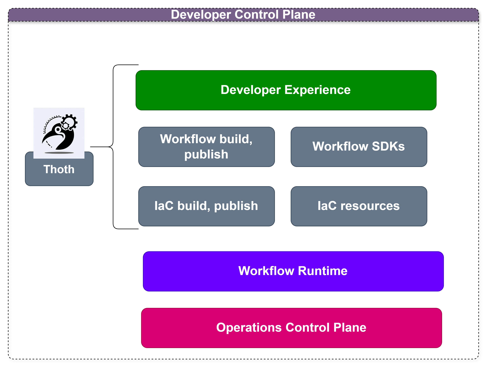

[](https://github.com/thothforge/thothctl/actions/workflows/python-publish.yml)
[](https://thothforge.github.io/thothctl/)
[](https://pypi.org/project/thothctl/)
[](https://www.python.org/)
[](LICENSE)

# ThothCTL

**AI-Powered Infrastructure Lifecycle CLI** for DevSecOps, Platform Engineering, and IaC governance.



ThothCTL accelerates the adoption of Internal Developer Platforms by combining natural-language IaC generation, security scanning, inventory management, cost analysis, AI-driven code review, and organizational policy enforcement into a single CLI.

## Quick Start

```bash
pip install --upgrade thothctl

# Generate governed IaC from natural language (dry-run by default)
thothctl generate iac -i "VPC with 3 private subnets, NAT gateway, and flow logs"

# Scan for security issues
thothctl scan iac -t checkov -t trivy -t opa

# Create infrastructure inventory (SBOM)
thothctl inventory iac --check-versions

# Launch web dashboard
thothctl dashboard launch

# AI-powered security review
thothctl ai-review analyze -d ./terraform -p ollama
```

## Key Features

### 🧠 Intent-to-IaC Generation

Generate governed Infrastructure as Code from natural language. Organizational conventions (`.thothcf.toml`, steering docs, existing patterns) are injected into the AI context, and output is validated by Checkov + OPA with self-correction:

```bash
# Single stack (dry-run shows code without writing)
thothctl generate iac -i "S3 bucket with versioning and encryption"

# Multi-stack composition, written to disk
thothctl generate iac -i "EKS cluster with VPC, RDS PostgreSQL, and S3 for artifacts" \
  --composition full --apply

# Tool-augmented generation with Kiro CLI (reads docs, validates, self-corrects)
thothctl generate iac -i "RDS Aurora cluster with read replicas and failover" -p kiro
```

- **Multi-provider**: Ollama (local), AWS Bedrock, OpenAI, Azure OpenAI, and **Kiro CLI** (tool-augmented)
- **Blueprint vs Project modes**: `--mode blueprint` for IDP/Backstage templates, `--mode project` for ready-to-deploy output
- **Composition-aware**: `single`, `full` (multi-stack), or `incremental` (add to existing project)
- **Policy at generation time**: `.thothcf.toml` rules and OPA policies evaluated inside the loop
- **Plan validation**: optional `terragrunt plan` validation with self-correction (`--plan-validation`)
- **Multi-format**: `terraform`, `terraform-terragrunt`, `terragrunt`, `cloudformation`, `cdkv2`

### 🔒 Security Scanning

Multi-tool scanning with unified HTML reports and enforcement:

```bash
# All scanners with hard enforcement (fails pipeline on violations)
thothctl scan iac -t checkov -t trivy -t kics -t opa -t terraform-compliance --enforcement hard

# Publish findings to a vulnerability management platform
thothctl scan iac -t checkov -t trivy --publish-to defectdojo
```

- **5 integrated tools**: Checkov, Trivy, KICS, OPA/Conftest, Terraform-compliance
- **Unified HTML reports** with severity badges, per-stack breakdown
- **Non-compliance findings table** on enforcement failure
- **SARIF output** for GitHub Code Scanning integration
- **Platform publishing**: push findings to **DefectDojo** or **SecObserve**
- **Organization policy repos** via `THOTH_ORG_POLICY` env var (HCL + CloudFormation)
- **Scan trend tracking** with local SQLite history

### 📦 Infrastructure Inventory (SBOM)

CycloneDX 1.6 compliant Software Bill of Materials:

```bash
thothctl inventory iac --check-versions

# Publish the SBOM to a supply-chain platform
thothctl inventory iac --check-versions --publish-sbom dependency-track
```

- **Module & provider version tracking** with staleness detection
- **CycloneDX 1.6 SBOM** with formulation, evidence, standards, attestations, dependency graph, hashes, and licenses
- **SBOM publishing**: push to **Dependency-Track**, **DefectDojo**, or **SecObserve** (auto-creates project/product)
- **CDK v2 support**: dependency tracking for AWS CDK projects
- **Technical debt scoring** with risk levels and recommendations
- **Schema compatibility analysis** for safe upgrades
- **Professional HTML reports** with collapsible stack groups

### 🔁 DevSecOps Workflow Engine

Orchestrated SDLC pipeline plus custom YAML DAG workflows:

```bash
# Built-in 7-phase pipeline (Plan → Develop → Build → Test → Secure → Deploy → Monitor)
thothctl workflow devsecops --phase all --enforcement hard

# Composite phase, only changed directories
thothctl workflow devsecops --phase pre-deploy --changed-only

# Custom composable pipeline (declarative YAML DAG)
thothctl workflow run --file .thothcf_workflow.yaml
```

- **7 SDLC phases** with composite `all` and `pre-deploy` shortcuts
- **Custom YAML DAG engine** with `depends_on`, topological ordering, variable interpolation (`{{changed_stacks}}`, `{{branch}}`, `{{project}}`, `{{space}}`), and per-stage failure handling (`block`/`warn`/`skip`)
- **Enforcement modes**: `soft` (warn) or `hard` (block on violations)
- **Git-aware** `--changed-only` scoping and dry-run plan visualization

### 📊 Web Dashboard

Modern FastAPI-based dashboard with dark mode:

```bash
thothctl dashboard launch
```

- **Security findings viewer** — filter by tool/severity/search, pagination, inline report iframe
- **SBOM details browser** — CycloneDX metadata, dependency graph, formulation, attestations
- **Inventory explorer** — collapsible stacks, module/provider tabs, version comparison
- **Generation history** — track all intent-to-IaC runs
- **Cost analysis** — service breakdown, monthly/annual projections
- **Drift detection** — severity-classified drifted resources
- **AI usage tracking** — token counts, costs per request

### 🤖 AI Agent for IaC Security

Multi-agent system for automated code review and PR decisions:

```bash
thothctl ai-review analyze -d ./terraform -p ollama
thothctl ai-review decide -d ./terraform --pr-number 42 --dry-run
```

- **4 specialized agents**: Security, Architecture, Fix, Decision
- **Multi-provider**: OpenAI, AWS Bedrock, Azure OpenAI, Ollama (local)
- **Two orchestration modes**: parallel agents (ThreadPoolExecutor) and Strands SDK deterministic pipeline
- **Auto-decisions** with confidence thresholds and safety controls
- **Adaptive memory**: filesystem or S3 (auto-detects runtime)

### 💰 Cost Analysis & Risk Assessment

```bash
thothctl check iac -type cost-analysis --recursive
thothctl check iac -type blast-radius --recursive
thothctl check iac -type drift --recursive
```

- **14 AWS services** supported (EC2, RDS, S3, Lambda, EKS, etc.)
- **Blast radius** with ITIL v4 risk classification
- **Drift detection** with severity scoring and IaC coverage tracking

### 🔄 Template Engine & Project Management

```bash
thothctl project convert --make-template --template-project-type terraform
thothctl init project -p my-infra --project-type terraform
```

- **Bidirectional conversion** between projects and reusable templates
- **Backstage integration** for self-service consumption
- **Template upgrade workflow** to keep projects in sync

### 🔌 MCP Integration

Model Context Protocol (v2.0+) server exposing ThothCTL as tools for AI assistants:

```bash
thothctl mcp
```

- **26 tools exposed** including `generate iac`, `scan iac`, `inventory iac`, and workflow commands
- **HTTP + stdio** transport modes
- **Recursion protection** when thothctl is used as an MCP tool inside an agent

## All Commands

| Command | Description |
|---------|-------------|
| `generate iac` | Generate governed IaC from natural language intent |
| `generate stacks` | Generate infrastructure stacks from configuration |
| `scan iac` | Multi-tool security scanning with enforcement and platform publishing |
| `inventory iac` | Infrastructure SBOM with version tracking and SBOM publishing |
| `check iac` | Cost analysis, blast radius, drift detection, structure validation |
| `workflow devsecops` | Orchestrated 7-phase DevSecOps SDLC pipeline |
| `workflow run` | Execute a custom YAML DAG workflow |
| `ai-review` | AI-powered security analysis and PR decisions |
| `dashboard launch` | Web dashboard for all reports |
| `document iac` | Auto-generate documentation |
| `project convert` | Template ↔ project conversion |
| `init project` | Scaffold new IaC projects |
| `space` | Manage spaces (activate, update, configure conventions) |
| `quickstart` | Guided onboarding for new projects |
| `mcp` | Model Context Protocol server (v2.0+) |

## Installation

```bash
pip install --upgrade thothctl
```

**Requirements**: Python 3.10+ | Linux, macOS, or Windows (WSL)

**Optional system packages**:
```bash
# Linux/Debian
sudo apt install graphviz libgraph-easy-perl -y

# macOS
brew install graphviz graph-easy
```

### Dev Container

A ready-to-use [Dev Container](.devcontainer/) is available with all tools pre-configured:

```bash
# Open in VS Code → "Reopen in Container"
# Or use the devcontainer CLI:
devcontainer up --workspace-folder .
```

## Documentation

📖 **Full docs**: [thothforge.github.io/thothctl](https://thothforge.github.io/thothctl/)

- [What's New](docs/whats_new.md)
- [Quick Start](docs/quick_start.md)
- [Generate IaC (Intent-to-IaC)](docs/framework/commands/generate/generate_iac.md)
- [DevSecOps SDLC Guide](docs/framework/use_cases/devsecops_sdlc.md)
- [Workflow Command](docs/framework/commands/workflow/workflow_overview.md)
- [Scan Command Reference](docs/framework/commands/scan/scan_overview.md)
- [Inventory & SBOM](docs/framework/commands/inventory/inventory_overview.md)
- [Dashboard](docs/dashboard/README.md)
- [AI Review](docs/framework/commands/ai-review/README.md)
- [Template Engine](docs/template_engine/template_engine.md)
- [MCP Server](docs/framework/commands/mcp/mcp.md)
- [Dev Container Setup](docs/installation/devcontainer_setup.md)

## CI/CD Integration

```yaml
# GitHub Actions
- name: Security scan
  run: thothctl scan iac -t checkov -t trivy -t opa --enforcement hard --post-to-pr

- name: Inventory check
  run: thothctl inventory iac --check-versions --report-type json
```

## Roadmap

Shipped:

- [x] Multi-tool security scanning with unified reports
- [x] AI Agent for IaC Security (multi-agent, auto-decisions)
- [x] CycloneDX 1.6 SBOM with full supply chain metadata
- [x] Organization policy engine (OPA/Rego, HCL + CloudFormation)
- [x] Web Dashboard with findings viewer and SBOM browser
- [x] Intent-to-IaC generation (natural language → governed IaC)
- [x] Composable workflow engine (declarative YAML DAG pipelines)
- [x] MCP v2.0 server (HTTP + stdio, 26 tools)
- [x] Security platform integrations (Dependency-Track, DefectDojo, SecObserve)
- [x] Kiro CLI provider for tool-augmented generation

In progress / planned:

- [ ] App-to-Infra inference (generate stacks from application source code)
- [ ] Graph-aware state visibility (tfstate → queryable resource graph)
- [ ] Continuous reconciliation (align live infra with intent)
- [ ] Agent governance & MCP gateway

📖 The active planning document is the **2026 Roadmap** (`thothctl_roadmap_2026.md` in the ThothForge root). The [FdI roadmap](docs/framework/roadmap_fdi.md) is preserved for historical context only.

## Contributing

Contributions welcome! See [CONTRIBUTING.md](CONTRIBUTING.md) for guidelines.

## License

[Apache-2.0](LICENSE)
