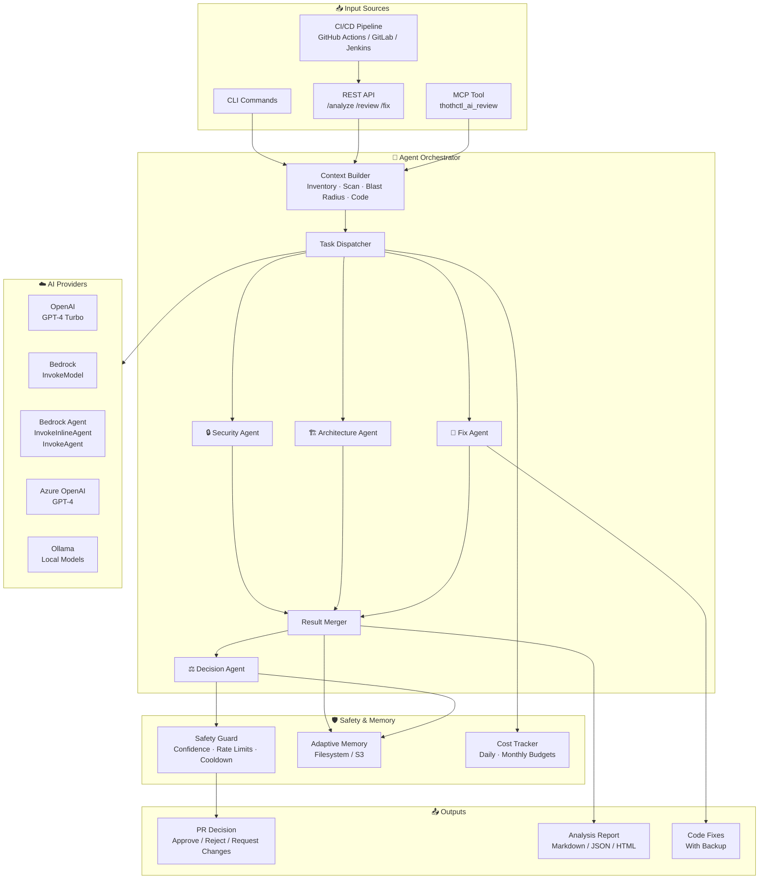
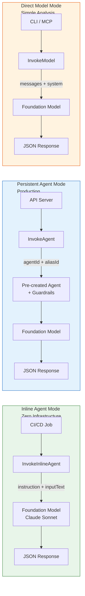
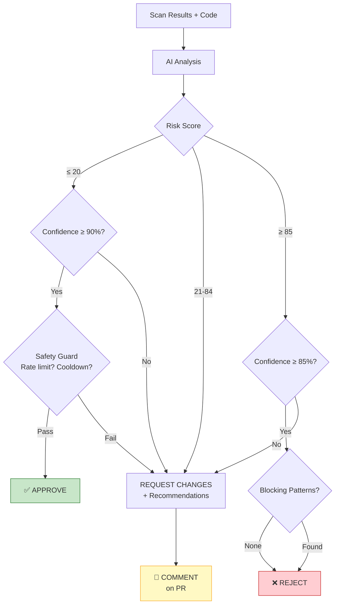
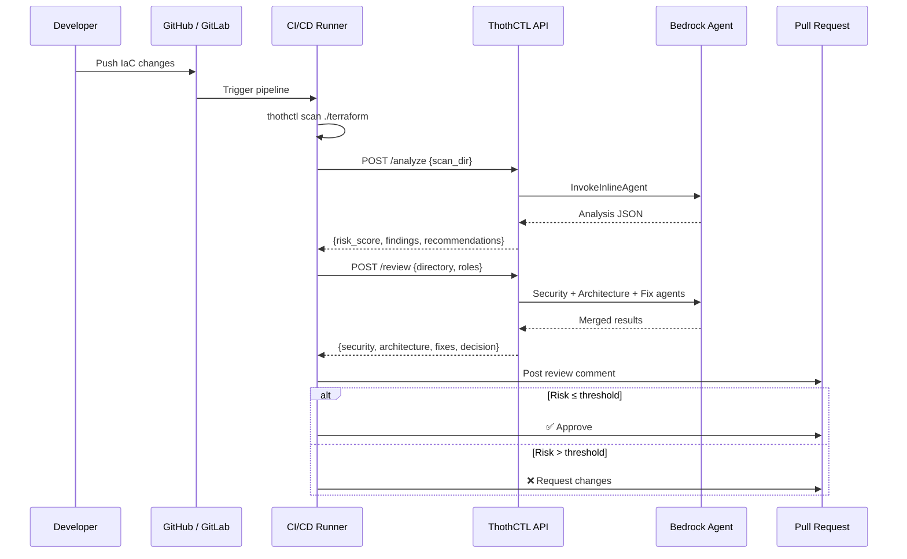
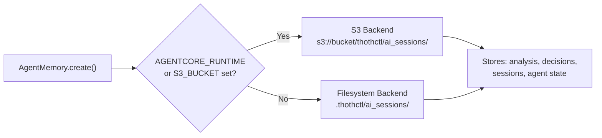
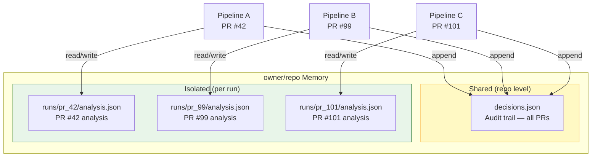

# AI Agent for IaC Security

ThothCTL's AI Agent provides automated security analysis, code review, auto-fix generation, and PR decision-making for Infrastructure as Code projects.

## Architecture

### Multi-Agent Orchestrator



### Bedrock Agent Modes



### Decision Flow



### CI/CD Integration Flow



## Overview

The system uses a **multi-agent orchestrator** pattern where a main coordinator dispatches tasks to specialized agents, each with a focused role:

| Agent | Role | Input |
|-------|------|-------|
| **Security** | Analyze scan findings, prioritize by severity | Checkov/KICS/Trivy results + affected code |
| **Architecture** | Review module structure, blast radius, versioning | Inventory + dependency graph + code structure |
| **Fix** | Generate actionable code fixes | Findings + full source code |
| **Decision** | Approve/reject/request-changes for PRs | Merged results from other agents |

## Commands

### `thothctl ai-review analyze`

Run AI security analysis on IaC code.

```bash
# Analyze with default provider
thothctl ai-review analyze -d ./terraform

# Use a specific provider and model
thothctl ai-review analyze -d ./terraform -p ollama -m llama3

# Use Bedrock Agent (inline mode — no pre-created agent)
thothctl ai-review analyze -d ./terraform -p bedrock_agent

# Analyze existing scan results
thothctl ai-review analyze -s ./Reports
```

### `thothctl ai-review improve`

Generate actionable code fixes for security findings.

```bash
# Generate fixes (uses AI when available, pattern fallback otherwise)
thothctl ai-review improve -d ./terraform --severity high -o fixes.json

# Output as JSON
thothctl ai-review improve -d ./terraform --json
```

The improve command supports 13 built-in fix patterns for common Checkov rules (S3 encryption, RDS encryption, security group restrictions, etc.) that work without any AI provider configured.

### `thothctl ai-review apply-fix`

Apply generated fixes with automatic backup.

```bash
# Preview changes
thothctl ai-review apply-fix --fixes-file fixes.json --dry-run

# Apply all fixes (creates backups in .thothctl/fix_backups/)
thothctl ai-review apply-fix --fixes-file fixes.json

# Apply specific fixes only
thothctl ai-review apply-fix --fixes-file fixes.json --fix-ids fix_000,fix_002

# Skip backup
thothctl ai-review apply-fix --fixes-file fixes.json --no-backup
```

### `thothctl ai-review orchestrate`

Run multiple specialized agents for comprehensive review.

```bash
# Run all agents
thothctl ai-review orchestrate -d ./terraform

# Run specific agents
thothctl ai-review orchestrate -d ./terraform -a security -a fix

# Control parallelism
thothctl ai-review orchestrate -d ./terraform --parallel 4

# With pipeline isolation (recommended for CI/CD)
thothctl ai-review orchestrate -d ./terraform \
  --repository owner/repo --run-id pr/42

# Save full results
thothctl ai-review orchestrate -d ./terraform -o review.json --json
```

### `thothctl ai-review decide`

Auto-decide on a PR (approve/reject/request-changes).

```bash
# Dry run (always safe)
thothctl ai-review decide -d ./terraform --dry-run

# Full CI/CD integration
thothctl ai-review decide \
  -d ./terraform \
  --pr-number 123 \
  --repository owner/repo \
  --provider bedrock_agent \
  --platform github
```

### `thothctl ai-review serve`

Start the REST API server for CI/CD and external integrations.

```bash
# Start on default port
thothctl ai-review serve

# Custom host and port
thothctl ai-review serve --host 127.0.0.1 --port 9090
```

**API Endpoints:**

| Endpoint | Method | Description |
|----------|--------|-------------|
| `/health` | GET | Health check and provider status |
| `/analyze` | POST | Analyze pre-existing scan results |
| `/review` | POST | Full multi-agent orchestrated review |
| `/fix` | POST | Generate code fixes |

**Example API calls:**

```bash
# Health check
curl http://localhost:8080/health

# Analyze scan results
curl -X POST http://localhost:8080/analyze \
  -H "Content-Type: application/json" \
  -d '{"scan_dir": "./Reports", "provider": "bedrock_agent"}'

# Full multi-agent review (with pipeline isolation)
curl -X POST http://localhost:8080/review \
  -H "Content-Type: application/json" \
  -d '{
    "directory": "./terraform",
    "roles": ["security", "architecture", "fix"],
    "repository": "owner/repo",
    "run_id": "pr/42"
  }'

# Generate fixes
curl -X POST http://localhost:8080/fix \
  -H "Content-Type: application/json" \
  -d '{"directory": "./terraform", "severity_filter": "high"}'
```

### `thothctl ai-review configure`

Configure AI provider settings.

```bash
# Show current configuration
thothctl ai-review configure --show

# Set provider
thothctl ai-review configure --provider bedrock_agent --model anthropic.claude-sonnet-4-20250514
```

### `thothctl ai-review configure-decisions`

Manage auto-decision thresholds and safety controls.

```bash
# Show current rules
thothctl ai-review configure-decisions --show

# Enable with custom thresholds
thothctl ai-review configure-decisions --enable --approve-threshold 20 --reject-threshold 85

# View today's stats
thothctl ai-review configure-decisions --stats
```

### `thothctl ai-review history`

View past AI decision records.

```bash
# Last 7 days
thothctl ai-review history

# Filter by repo and action
thothctl ai-review history --repository owner/repo --action approve --days 30

# JSON output
thothctl ai-review history --json
```

### `thothctl ai-review override`

Manually override an AI decision.

```bash
# Record override
thothctl ai-review override --repository owner/repo --pr-number 42 --action approve --reason "Manual review completed"

# Record and publish to PR
thothctl ai-review override --repository owner/repo --pr-number 42 --action approve --publish
```

## AI Providers

| Provider | Model | Mode | Use Case |
|----------|-------|------|----------|
| **OpenAI** | GPT-4 Turbo | Direct API | Best quality analysis |
| **Bedrock** | Claude 3 Sonnet | InvokeModel | AWS-native, simple one-shot |
| **Bedrock Agent** | Claude Sonnet | InvokeInlineAgent / InvokeAgent | CI/CD pipelines, production APIs, sessions |
| **Azure OpenAI** | GPT-4 | Direct API | Enterprise Azure environments |
| **Ollama** | Llama 3, Mistral, etc. | Local API | Offline, no data leaves your machine |

### Bedrock Agent Provider

The `bedrock_agent` provider uses the **Bedrock Agent Runtime** APIs, which are complementary to the direct `bedrock` provider:

| Feature | `bedrock` (InvokeModel) | `bedrock_agent` (Agent Runtime) |
|---------|------------------------|--------------------------------|
| API | `bedrock-runtime` | `bedrock-agent-runtime` |
| Session support | No | Yes (stateful conversations) |
| Infrastructure | None | None (inline) or pre-created agent |
| Guardrails | No | Yes (persistent mode) |
| Action groups | No | Yes (persistent mode) |
| Best for | Simple one-shot analysis | CI/CD pipelines, production APIs |

**Inline mode** (zero infrastructure):
```bash
export THOTH_AI_PROVIDER=bedrock_agent
thothctl ai-review analyze -d ./terraform
```

**Persistent mode** (pre-created agent with guardrails):
```bash
export THOTH_AI_PROVIDER=bedrock_agent
export THOTH_BEDROCK_AGENT_ID=ABCDEF1234
export THOTH_BEDROCK_AGENT_ALIAS_ID=prod-v1
thothctl ai-review serve --port 8080
```

### Configuration

Via environment:
```bash
export THOTH_AI_PROVIDER=bedrock_agent
export AWS_DEFAULT_REGION=us-east-1
export THOTH_BEDROCK_AGENT_ID=ABCDEF1234        # optional: enables persistent mode
export THOTH_BEDROCK_AGENT_ALIAS_ID=prod-v1      # optional: agent alias
```

Via YAML (`.thothctl/ai_config.yaml`):
```yaml
ai_review:
  default_provider: bedrock_agent
  providers:
    bedrock_agent:
      model: "anthropic.claude-sonnet-4-20250514"
      region: "us-east-1"
      max_tokens: 4000
      temperature: 0.1
      agent_id: ""           # empty = inline mode
      agent_alias_id: ""
```

## Adaptive Memory

The agent automatically selects the right memory backend based on the runtime environment.



| Runtime | Backend | Storage Location |
|---------|---------|-----------------|
| Local CLI | Filesystem | `.thothctl/ai_sessions/` |
| Bedrock AgentCore | S3 | `s3://{bucket}/thothctl/ai_sessions/` |
| CI/CD with S3 | S3 | `s3://{bucket}/thothctl/ai_sessions/` |

### Pipeline Isolation

When multiple pipelines run against the same repository (e.g. parallel PRs), each pipeline gets its own isolated analysis cache via `--run-id`:



| Data | Scope | Key Pattern |
|------|-------|-------------|
| Analysis cache | Per run | `repos/{repo}/runs/{run_id}/analysis.json` |
| Decision history | Per repo (audit) | `repos/{repo}/decisions.json` |
| Sessions | Per process | `sessions/{uuid}.json` |
| Agent state | Per agent | `state/{agent_id}.json` |

Without `--run-id`, analysis is stored at the repo level (backward compatible for local CLI use).

### Storage Structure

```
.thothctl/ai_sessions/              # or s3://{bucket}/{prefix}/
├── repos/
│   └── owner_repo/
│       ├── decisions.json           # Shared audit trail
│       └── runs/
│           ├── pr_42/
│           │   └── analysis.json    # PR #42 isolated
│           └── pr_99/
│               └── analysis.json    # PR #99 isolated
├── sessions/
│   └── {session_id}.json
└── state/
    └── {agent_id}.json
```

### Configuration

```bash
export THOTH_MEMORY_MODE=auto            # auto, local, or agentcore
export THOTH_MEMORY_S3_BUCKET=my-bucket  # S3 bucket for agentcore mode
export THOTH_MEMORY_DIR=.thothctl/ai_sessions  # Local storage directory
```

## Safety Controls

Auto-decisions are **disabled by default**. Enable with:

```bash
thothctl ai-review configure-decisions --enable
```

| Control | Default | Description |
|---------|---------|-------------|
| Enabled | `false` | Must be explicitly enabled |
| Approve confidence | 90% | AI must be ≥90% confident to auto-approve |
| Reject confidence | 85% | AI must be ≥85% confident to auto-reject |
| Max risk for approve | 20/100 | Risk score must be ≤20 |
| Min risk for reject | 85/100 | Risk score must be ≥85 |
| Daily approve limit | 50 | Max auto-approvals per day per repo |
| Daily reject limit | 20 | Max auto-rejections per day per repo |
| Cooldown | 5 min | Minimum time between actions on same repo |
| Emergency labels | `emergency`, `hotfix`, `security-patch` | Falls back to comment-only |
| Trusted bots | `dependabot`, `renovate` | Falls back to comment-only |
| Dry run | Always available | `--dry-run` works even when disabled |

### Blocking Patterns

These patterns in findings trigger automatic rejection regardless of risk score:

- Hardcoded secrets
- Public S3 buckets
- Unrestricted security groups
- Admin access keys
- Unencrypted databases

## Code Improvement Patterns

The `improve` command includes 13 built-in fix patterns that work without AI:

| Check ID | Fix |
|----------|-----|
| `CKV_AWS_18` | Enable S3 bucket access logging |
| `CKV_AWS_19` | Enable S3 bucket encryption (AES256) |
| `CKV_AWS_21` | Enable S3 bucket versioning |
| `CKV_AWS_145` | Enable S3 bucket encryption (KMS) |
| `CKV_AWS_23` | Add security group description |
| `CKV_AWS_24` | Restrict SSH ingress CIDR |
| `CKV_AWS_25` | Restrict RDP ingress CIDR |
| `CKV_AWS_16` | Enable RDS encryption at rest |
| `CKV_AWS_17` | Disable RDS public access |
| `CKV_AWS_158` | Enable CloudWatch Log Group encryption |
| `CKV_AWS_3` | Enable EBS volume encryption |
| `CKV_AWS_116` | Add Lambda dead letter config |
| `CKV_AWS_272` | Enable Lambda code signing |

## MCP Integration

The AI review is exposed as an MCP tool (`thothctl_ai_review`) for AI assistant interoperability:

```json
{
  "name": "thothctl_ai_review",
  "arguments": {
    "directory": "./terraform",
    "provider": "bedrock_agent",
    "mode": "analyze | decide | improve | orchestrate",
    "severity": "critical | high | medium | low",
    "agents": ["security", "architecture", "fix", "decision"]
  }
}
```

## CI/CD Integration

### GitHub Actions

```yaml
name: IaC Security Review
on: [pull_request]

jobs:
  security-review:
    runs-on: ubuntu-latest
    steps:
      - uses: actions/checkout@v4

      - uses: aws-actions/configure-aws-credentials@v4
        with:
          aws-access-key-id: ${{ secrets.AWS_ACCESS_KEY_ID }}
          aws-secret-access-key: ${{ secrets.AWS_SECRET_ACCESS_KEY }}
          aws-region: us-east-1

      - name: Install ThothCTL
        run: pip install thothctl

      - name: Security Scan + AI Review
        run: |
          thothctl scan .
          thothctl ai-review decide \
            -d . \
            --pr-number ${{ github.event.pull_request.number }} \
            --repository ${{ github.repository }} \
            --provider bedrock_agent \
            --platform github
        env:
          GITHUB_TOKEN: ${{ secrets.GITHUB_TOKEN }}

      # Or use orchestrate with pipeline isolation
      - name: Multi-Agent Review (isolated per PR)
        run: |
          thothctl ai-review orchestrate -d . \
            --repository ${{ github.repository }} \
            --run-id "pr/${{ github.event.pull_request.number }}" \
            -a security -a fix --json > review.json
```

### Azure DevOps Pipelines

```yaml
- script: |
    thothctl scan .
    thothctl ai-review decide \
      -d $(Build.SourcesDirectory) \
      --pr-number $(System.PullRequest.PullRequestId) \
      --repository $(Build.Repository.Name) \
      --provider bedrock_agent \
      --platform azure_devops
  env:
    SYSTEM_ACCESSTOKEN: $(System.AccessToken)
```

### REST API in CI/CD

```yaml
# Start API as a service, then call from pipeline steps
- name: Start AI Review API
  run: thothctl ai-review serve --port 8080 &

- name: Analyze
  run: |
    curl -X POST http://localhost:8080/review \
      -H "Content-Type: application/json" \
      -d '{
        "directory": ".",
        "repository": "${{ github.repository }}",
        "run_id": "pr/${{ github.event.pull_request.number }}",
        "roles": ["security", "fix"]
      }' > review.json
    cat review.json | jq '.security.risk_score'
```

### Docker Deployment

```dockerfile
FROM python:3.11-slim
WORKDIR /app
RUN pip install thothctl
EXPOSE 8080
CMD ["thothctl", "ai-review", "serve", "--port", "8080"]
```

```bash
docker build -t thothctl-ai-api .
docker run -p 8080:8080 \
  -e THOTH_AI_PROVIDER=bedrock_agent \
  -e AWS_DEFAULT_REGION=us-east-1 \
  -e THOTH_BEDROCK_AGENT_ID=ABCDEF1234 \
  thothctl-ai-api
```

## File Structure

```
services/ai_review/
├── ai_agent.py              # AIReviewAgent — single-agent analysis + fix generation
├── orchestrator.py          # AgentOrchestrator — multi-agent coordinator
├── decision_engine.py       # DecisionEngine — approve/reject/request-changes logic
├── pr_decision_publisher.py # Publish decisions to GitHub/Azure DevOps PRs
├── memory.py                # AgentMemory — adaptive local/S3 backend
├── bedrock_agent_api.py     # FastAPI REST API (/health, /analyze, /review, /fix)
├── config/
│   ├── ai_settings.py       # Provider config, cost controls
│   └── decision_rules.py    # Thresholds, safety config, blocking patterns
├── providers/
│   ├── openai_provider.py   # OpenAI GPT-4
│   ├── bedrock_provider.py  # AWS Bedrock (InvokeModel — direct)
│   ├── bedrock_agent_provider.py  # AWS Bedrock Agent (InvokeInlineAgent / InvokeAgent)
│   ├── azure_provider.py    # Azure OpenAI
│   └── ollama_provider.py   # Ollama (local models)
├── analyzers/
│   ├── report_analyzer.py   # Parse Checkov/KICS/Trivy scan results
│   ├── code_reviewer.py     # Collect IaC files for review
│   ├── risk_assessor.py     # Risk scoring without AI
│   └── context_builder.py   # Build context from thothctl services
├── utils/
│   ├── prompts.py           # System prompts for each agent role
│   ├── fix_prompts.py       # Fix generation prompt
│   ├── fix_patterns.py      # 13 built-in Checkov fix patterns
│   ├── cost_tracker.py      # API usage and cost tracking
│   └── formatters.py        # Markdown, JSON, PR comment formatters
└── safety/
    └── safety_guard.py      # Confidence, rate limits, emergency overrides
```
