# IaC Documentation

The `thothctl document iac` command generates comprehensive documentation for Infrastructure as Code (IaC) resources. It supports multiple IaC frameworks including Terraform and Terragrunt, helping teams maintain clear and up-to-date documentation for their infrastructure code.

## Command Syntax

```bash
thothctl document iac [OPTIONS]
```

## Options

| Option | Description |
|--------|-------------|
| `--recursive / --no-recursive` | Generate documentation recursively for all modules/components |
| `--exclude TEXT` | Patterns to exclude from recursive generation |
| `--config-file PATH` | Custom terraform-docs configuration file |
| `--suffix TEXT` | Suffix for project root path (terragrunt only) |
| `--mood [resources\|modules]` | Type of documentation to generate |
| `-f, --framework [terraform\|terragrunt\|terraform-terragrunt]` | Type of IaC framework to document (required) |
| `--graph-type [dot\|mermaid]` | Type of dependency graph to generate (terragrunt only, default: dot) |
| `--help` | Show help message and exit |

## Supported Frameworks

### Terraform

[Terraform](https://www.terraform.io/) is an open-source infrastructure as code software tool that enables you to safely and predictably create, change, and improve infrastructure.

```bash
# Generate documentation for a Terraform module
thothctl document iac -f terraform

# Generate documentation recursively for all Terraform modules
thothctl document iac -f terraform --recursive
```

### Terragrunt

[Terragrunt](https://terragrunt.gruntwork.io/) is a thin wrapper for Terraform that provides extra tools for working with multiple Terraform modules.

```bash
# Generate documentation for a Terragrunt project
thothctl document iac -f terragrunt

# Generate documentation recursively for all Terragrunt modules
thothctl document iac -f terragrunt --recursive
```

#### Dependency Graphs

Terragrunt projects support automatic dependency graph generation to visualize module relationships.

**SVG Graph (Default)**:
```bash
# Generate SVG dependency graph
thothctl document iac -f terragrunt --graph-type dot
```

Output: `graph.svg` - Interactive SVG diagram showing module dependencies

**Mermaid Graph**:
```bash
# Generate Mermaid dependency graph
thothctl document iac -f terragrunt --graph-type mermaid
```

Output: `graph.mmd` - Text-based Mermaid diagram with:
- **Professional styling** with ThothCTL brand colors
- **Color-coded nodes** by complexity:
  - 🟢 Green: Root nodes (no dependencies)
  - 🔵 Blue: Normal nodes (1-2 dependencies)
  - 🟠 Orange: Complex nodes (3+ dependencies)
- **Edge labels** showing input keys from `mock_outputs`
- **Dependency details** in node labels

**Example Mermaid Output**:

```mermaid
%%{init: {'theme':'base', 'themeVariables': {...}}}%%
graph LR
    vpc["<b>vpc</b>"]:::rootNode
    sg["<b>security-groups</b><br/><small>📥 vpc: vpc_id, subnet_ids</small>"]:::normalNode
    app["<b>app</b><br/><small>📥 vpc: vpc_id<br/>📥 sg: sg_id</small>"]:::normalNode
    
    sg -->|vpc_id, subnet_ids| vpc
    app -->|vpc_id| vpc
    app -->|sg_id| sg

    classDef rootNode fill:#4caf50,stroke:#2e7d32,stroke-width:3px,color:#fff
    classDef normalNode fill:#2196f3,stroke:#1565c0,stroke-width:2px,color:#fff
    classDef complexNode fill:#ff9800,stroke:#e65100,stroke-width:2px,color:#fff
```


**Mermaid Benefits**:
- ✅ Text-based (easy to version control and diff)
- ✅ Renders in GitHub, GitLab, and documentation sites
- ✅ Shows explicit data flow between modules
- ✅ Professional appearance for presentations
- ✅ Editable without regenerating

### Terraform-Terragrunt

This option generates documentation for projects that use both Terraform and Terragrunt together.

```bash
# Generate documentation for a mixed Terraform-Terragrunt project
thothctl document iac -f terraform-terragrunt
```

## Documentation Types

### Resources Documentation

Generate documentation focused on the resources defined in your IaC code.

```bash
# Generate resources documentation
thothctl document iac -f terraform --mood resources
```

### Modules Documentation

Generate documentation focused on the modules used in your IaC code.

```bash
# Generate modules documentation
thothctl document iac -f terraform --mood modules
```

## Recursive Documentation

The `--recursive` flag allows you to generate documentation for all modules or components in a project, including nested ones.

```bash
# Generate documentation recursively
thothctl document iac -f terraform --recursive

# Exclude certain patterns when generating recursively
thothctl document iac -f terraform --recursive --exclude "**/.terraform/**" --exclude "**/examples/**"
```

## Custom Configuration

You can provide a custom configuration file for terraform-docs to customize the generated documentation.

```bash
# Use a custom configuration file
thothctl document iac -f terraform --config-file ./terraform-docs.yml
```

Example `terraform-docs.yml` configuration:

```yaml
formatter: markdown table

header-from: main.tf
footer-from: ""

sections:
  hide: []
  show: []

content: |-
  {{ .Header }}

  ## Usage

  Basic usage example:

  ```hcl
  module "example" {
    source = "path/to/module"
    
    // Required variables
    region = "us-west-2"
    
    // Optional variables
    environment = "dev"
  }
  ```

  {{ .Requirements }}

  {{ .Providers }}

  {{ .Modules }}

  {{ .Resources }}

  {{ .Inputs }}

  {{ .Outputs }}

output:
  file: "README.md"
  mode: replace
```

## Output Examples

### Terraform Module Documentation

The generated documentation for a Terraform module typically includes:

- Module description and usage examples
- Required providers and their versions
- Input variables with descriptions, types, and default values
- Output values with descriptions
- Resources created by the module
- Submodules used by the module

### Terragrunt Project Documentation

The generated documentation for a Terragrunt project typically includes:

- Project structure and organization
- Module dependencies and relationships
- Input variables and their sources
- Generated Terraform configurations

## Integration with Version Control

You can integrate the document command with your version control workflow to ensure documentation is always up-to-date:

```bash
# Pre-commit hook example
cat > .git/hooks/pre-commit << 'EOF'
#!/bin/bash
echo "Updating documentation..."
thothctl document iac -f terraform --recursive
git add README.md **/README.md
EOF
chmod +x .git/hooks/pre-commit
```

## CI/CD Integration

You can also integrate the document command into your CI/CD pipeline:

```yaml
# GitHub Actions example
name: Update Documentation

on:
  push:
    branches: [ main ]
    paths:
      - '**.tf'
      - '**.hcl'

jobs:
  update-docs:
    runs-on: ubuntu-latest
    steps:
      - uses: actions/checkout@v3
      
      - name: Set up Python
        uses: actions/setup-python@v4
        with:
          python-version: '3.10'
          
      - name: Install ThothCTL
        run: pip install thothctl
        
      - name: Generate Documentation
        run: thothctl document iac -f terraform --recursive
        
      - name: Commit updated documentation
        uses: stefanzweifel/git-auto-commit-action@v4
        with:
          commit_message: "docs: Update generated documentation"
          file_pattern: "README.md **/README.md"
```

## Best Practices

1. **Keep documentation close to code**: Generate documentation in the same directory as your IaC code
2. **Version control documentation**: Include generated documentation in your version control system
3. **Automate documentation updates**: Use pre-commit hooks or CI/CD pipelines to keep documentation up-to-date
4. **Use consistent formatting**: Standardize documentation format across all projects
5. **Include usage examples**: Add examples to help users understand how to use your modules
6. **Document all variables**: Ensure all input variables have clear descriptions
7. **Update documentation before releases**: Always regenerate documentation before creating a new release
8. **Use Mermaid for presentations**: Generate mermaid graphs for architecture documentation and presentations
9. **Leverage dependency graphs**: Use graphs to understand and communicate module relationships

## Dependency Graph Examples

### Simple Stack

**Structure**:
```
stacks/
├── vpc/
│   └── terragrunt.hcl
└── security-groups/
    └── terragrunt.hcl (depends on vpc)
```

**Command**:
```bash
cd stacks
thothctl document iac -f terragrunt --graph-type mermaid
```

**Result** (`graph.mmd`):

```mermaid
graph LR
    vpc["<b>vpc</b>"]:::rootNode
    security_groups["<b>security-groups</b><br/><small>📥 vpc: vpc_id, subnet_ids</small>"]:::normalNode
    security_groups -->|vpc_id, subnet_ids| vpc
```


### Complex Stack

**Structure**:
```
stacks/
├── vpc/
├── rds/ (depends on vpc)
├── security-groups/ (depends on vpc)
└── app/ (depends on vpc, rds, security-groups)
```

**Command**:
```bash
cd stacks
thothctl document iac -f terragrunt --graph-type mermaid
```

**Result**: Multi-level dependency graph with color-coded complexity

### From Subdirectory

When running from a subdirectory, the graph shows relative paths:

```bash
cd stacks/app
thothctl document iac -f terragrunt --graph-type mermaid
```

**Result**: Shows `app` and its dependencies like `..vpc`, `..rds`
