# Document IaC Command

## Overview

The `document iac` command generates comprehensive documentation for Infrastructure as Code projects using terraform-docs and AI-powered documentation generation.

## Usage

```bash
# Basic documentation generation
thothctl document iac -f terraform-terragrunt

# Recursive documentation
thothctl document iac -f terraform-terragrunt --recursive

# Custom configuration
thothctl document iac -f terraform --config-file .terraform-docs.yml
```

## Features

- **Automatic Documentation**: Generate README files for modules
- **Terraform-docs Integration**: Professional module documentation
- **AI-Powered Docs**: Generative AI documentation creation
- **Graph Generation**: Dependency graphs in SVG or Mermaid format
- **Multi-Framework Support**: Terraform, Terragrunt, CDK
- **Dependency Visualization**: Show module relationships with input/output details
- **Professional Styling**: Color-coded graphs with ThothCTL branding

## Supported Frameworks

- **terraform**: Pure Terraform projects
- **terragrunt**: Terragrunt-based projects
- **terraform-terragrunt**: Mixed environments

## Output

The command generates:
- README.md files for each module
- Dependency graphs (SVG or Mermaid format)
- Input/output documentation with mock_outputs details
- Usage examples
- Visual dependency relationships

### Graph Formats

**SVG (--graph-type dot)**:
- Interactive vector graphics
- Scalable and zoomable
- Best for local viewing

**Mermaid (--graph-type mermaid)**:
- Text-based diagrams
- Version control friendly
- Renders in GitHub/GitLab
- Shows input keys on edges
- Color-coded by complexity

## Examples

### Generate Module Documentation
```bash
thothctl document iac -f terraform-terragrunt
```

### Recursive Documentation
```bash
thothctl document iac -f terraform-terragrunt --recursive
```

### Custom Configuration
```bash
thothctl document iac -f terraform --config-file custom-docs.yml
```

### Generate Dependency Graphs

**SVG Graph (Default)**:
```bash
thothctl document iac -f terragrunt --graph-type dot
```
Output: `graph.svg` with visual dependency tree

**Mermaid Graph**:
```bash
thothctl document iac -f terragrunt --graph-type mermaid
```
Output: `graph.mmd` with text-based diagram showing:
- Module dependencies
- Input keys from mock_outputs
- Color-coded complexity

**Example Mermaid Output**:

```mermaid
graph LR
    vpc["<b>vpc</b>"]:::rootNode
    app["<b>app</b><br/><small>📥 vpc: vpc_id, subnet_ids</small>"]:::normalNode
    app -->|vpc_id, subnet_ids| vpc
```


### From Subdirectory
```bash
cd stacks/app
thothctl document iac -f terragrunt --graph-type mermaid
```
Shows current module and its dependencies with relative paths

## Related Commands

- [`check iac`](../check/check_iac.md) - Validate structure
- [`inventory iac`](../inventory/iac.md) - Create inventory
- [`scan iac`](../scan/iac.md) - Security scanning
