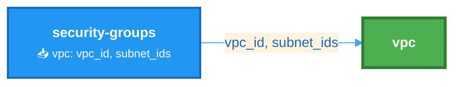
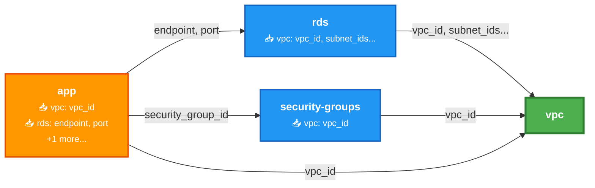
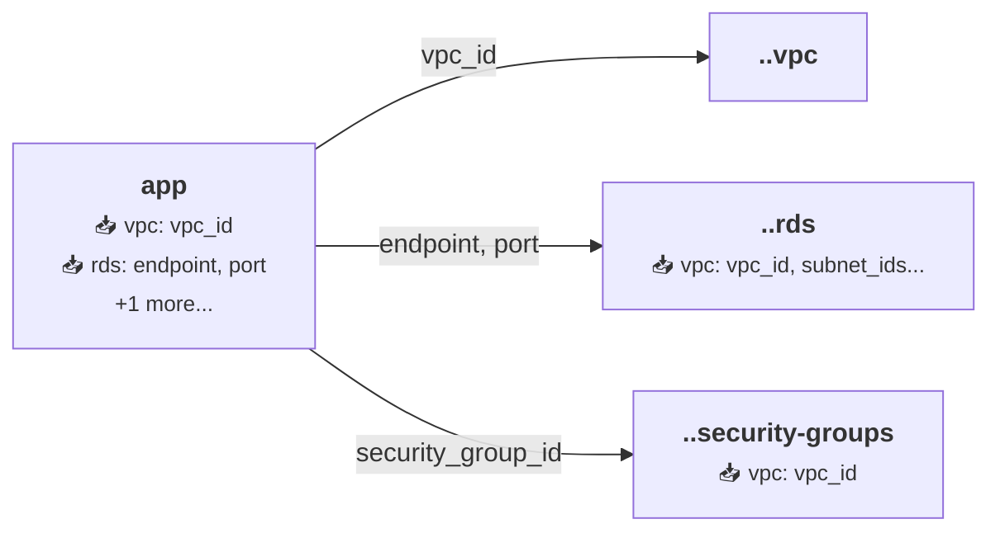

# Mermaid Dependency Graphs - Examples

## Overview

ThothCTL generates professional Mermaid diagrams for Terragrunt projects, showing module dependencies with explicit input/output relationships.

## Basic Usage

```bash
# Generate Mermaid diagram
thothctl document iac --framework terragrunt --graph-type mermaid

# Output: graph.mmd in current directory
```

## Example 1: Simple Two-Module Stack

### Project Structure
```
stacks/
├── vpc/
│   └── terragrunt.hcl
└── security-groups/
    └── terragrunt.hcl
```

### vpc/terragrunt.hcl
```hcl
terraform {
  source = "git::https://github.com/terraform-aws-modules/terraform-aws-vpc.git?ref=v5.0.0"
}

inputs = {
  name = "my-vpc"
  cidr = "10.0.0.0/16"
}
```

### security-groups/terragrunt.hcl
```hcl
terraform {
  source = "git::https://github.com/terraform-aws-modules/terraform-aws-security-group.git?ref=v5.0.0"
}

dependency "vpc" {
  config_path = "../vpc"
  
  mock_outputs = {
    vpc_id = "vpc-mock-12345"
    subnet_ids = ["subnet-1", "subnet-2"]
  }
}

inputs = {
  vpc_id = dependency.vpc.outputs.vpc_id
  name = "my-sg"
}
```

### Generated Diagram

```bash
cd stacks
thothctl document iac -f terragrunt --graph-type mermaid
```

**Output** (`graph.mmd`):


**Visual Result**:
- 🟢 **vpc** (green) - Root module with no dependencies
- 🔵 **security-groups** (blue) - Normal module with 1 dependency
- Edge shows: `vpc_id, subnet_ids` - the actual inputs being passed

## Example 2: Multi-Tier Application

### Project Structure
```
stacks/
├── vpc/
├── rds/
├── security-groups/
└── app/
```

### rds/terragrunt.hcl
```hcl
dependency "vpc" {
  config_path = "../vpc"
  
  mock_outputs = {
    vpc_id = "vpc-123"
    subnet_ids = ["subnet-1", "subnet-2"]
    database_subnet_group = "db-subnet-group"
  }
}

inputs = {
  vpc_id = dependency.vpc.outputs.vpc_id
  subnet_ids = dependency.vpc.outputs.subnet_ids
}
```

### app/terragrunt.hcl
```hcl
dependency "vpc" {
  config_path = "../vpc"
  
  mock_outputs = {
    vpc_id = "vpc-123"
  }
}

dependency "rds" {
  config_path = "../rds"
  
  mock_outputs = {
    endpoint = "db.example.com"
    port = 5432
  }
}

dependency "sg" {
  config_path = "../security-groups"
  
  mock_outputs = {
    security_group_id = "sg-123"
  }
}

inputs = {
  vpc_id = dependency.vpc.outputs.vpc_id
  db_endpoint = dependency.rds.outputs.endpoint
  security_group_id = dependency.sg.outputs.security_group_id
}
```

### Generated Diagram



**Visual Result**:
- 🟢 **vpc** (green) - Root module
- 🔵 **rds, security-groups** (blue) - Normal modules (1-2 dependencies)
- 🟠 **app** (orange) - Complex module (3+ dependencies)

## Example 3: Running from Subdirectory

```bash
cd stacks/app
thothctl document iac -f terragrunt --graph-type mermaid
```

**Output** shows relative paths:


## Node Color Coding

| Color | Meaning | Dependencies |
|-------|---------|--------------|
| 🟢 Green | Root node | 0 dependencies |
| 🔵 Blue | Normal node | 1-2 dependencies |
| 🟠 Orange | Complex node | 3+ dependencies |

## Edge Labels

Edge labels show the **actual input keys** from `mock_outputs`:

```hcl
dependency "vpc" {
  mock_outputs = {
    vpc_id = "vpc-123"
    subnet_ids = ["subnet-1"]
  }
}
```

Results in edge label: `vpc_id, subnet_ids`

### Truncation

If more than 2 keys, the label is truncated:
- Shows first 2 keys
- Adds "..." to indicate more

Example: `vpc_id, subnet_ids...`

## Node Labels

Node labels show:
1. **Bold module name**
2. **Dependency details** (if any):
   - 📥 emoji indicator
   - Dependency name
   - Input keys (up to 3)
3. **Overflow indicator** (if more than 2 dependencies)

Example:
```
<b>app</b>
📥 vpc: vpc_id
📥 rds: endpoint, port
+1 more...
```

## Rendering

### GitHub/GitLab
Mermaid diagrams render automatically in:
- README.md files
- Pull request descriptions
- Issue comments
- Wiki pages

### VS Code
Install extension: "Markdown Preview Mermaid Support"

### Mermaid Live Editor
https://mermaid.live/ - Paste and preview

### Export to Image
```bash
# Install mermaid-cli
npm install -g @mermaid-js/mermaid-cli

# Generate PNG
mmdc -i graph.mmd -o graph.png

# Generate SVG
mmdc -i graph.mmd -o graph.svg
```

## Comparison: Mermaid vs SVG

| Feature | Mermaid | SVG |
|---------|---------|-----|
| **Format** | Text | Binary |
| **Version Control** | Easy to diff | Hard to diff |
| **Editability** | Edit text file | Regenerate only |
| **Rendering** | GitHub/GitLab | Browser/viewer |
| **Input Details** | Shows on edges | Not shown |
| **Complexity Colors** | Yes | No |
| **File Size** | Small (~1KB) | Larger (~10KB+) |

## Best Practices

1. **Use Mermaid for documentation**: Better for README files and wikis
2. **Use SVG for presentations**: Better for slides and reports
3. **Commit both formats**: Provide options for different use cases
4. **Update on changes**: Regenerate when dependencies change
5. **Add to CI/CD**: Automate diagram generation

## CI/CD Integration

### GitHub Actions
```yaml
name: Update Dependency Graphs

on:
  push:
    paths:
      - '**/terragrunt.hcl'

jobs:
  update-graphs:
    runs-on: ubuntu-latest
    steps:
      - uses: actions/checkout@v3
      
      - name: Install ThothCTL
        run: pip install thothctl
        
      - name: Generate Mermaid Diagrams
        run: |
          cd stacks
          thothctl document iac -f terragrunt --graph-type mermaid
        
      - name: Commit Diagrams
        uses: stefanzweifel/git-auto-commit-action@v4
        with:
          commit_message: "docs: Update dependency graphs"
          file_pattern: "**/graph.mmd"
```

## Troubleshooting

### No Edge Labels
**Issue**: Edges show no input keys

**Causes**:
1. No `mock_outputs` in dependency block
2. Dependency name doesn't match module name
3. Empty `mock_outputs = {}`

**Solution**: Add mock_outputs to dependency blocks

### Wrong Module Names
**Issue**: Shows "." or "../module" instead of clean names

**Solution**: This is expected when running from subdirectories. Run from project root for clean names.

### Colors Not Showing
**Issue**: All nodes same color

**Cause**: Rendering platform doesn't support Mermaid themes

**Solution**: Use Mermaid Live Editor or GitHub/GitLab

## Additional Resources

- [Mermaid Documentation](https://mermaid.js.org/)
- [Terragrunt Dependencies](https://terragrunt.gruntwork.io/docs/features/execute-terraform-commands-on-multiple-modules-at-once/#dependencies-between-modules)
- [ThothCTL Documentation](https://github.com/thothforge/thothctl)
