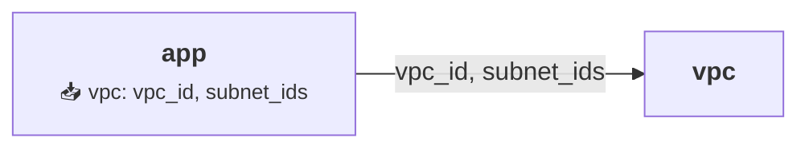

# Mermaid Graphs - Quick Reference

## Command

```bash
thothctl document iac --framework terragrunt --graph-type mermaid
```

## Output

`graph.mmd` - Text-based Mermaid diagram

## Features

| Feature | Description |
|---------|-------------|
| **Edge Labels** | Shows input keys from `mock_outputs` |
| **Color Coding** | 🟢 Root, 🔵 Normal, 🟠 Complex |
| **Dependency Details** | Lists inputs in node labels |
| **Professional Styling** | ThothCTL brand colors |
| **Version Control** | Text-based, easy to diff |
| **Renders Everywhere** | GitHub, GitLab, VS Code |

## Example

### Input (terragrunt.hcl)
```hcl
dependency "vpc" {
  config_path = "../vpc"
  mock_outputs = {
    vpc_id = "vpc-123"
    subnet_ids = ["subnet-1"]
  }
}
```

### Output (graph.mmd)


## Color Guide

- 🟢 **Green** = 0 dependencies (root)
- 🔵 **Blue** = 1-2 dependencies (normal)
- 🟠 **Orange** = 3+ dependencies (complex)

## Quick Tips

✅ Run from project root for clean names  
✅ Commit `graph.mmd` to version control  
✅ Renders automatically in GitHub/GitLab  
✅ Use for architecture documentation  
✅ Shows explicit data flow between modules  

## Troubleshooting

**No edge labels?**  
→ Add `mock_outputs` to dependency blocks

**Shows "." instead of module name?**  
→ Expected from subdirectories, or run from root

**Want SVG instead?**  
→ Use `--graph-type dot`

## More Info

See: `docs/framework/commands/document/mermaid_examples.md`
