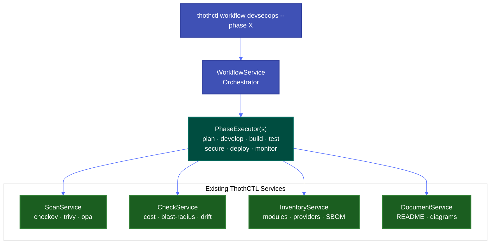

# thothctl workflow devsecops

Execute DevSecOps SDLC workflow phases as composite operations.

## Synopsis

```bash
thothctl workflow devsecops [OPTIONS]
```

## Description

Orchestrates one or more DevSecOps phases, running the appropriate ThothCTL commands in sequence. Each phase bundles related operations and provides enforcement gates to block deployments when violations are found.

The command displays a live spinner animation during execution and prints immediate pass/fail/skip status after each phase completes, followed by a detailed results table.

## Options

| Option | Type | Default | Description |
|--------|------|---------|-------------|
| `-p, --phase` | Choice | `all` | SDLC phase to execute |
| `--enforcement` | Choice | `soft` | `soft` reports violations (exit 0), `hard` blocks pipeline (exit 1) |
| `--policy-dir` | Text | None | OPA policy directory or Git URL for secure phase |
| `-t, --tools` | Multiple | None | Override scan tools for secure phase |
| `-r, --reports-dir` | Path | `Reports` | Directory to save reports |

### Phase Choices

| Phase | Description | Commands Executed |
|-------|-------------|-------------------|
| `plan` | Cost estimation and risk assessment | `check iac -type cost-analysis`, `check iac -type blast-radius` |
| `develop` | Environment and structure validation | `check environment`, `check project iac`, `document iac` |
| `build` | Inventory and dependency tracking | `inventory iac --check-versions --check-provider-versions` |
| `test` | Plan validation and impact analysis | `check iac -type tfplan` |
| `secure` | Security scanning and compliance | `scan iac -t checkov -t trivy -t opa` |
| `deploy` | Pre-deployment enforcement gate | `scan iac --enforcement hard` |
| `monitor` | Drift detection | `check iac -type drift` |
| `pre-deploy` | Combined test + secure | Runs `test` then `secure` phases |
| `all` | Full pipeline | Runs all phases in order: plan → develop → build → test → secure → deploy → monitor |

## Phases in Detail

### 📋 Plan

Runs cost estimation and blast radius analysis. **Requires `tfplan.json` files** in the project. If no plan files are found, the phase skips with an informational message.

```bash
thothctl workflow devsecops -p plan
```

**Steps:**

1. `cost-analysis` — Monthly/annual cost projections per stack
2. `blast-radius` — Number of resources affected by changes

**Prerequisites:**
```bash
# Terragrunt
terragrunt run-all plan --out-dir tfplan --json-out-dir tfplan

# Terraform
terraform plan -out=tfplan.binary
terraform show -json tfplan.binary > tfplan.json
```

---

### 💻 Develop

Validates the development environment, project structure, and generates documentation.

```bash
thothctl workflow devsecops -p develop
```

**Steps:**

1. `check-environment` — Verifies required tools are installed (Terraform, Checkov, etc.)
2. `check-project` — Validates project structure against organizational standards
3. `document-iac` — Generates README and module documentation

---

### 🔨 Build

Creates infrastructure inventory with version analysis.

```bash
thothctl workflow devsecops -p build
```

**Steps:**

1. `inventory` — Catalogs all modules and providers with version checks

**Produces:**
- Module dependency report with latest versions
- Provider version analysis
- Outdated dependency warnings

---

### ✅ Test

Validates Terraform plan files for correctness. **Requires `tfplan.json` files.**

```bash
thothctl workflow devsecops -p test
```

**Steps:**

1. `tfplan-validation` — Analyzes plan for expected changes and potential issues

---

### 🔒 Secure

Runs multi-tool security scanning pipeline.

```bash
# Default tools (checkov, trivy, opa)
thothctl workflow devsecops -p secure

# Custom tools
thothctl workflow devsecops -p secure -t checkov -t trivy

# With organization policies
thothctl workflow devsecops -p secure \
  --policy-dir https://github.com/myorg/iac-policies.git@main
```

**Steps:**

1. `scan-checkov` — Static analysis for misconfigurations (CIS, AWS best practices)
2. `scan-trivy` — Vulnerability scanning (CVEs in modules and configs)
3. `scan-opa` — Custom organization policy evaluation (Rego)

**Gate logic:** If any scan finds failures and `--enforcement hard` is set, the pipeline blocks.

---

### 🚀 Deploy

Pre-deployment gate that runs security scanning with hard enforcement. Blocks if any violations exist.

```bash
thothctl workflow devsecops -p deploy --enforcement hard
```

**Steps:**

1. `deploy-gate` — Runs full security scan with `--enforcement hard`

**Behavior:**
- If 0 violations: "All security gates passed — safe to deploy"
- If violations found: "Deployment blocked: N violation(s) must be resolved"

---

### 📊 Monitor

Drift detection comparing live infrastructure against IaC state. **Requires cloud credentials.**

```bash
thothctl workflow devsecops -p monitor
```

**Steps:**

1. `drift-detection` — Compares Terraform state with actual cloud resources

---

### Composite Phases

#### `pre-deploy`
Combines `test` + `secure`. Use before merging PRs or deploying.

```bash
thothctl workflow devsecops -p pre-deploy --enforcement hard
```

#### `all`
Runs the full pipeline in order: plan → develop → build → test → secure → deploy → monitor.

```bash
thothctl workflow devsecops -p all
```

## Output

### Live Progress

While running, the command shows an animated spinner:

```
⠼ 🔒 Running phase 3/7: Secure  (🔒 Secure — Security scanning, compliance, vulnerability detection)
```

After each phase completes, an immediate result line appears:

```
  📋 Plan — passed
  💻 Develop — passed
  🔨 Build — passed
  ✅ Test — skipped (prerequisites missing)
  🔒 Secure — 22 finding(s)
```

### Results Table

After all phases complete, a summary table is displayed:

```
                           Workflow Results
╭────────┬───────────────────┬─────────┬──────────┬──────────┬─────────────────────────────╮
│ Phase  │ Step              │ Status  │ Findings │ Duration │ Summary                     │
├────────┼───────────────────┼─────────┼──────────┼──────────┼─────────────────────────────┤
│ plan   │ cost-analysis     │ ✅ PASS │    -     │    1.4s  │ Cost estimation completed   │
│        │ blast-radius      │ ✅ PASS │    -     │    0.5s  │ Blast radius assessed       │
├────────┼───────────────────┼─────────┼──────────┼──────────┼─────────────────────────────┤
│ secure │ scan-checkov      │ ❌ FAIL │   22     │   45.2s  │ 171 passed, 22 failed       │
│        │ scan-trivy        │ ✅ PASS │    -     │   12.1s  │ 789 passed, 0 failed        │
│        │ scan-opa          │ ⚠️ WARN │    -     │    0.8s  │ 97 passed, 0 failed, 4 warn │
╰────────┴───────────────────┴─────────┴──────────┴──────────┴─────────────────────────────╯
```

### Exit Codes

| Code | Meaning |
|------|---------|
| 0 | All phases passed, or soft enforcement with findings |
| 1 | Hard enforcement mode and violations detected |

## Examples

### CI/CD Pipeline — GitHub Actions

```yaml
name: DevSecOps Pipeline

on: [pull_request]

jobs:
  devsecops:
    runs-on: ubuntu-latest
    env:
      THOTH_ORG_POLICY: https://github.com/myorg/iac-policies.git@main
    steps:
      - uses: actions/checkout@v4
      - run: pip install thothctl

      - name: Pre-deploy validation
        run: thothctl workflow devsecops --phase pre-deploy --enforcement hard
```

### CI/CD Pipeline — Azure Pipelines

```yaml
trigger:
  - main

pool:
  vmImage: ubuntu-latest

steps:
  - script: pip install thothctl
    displayName: Install ThothCTL

  - script: |
      thothctl workflow devsecops \
        --phase pre-deploy \
        --enforcement hard \
        --policy-dir "https://$(POLICY_PAT)@dev.azure.com/myorg/myproject/_git/iac-policies@main"
    displayName: DevSecOps Gate
```

### Local Development — Full Audit

```bash
# Run everything, report only (don't block)
thothctl workflow devsecops --phase all

# Just check your code before pushing
thothctl workflow devsecops --phase develop

# Quick security check
thothctl workflow devsecops --phase secure
```

### With Organization Policies

```bash
# From Git URL (clones and caches automatically)
thothctl workflow devsecops -p secure \
  --policy-dir https://github.com/thothforge/org-iac-policies.git@main

# From local path
thothctl workflow devsecops -p secure \
  --policy-dir /path/to/org-iac-policies/shared/policy/hcl

# Via environment variable
export THOTH_ORG_POLICY=https://github.com/myorg/policies.git@main
thothctl workflow devsecops -p secure
```

## Architecture



The workflow command does NOT duplicate logic — it orchestrates existing services and commands.

## Related

- [Workflow Overview](workflow_overview.md)
- [Scan IAC Command](../scan/scan_iac.md)
- [Check IAC Command](../check/)
- [Inventory IAC Command](../inventory/)
- [DevSecOps SDLC Use Case](../../use_cases/devsecops_sdlc.md)
