# Workflow Command

The `workflow` command in ThothCTL provides composite DevSecOps pipeline execution, orchestrating multiple commands into cohesive SDLC phases. Instead of running individual commands manually, the workflow command chains them in the correct order with enforcement gates and live progress feedback.

## Overview

The workflow command helps DevSecOps teams to:

- Execute complete SDLC phases with a single command
- Enforce security gates that block deployments on violations
- Get live progress feedback with animated spinners
- Skip phases gracefully when prerequisites are missing
- Produce consolidated results across all steps in a phase

## Subcommands

| Subcommand | Description |
|------------|-------------|
| `devsecops` | Execute DevSecOps SDLC phases (plan, develop, build, test, secure, deploy, monitor) |

## Basic Usage

```bash
# Run full DevSecOps pipeline
thothctl workflow devsecops

# Run a specific phase
thothctl workflow devsecops --phase secure

# Run with hard enforcement (exit 1 on violations)
thothctl workflow devsecops --phase secure --enforcement hard

# Run pre-deployment validation (test + secure combined)
thothctl workflow devsecops --phase pre-deploy

# Use organization policies from a Git repo
thothctl workflow devsecops --phase secure \
  --policy-dir https://github.com/myorg/iac-policies.git@main
```

## How It Works

```mermaid
%%{init: {'theme':'base', 'themeVariables': { 'primaryColor':'#3f51b5','primaryTextColor':'#ffffff','primaryBorderColor':'#303f9f','lineColor':'#536dfe','secondaryColor':'#536dfe','tertiaryColor':'#fff','background':'transparent','mainBkg':'#3f51b5','secondBkg':'#536dfe','tertiaryBkg':'#90caf9','textColor':'#ffffff','nodeTextColor':'#ffffff','fontSize':'14px'}}}%%
graph LR
    A["📋 Plan<br/>Cost Estimation<br/>Blast Radius"] --> B["💻 Develop<br/>Environment Check<br/>Structure Validation"]
    B --> C["🔨 Build<br/>Inventory & SBOM<br/>Version Tracking"]
    C --> D["✅ Test<br/>Plan Validation<br/>Change Impact"]
    D --> E["🔒 Secure<br/>Checkov · Trivy · OPA<br/>Compliance Check"]
    E --> F["🚀 Deploy<br/>Enforcement Gate<br/>Approval"]
    F --> G["📊 Monitor<br/>Drift Detection<br/>Continuous Scan"]

    classDef planStyle fill:#01579b,stroke:#0288d1,stroke-width:2px,color:#ffffff
    classDef devStyle fill:#1b5e20,stroke:#2e7d32,stroke-width:2px,color:#ffffff
    classDef buildStyle fill:#e65100,stroke:#ef6c00,stroke-width:2px,color:#ffffff
    classDef testStyle fill:#4a148c,stroke:#6a1b9a,stroke-width:2px,color:#ffffff
    classDef secureStyle fill:#b71c1c,stroke:#c62828,stroke-width:2px,color:#ffffff
    classDef deployStyle fill:#004d40,stroke:#00695c,stroke-width:2px,color:#ffffff
    classDef monitorStyle fill:#33691e,stroke:#558b2f,stroke-width:2px,color:#ffffff

    class A planStyle
    class B devStyle
    class C buildStyle
    class D testStyle
    class E secureStyle
    class F deployStyle
    class G monitorStyle
```



Each phase:

1. Shows an animated spinner while running
2. Prints immediate pass/fail/skip after completion
3. Stops the pipeline on gate failure (`--enforcement hard`)

## Related

- [Workflow DevSecOps Command Reference](workflow_devsecops.md)
- [DevSecOps SDLC Use Case](../../use_cases/devsecops_sdlc.md)
- [DevSecOps Quick Start](../../use_cases/devsecops_quickstart.md)
