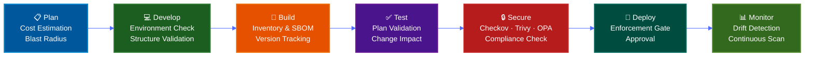

# Workflow Command

The `workflow` command in ThothCTL provides composite DevSecOps pipeline execution, orchestrating multiple commands into cohesive SDLC phases. Instead of running individual commands manually, the workflow command chains them in the correct order with enforcement gates and live progress feedback.

## Overview

The workflow command helps DevSecOps teams to:

- Execute complete SDLC phases with a single command
- Enforce security gates that block deployments on violations
- Get live progress feedback with animated spinners
- Skip phases gracefully when prerequisites are missing
- Produce consolidated results across all steps in a phase

## Subcommands

| Subcommand | Description |
|------------|-------------|
| `devsecops` | Execute DevSecOps SDLC phases (plan, develop, build, test, secure, deploy, monitor) |
| `run` | Execute a custom composable workflow defined in YAML |

## Basic Usage

```bash
# Run full DevSecOps pipeline
thothctl workflow devsecops

# Run a specific phase
thothctl workflow devsecops --phase secure

# Run with hard enforcement (exit 1 on violations)
thothctl workflow devsecops --phase secure --enforcement hard

# Run pre-deployment validation (test + secure combined)
thothctl workflow devsecops --phase pre-deploy

# Use organization policies from a Git repo
thothctl workflow devsecops --phase secure \
  --policy-dir https://github.com/myorg/iac-policies.git@main
```

## How It Works


```mermaid
%%{init: {'theme':'base', 'themeVariables': { 'primaryColor':'#3f51b5','primaryTextColor':'#ffffff','primaryBorderColor':'#303f9f','lineColor':'#536dfe','secondaryColor':'#536dfe','tertiaryColor':'#fff','background':'transparent','mainBkg':'#3f51b5','secondBkg':'#536dfe','tertiaryBkg':'#90caf9','textColor':'#ffffff','nodeTextColor':'#ffffff','fontSize':'14px'}}}%%
graph LR
    A["📋 Plan<br/>Cost Estimation<br/>Blast Radius"] --> B["💻 Develop<br/>Environment Check<br/>Structure Validation"]
    B --> C["🔨 Build<br/>Inventory & SBOM<br/>Version Tracking"]
    C --> D["✅ Test<br/>Plan Validation<br/>Change Impact"]
    D --> E["🔒 Secure<br/>Checkov · Trivy · OPA<br/>Compliance Check"]
    E --> F["🚀 Deploy<br/>Enforcement Gate<br/>Approval"]
    F --> G["📊 Monitor<br/>Drift Detection<br/>Continuous Scan"]

    classDef planStyle fill:#01579b,stroke:#0288d1,stroke-width:2px,color:#ffffff
    classDef devStyle fill:#1b5e20,stroke:#2e7d32,stroke-width:2px,color:#ffffff
    classDef buildStyle fill:#e65100,stroke:#ef6c00,stroke-width:2px,color:#ffffff
    classDef testStyle fill:#4a148c,stroke:#6a1b9a,stroke-width:2px,color:#ffffff
    classDef secureStyle fill:#b71c1c,stroke:#c62828,stroke-width:2px,color:#ffffff
    classDef deployStyle fill:#004d40,stroke:#00695c,stroke-width:2px,color:#ffffff
    classDef monitorStyle fill:#33691e,stroke:#558b2f,stroke-width:2px,color:#ffffff

    class A planStyle
    class B devStyle
    class C buildStyle
    class D testStyle
    class E secureStyle
    class F deployStyle
    class G monitorStyle
```

Each phase:

1. Shows an animated spinner while running
2. Prints immediate pass/fail/skip after completion
3. Stops the pipeline on gate failure (`--enforcement hard`)

## Workflow Run (v0.25.0)

The `run` subcommand executes a **custom composable workflow** defined in a YAML file. This enables teams to define their own multi-step pipelines with variables, failure handling, and conditional execution.

### Usage

```bash
# Run a workflow file
thothctl workflow run -f workflow.yaml

# Dry-run to preview steps without execution
thothctl workflow run -f workflow.yaml --dry-run
```

### YAML Format

Workflow files define a sequence of steps, each invoking a ThothCTL command with optional variables and failure behavior.

```yaml
# .thothcf_workflow.yaml
name: pre-merge-checks
description: Run before merging infrastructure PRs

variables:
  stacks: "{{changed_stacks}}"
  branch: "{{branch}}"
  space: "{{space}}"
  project: "{{project}}"

steps:
  - name: inventory
    command: inventory iac --check-versions
    on_failure: warn

  - name: security-scan
    command: scan iac -t checkov -t trivy --stacks {{changed_stacks}}
    on_failure: block

  - name: cost-analysis
    command: check iac -type cost-analysis --recursive
    on_failure: warn

  - name: blast-radius
    command: check iac -type blast-radius --recursive
    on_failure: block

  - name: ai-review
    command: ai-review analyze -d . -p ollama
    on_failure: skip
```

### Built-in Variables

| Variable | Description |
|----------|-------------|
| `{{changed_stacks}}` | Stacks with changes detected (from git diff) |
| `{{branch}}` | Current git branch name |
| `{{space}}` | Active ThothCTL space |
| `{{project}}` | Active ThothCTL project name |

Variables are resolved at runtime and substituted into step commands.

### Failure Handling (`on_failure`)

Each step defines how to handle failures:

| Value | Behavior |
|-------|----------|
| `block` | Stop the workflow immediately with a non-zero exit code |
| `warn` | Log a warning and continue to the next step |
| `skip` | Silently skip and continue (useful for optional steps) |

### `--dry-run` Flag

```bash
thothctl workflow run -f .thothcf_workflow.yaml --dry-run
```

Prints each step's resolved command without executing it. Useful for validating variable substitution and step order.

### CI/CD Integration

```yaml
# GitHub Actions
- name: Run pre-merge workflow
  run: thothctl workflow run -f .thothcf_workflow.yaml

# GitLab CI
script:
  - thothctl workflow run -f .thothcf_workflow.yaml
```

---

## Related

- [Workflow DevSecOps Command Reference](workflow_devsecops.md)
- [DevSecOps SDLC Use Case](../../use_cases/devsecops_sdlc.md)
- [DevSecOps Quick Start](../../use_cases/devsecops_quickstart.md)
