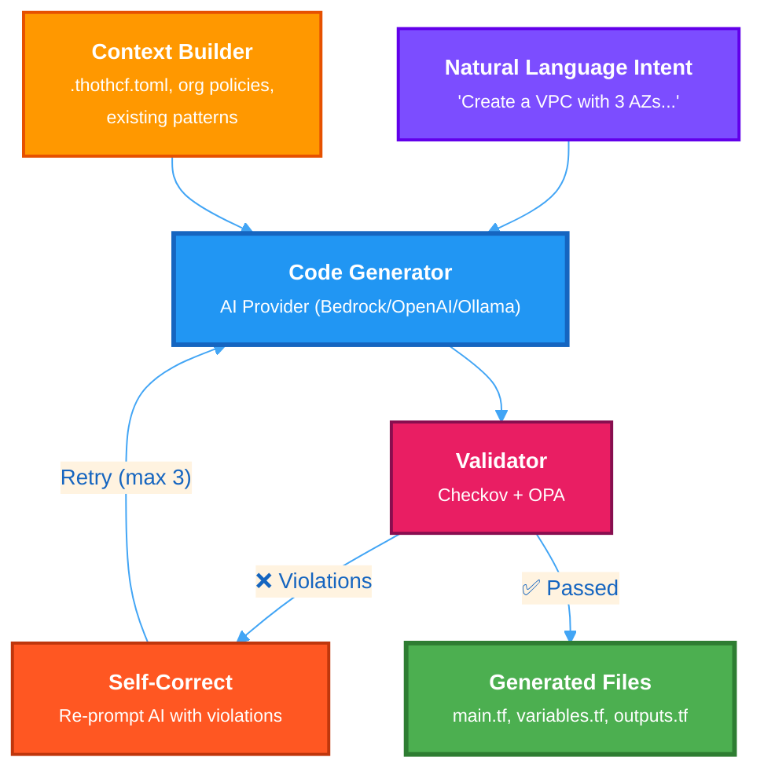
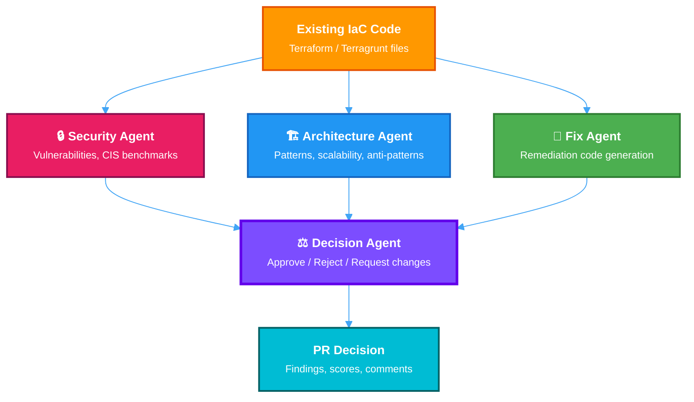
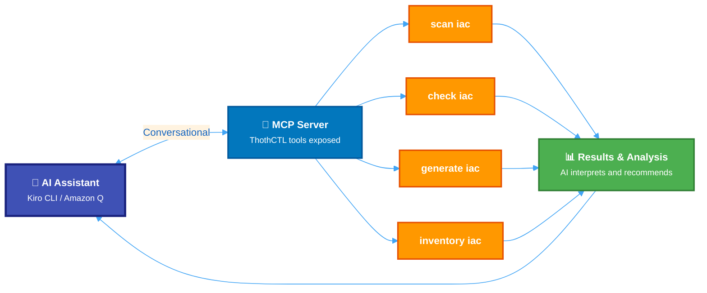
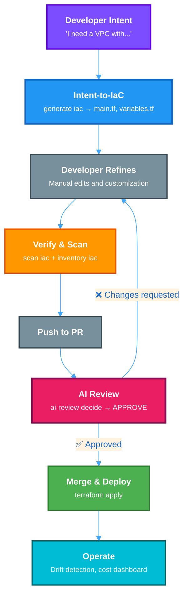

# Concepts

## AI Workflows

ThothCTL integrates AI across the infrastructure lifecycle through three distinct but complementary workflows. Understanding their differences helps you use the right tool at the right stage.

### AI SDLC (Software Development Lifecycle)

The **AI SDLC** is the overarching framework — not a single command, but the governed lifecycle that all ThothCTL features plug into. It defines *when* and *how* AI assists at each phase of infrastructure development.



```mermaid
%%{init: {'theme':'base', 'themeVariables': { 'primaryColor':'#e3f2fd','primaryTextColor':'#1565c0','primaryBorderColor':'#1976d2','lineColor':'#42a5f5','secondaryColor':'#fff3e0','tertiaryColor':'#f3e5f5','fontSize':'14px'}}}%%
graph LR
    plan["<b>Plan</b><br/><small>generate iac</small>"]:::planNode
    create["<b>Create</b><br/><small>init project</small>"]:::createNode
    verify["<b>Verify</b><br/><small>scan iac / inventory</small>"]:::verifyNode
    review["<b>Review</b><br/><small>ai-review</small>"]:::reviewNode
    deploy["<b>Deploy</b><br/><small>blast-radius</small>"]:::deployNode
    operate["<b>Operate</b><br/><small>drift / dashboard</small>"]:::operateNode

    plan -->|"Intent → Code"| create
    create -->|"Scaffold"| verify
    verify -->|"Compliance"| review
    review -->|"Approved"| deploy
    deploy -->|"Applied"| operate
    operate -->|"Feedback"| plan

    classDef planNode fill:#7c4dff,stroke:#6200ea,stroke-width:2px,color:#fff
    classDef createNode fill:#2196f3,stroke:#1565c0,stroke-width:2px,color:#fff
    classDef verifyNode fill:#ff9800,stroke:#e65100,stroke-width:2px,color:#fff
    classDef reviewNode fill:#e91e63,stroke:#880e4f,stroke-width:2px,color:#fff
    classDef deployNode fill:#4caf50,stroke:#2e7d32,stroke-width:2px,color:#fff
    classDef operateNode fill:#00bcd4,stroke:#006064,stroke-width:2px,color:#fff
```

| Phase | Command | What happens |
|-------|---------|--------------|
| Plan | `generate iac` | Natural language → governed IaC code |
| Create | `init project`, `project convert` | Scaffold, templatize, standardize |
| Verify | `scan iac`, `inventory iac` | Security scanning, SBOM, compliance |
| Review | `ai-review analyze`, `ai-review decide` | AI-powered PR gate |
| Deploy | `check iac -type blast-radius` | Risk assessment before apply |
| Operate | `check iac -type drift`, `dashboard` | Drift detection, cost tracking |

The AI SDLC is what makes ThothCTL a **platform tool** rather than a collection of scripts — it enforces organizational governance at every stage.

### Intent-to-IaC (`generate iac`)

**Role**: Creator — generates new infrastructure code from natural language.

```bash
thothctl generate iac \
  -i "VPC with 3 AZs, NAT gateway, and flow logs" \
  -p bedrock --apply
```



**Key characteristics**:

- Single code-generation agent
- Input: natural language description
- Output: `.tf` / `.hcl` files ready for `terraform plan`
- Governed by organizational rules and policies
- Validation loop ensures compliance *before* human review

### AI Review (`ai-review`)

**Role**: Reviewer — analyzes existing IaC code for security, architecture, and compliance.

```bash
thothctl ai-review analyze -d ./terraform -p bedrock
thothctl ai-review decide --pr-number 42
```



**Key characteristics**:

- Multi-agent system (4 parallel agents)
- Input: your existing IaC files
- Output: findings, risk scores, PR decisions
- Designed for CI/CD pipelines and PR gates
- Supports memory (per-repo, per-run) for contextual decisions

### AI DLC (Development Lifecycle with MCP)

**Role**: Orchestrator — connects AI assistants to ThothCTL via the Model Context Protocol.

```bash
thothctl mcp start  # Start MCP server
# Then use from Kiro CLI, Amazon Q, or any MCP-compatible assistant
```



**Key characteristics**:

- Not a standalone workflow — it's an integration layer
- Enables any MCP-compatible AI to use ThothCTL
- Combines multiple commands in a single conversational session
- Best for exploratory work and interactive troubleshooting

### How they work together



### Quick comparison

| Aspect | Intent-to-IaC | AI Review | AI DLC (MCP) |
|--------|---------------|-----------|--------------|
| Direction | Intent → Code | Code → Feedback | Bidirectional |
| Input | Natural language | Existing IaC files | Conversational |
| Output | Generated files | Findings & decisions | Mixed |
| Agents | 1 (generator) | 4 (parallel) | Depends on assistant |
| Phase | Plan/Create | Review | Any |
| Use case | Bootstrap infra | CI/CD PR gates | Interactive sessions |

---

## Environment

Define the development environment for IaC projects. For example, native OS like Debian/Linux, Windows or DevToContainers.

## Project

IaC project, could be around a use case, blueprint, starter template published in your Catalog or default setup. 

## Space

A Space is the top-level organizational unit in ThothForge. It represents an **Internal Developer Platform context** — a set of shared configuration (VCS provider, Terraform registry, orchestration tool, credentials) that all projects within that space inherit.

### Hierarchy

```
Space (IDP context)
└── Project (IaC codebase)
    └── Components (modules, stacks, templates)
```

### What a Space defines

| Configuration | Example |
|---------------|---------|
| Version control provider | GitHub, GitLab, Azure Repos |
| Terraform registry | `https://registry.terraform.io` or private |
| Orchestration tool | Terragrunt, Terramate, none |
| Credentials | PATs, tokens (encrypted per-space) |

### Storage layout

```
~/.thothcf/
├── spaces.toml          # Registry of all spaces
├── active_space         # Currently active space name
├── .thothcf.toml        # Project registry
└── spaces/
    └── <space_name>/
        ├── space.toml
        ├── credentials/
        ├── vcs/
        ├── terraform/
        └── orchestration/
```

### Active space

You can set an active space so that subsequent commands (like `init project`) automatically use it:

```bash
thothctl space activate production
thothctl init project -pn my-app  # uses "production" space
```

### Typical workflow

```bash
# 1. Create a space
thothctl init space -s production --vcs-provider github --orchestration-tool terragrunt

# 2. Activate it
thothctl space activate production

# 3. Create projects within it
thothctl init project -pn infra-networking
thothctl init project -pn infra-compute

# 4. Update space config later
thothctl space update production --terraform-registry https://private.registry.example.com

# 5. List and inspect
thothctl list spaces
thothctl check space -s production
```

