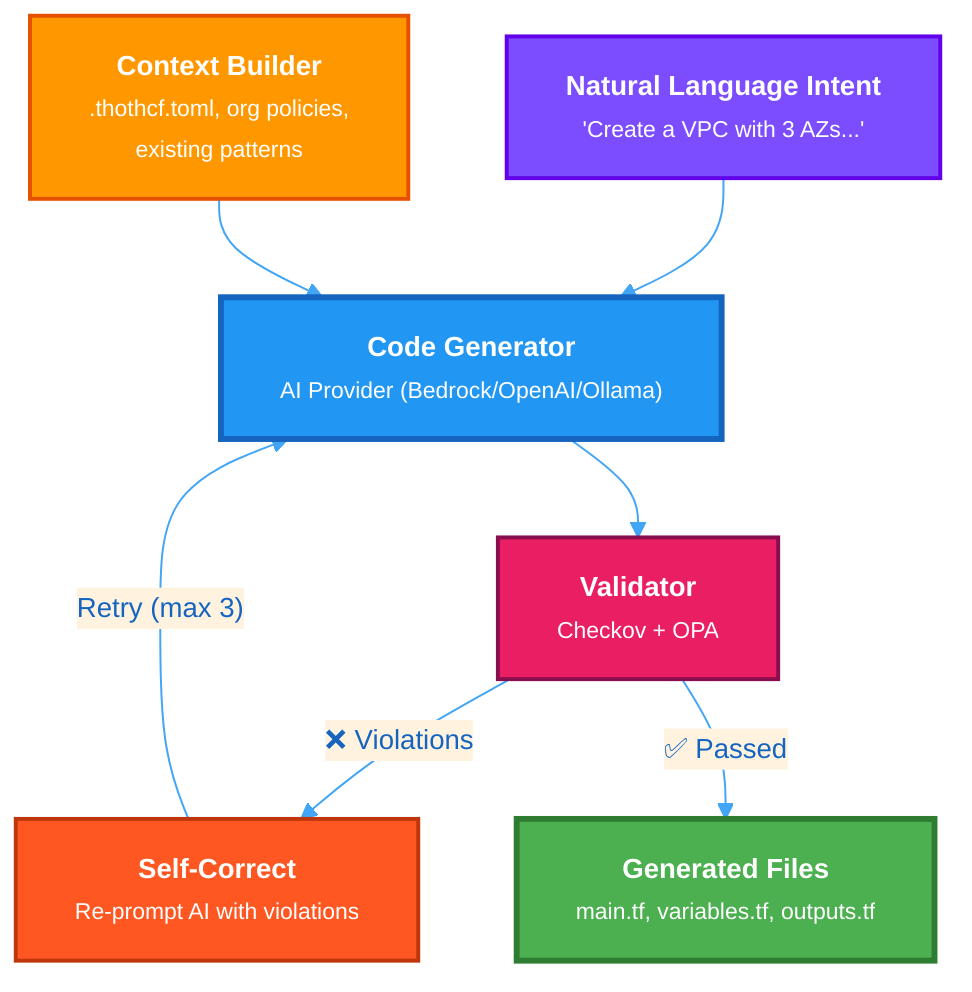
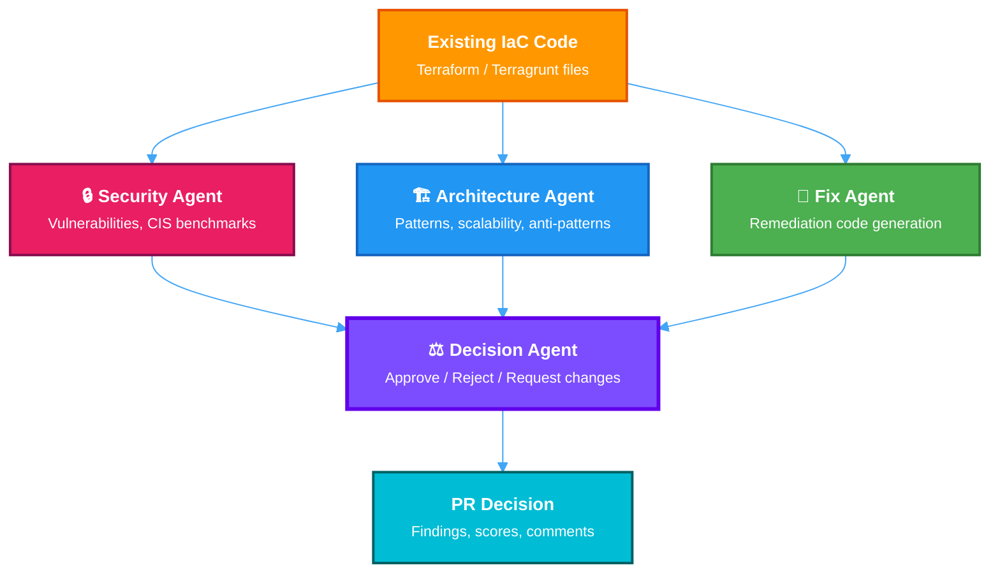
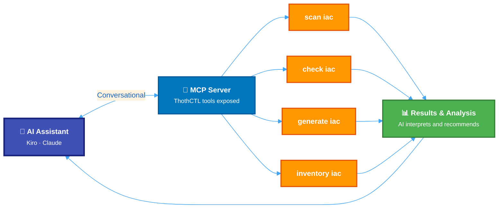
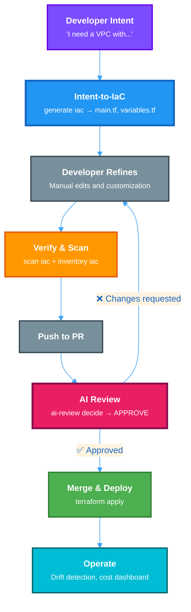
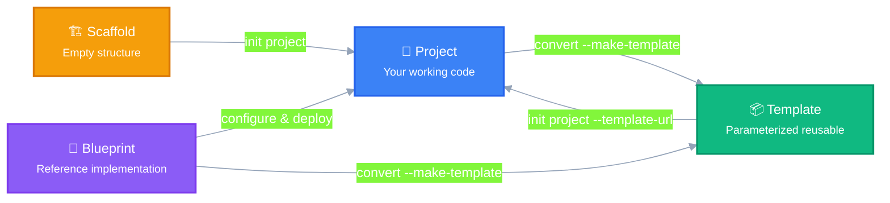

# Concepts

## AI Workflows

ThothCTL integrates AI across the infrastructure lifecycle through three distinct but complementary workflows. Understanding their differences helps you use the right tool at the right stage.

### AI SDLC (Software Development Lifecycle)

The **AI SDLC** is the overarching framework — not a single command, but the governed lifecycle that all ThothCTL features plug into. It defines *when* and *how* AI assists at each phase of infrastructure development.

> 📖 **For the complete phase-by-phase guide** (enforcement modes, CI/CD integration, configuration, and detailed examples), see the [DevSecOps SDLC Guide](use_cases/devsecops_sdlc.md).


```mermaid
%%{init: {'theme':'base', 'themeVariables': { 'primaryColor':'#e3f2fd','primaryTextColor':'#1565c0','primaryBorderColor':'#1976d2','lineColor':'#42a5f5','secondaryColor':'#fff3e0','tertiaryColor':'#f3e5f5','fontSize':'14px'}}}%%
graph LR
    plan["<b>Plan</b><br/><small>generate iac</small>"]:::planNode
    create["<b>Create</b><br/><small>init project</small>"]:::createNode
    verify["<b>Verify</b><br/><small>scan iac / inventory</small>"]:::verifyNode
    review["<b>Review</b><br/><small>ai-review</small>"]:::reviewNode
    deploy["<b>Deploy</b><br/><small>blast-radius</small>"]:::deployNode
    operate["<b>Operate</b><br/><small>drift / dashboard</small>"]:::operateNode

    plan -->|"Intent → Code"| create
    create -->|"Scaffold"| verify
    verify -->|"Compliance"| review
    review -->|"Approved"| deploy
    deploy -->|"Applied"| operate
    operate -->|"Feedback"| plan

    classDef planNode fill:#7c4dff,stroke:#6200ea,stroke-width:2px,color:#fff
    classDef createNode fill:#2196f3,stroke:#1565c0,stroke-width:2px,color:#fff
    classDef verifyNode fill:#ff9800,stroke:#e65100,stroke-width:2px,color:#fff
    classDef reviewNode fill:#e91e63,stroke:#880e4f,stroke-width:2px,color:#fff
    classDef deployNode fill:#4caf50,stroke:#2e7d32,stroke-width:2px,color:#fff
    classDef operateNode fill:#00bcd4,stroke:#006064,stroke-width:2px,color:#fff
```

| Phase | Command | What happens |
|-------|---------|--------------|
| Plan | `generate iac` | Natural language → governed IaC code |
| Create | `init project`, `project convert` | Scaffold, templatize, standardize |
| Verify | `scan iac`, `inventory iac` | Security scanning, SBOM, compliance |
| Review | `ai-review analyze`, `ai-review decide` | AI-powered PR gate |
| Deploy | `check iac -type blast-radius` | Risk assessment before apply |
| Operate | `check iac -type drift`, `dashboard` | Drift detection, cost tracking |

The AI SDLC is what makes ThothCTL a **platform tool** rather than a collection of scripts — it enforces organizational governance at every stage.

### Intent-to-IaC (`generate iac`)

**Role**: Creator — generates new infrastructure code from natural language.

```bash
thothctl generate iac \
  -i "VPC with 3 AZs, NAT gateway, and flow logs" \
  -p bedrock --apply
```


```mermaid
%%{init: {'theme':'base', 'themeVariables': { 'primaryColor':'#e3f2fd','primaryTextColor':'#1565c0','primaryBorderColor':'#1976d2','lineColor':'#42a5f5','secondaryColor':'#fff3e0','tertiaryColor':'#f3e5f5','fontSize':'14px'}}}%%
graph TD
    intent["<b>Natural Language Intent</b><br/><small>'Create a VPC with 3 AZs...'</small>"]:::inputNode
    context["<b>Context Builder</b><br/><small>.thothcf.toml, org policies,<br/>existing patterns</small>"]:::contextNode
    generate["<b>Code Generator</b><br/><small>AI Provider (Bedrock/OpenAI/Ollama)</small>"]:::aiNode
    validate["<b>Validator</b><br/><small>Checkov + OPA</small>"]:::validateNode
    fix["<b>Self-Correct</b><br/><small>Re-prompt AI with violations</small>"]:::fixNode
    output["<b>Generated Files</b><br/><small>main.tf, variables.tf, outputs.tf</small>"]:::outputNode

    intent --> generate
    context --> generate
    generate --> validate
    validate -->|"❌ Violations"| fix
    fix -->|"Retry (max 3)"| generate
    validate -->|"✅ Passed"| output

    classDef inputNode fill:#7c4dff,stroke:#6200ea,stroke-width:2px,color:#fff
    classDef contextNode fill:#ff9800,stroke:#e65100,stroke-width:2px,color:#fff
    classDef aiNode fill:#2196f3,stroke:#1565c0,stroke-width:3px,color:#fff
    classDef validateNode fill:#e91e63,stroke:#880e4f,stroke-width:2px,color:#fff
    classDef fixNode fill:#ff5722,stroke:#bf360c,stroke-width:2px,color:#fff
    classDef outputNode fill:#4caf50,stroke:#2e7d32,stroke-width:3px,color:#fff
```

**Key characteristics**:

- Single code-generation agent
- Input: natural language description
- Output: `.tf` / `.hcl` files ready for `terraform plan`
- Governed by organizational rules and policies
- Validation loop ensures compliance *before* human review

### AI Review (`ai-review`)

**Role**: Reviewer — analyzes existing IaC code for security, architecture, and compliance.

```bash
thothctl ai-review analyze -d ./terraform -p bedrock
thothctl ai-review decide --pr-number 42
```


```mermaid
%%{init: {'theme':'base', 'themeVariables': { 'primaryColor':'#e3f2fd','primaryTextColor':'#1565c0','primaryBorderColor':'#1976d2','lineColor':'#42a5f5','secondaryColor':'#fff3e0','tertiaryColor':'#f3e5f5','fontSize':'14px'}}}%%
graph TD
    code["<b>Existing IaC Code</b><br/><small>Terraform / Terragrunt files</small>"]:::inputNode
    security["<b>🔒 Security Agent</b><br/><small>Vulnerabilities, CIS benchmarks</small>"]:::securityNode
    arch["<b>🏗️ Architecture Agent</b><br/><small>Patterns, scalability, anti-patterns</small>"]:::archNode
    fix["<b>🔧 Fix Agent</b><br/><small>Remediation code generation</small>"]:::fixNode
    decision["<b>⚖️ Decision Agent</b><br/><small>Approve / Reject / Request changes</small>"]:::decisionNode
    output["<b>PR Decision</b><br/><small>Findings, scores, comments</small>"]:::outputNode

    code --> security
    code --> arch
    code --> fix
    security --> decision
    arch --> decision
    fix --> decision
    decision --> output

    classDef inputNode fill:#ff9800,stroke:#e65100,stroke-width:2px,color:#fff
    classDef securityNode fill:#e91e63,stroke:#880e4f,stroke-width:2px,color:#fff
    classDef archNode fill:#2196f3,stroke:#1565c0,stroke-width:2px,color:#fff
    classDef fixNode fill:#4caf50,stroke:#2e7d32,stroke-width:2px,color:#fff
    classDef decisionNode fill:#7c4dff,stroke:#6200ea,stroke-width:3px,color:#fff
    classDef outputNode fill:#00bcd4,stroke:#006064,stroke-width:2px,color:#fff
```

**Key characteristics**:

- Multi-agent system (4 parallel agents)
- Input: your existing IaC files
- Output: findings, risk scores, PR decisions
- Designed for CI/CD pipelines and PR gates
- Supports memory (per-repo, per-run) for contextual decisions

### AI DLC (Development Lifecycle with MCP)

**Role**: Orchestrator — connects AI assistants to ThothCTL via the Model Context Protocol.

```bash
thothctl mcp start  # Start MCP server
# Then use from Kiro CLI, Claude, or any MCP-compatible assistant
```


```mermaid
%%{init: {'theme':'base', 'themeVariables': { 'primaryColor':'#e3f2fd','primaryTextColor':'#1565c0','primaryBorderColor':'#1976d2','lineColor':'#42a5f5','secondaryColor':'#fff3e0','tertiaryColor':'#f3e5f5','fontSize':'14px'}}}%%
graph LR
    ai["<b>🤖 AI Assistant</b><br/><small>Kiro · Claude</small>"]:::aiNode
    mcp["<b>📡 MCP Server</b><br/><small>ThothCTL tools exposed</small>"]:::mcpNode
    scan["<b>scan iac</b>"]:::toolNode
    check["<b>check iac</b>"]:::toolNode
    generate["<b>generate iac</b>"]:::toolNode
    inventory["<b>inventory iac</b>"]:::toolNode
    results["<b>📊 Results & Analysis</b><br/><small>AI interprets and recommends</small>"]:::outputNode

    ai <-->|"Conversational"| mcp
    mcp --> scan
    mcp --> check
    mcp --> generate
    mcp --> inventory
    scan --> results
    check --> results
    generate --> results
    inventory --> results
    results --> ai

    classDef aiNode fill:#3f51b5,stroke:#1a237e,stroke-width:3px,color:#fff
    classDef mcpNode fill:#0277bd,stroke:#01579b,stroke-width:2px,color:#fff
    classDef toolNode fill:#ff9800,stroke:#e65100,stroke-width:2px,color:#fff
    classDef outputNode fill:#4caf50,stroke:#2e7d32,stroke-width:2px,color:#fff
```

**Key characteristics**:

- Not a standalone workflow — it's an integration layer
- Enables any MCP-compatible AI to use ThothCTL
- Combines multiple commands in a single conversational session
- Best for exploratory work and interactive troubleshooting

### How they work together


```mermaid
%%{init: {'theme':'base', 'themeVariables': { 'primaryColor':'#e3f2fd','primaryTextColor':'#1565c0','primaryBorderColor':'#1976d2','lineColor':'#42a5f5','secondaryColor':'#fff3e0','tertiaryColor':'#f3e5f5','fontSize':'14px'}}}%%
graph TD
    intent["<b>Developer Intent</b><br/><small>'I need a VPC with...'</small>"]:::startNode
    gen["<b>Intent-to-IaC</b><br/><small>generate iac → main.tf, variables.tf</small>"]:::genNode
    refine["<b>Developer Refines</b><br/><small>Manual edits and customization</small>"]:::devNode
    verify["<b>Verify & Scan</b><br/><small>scan iac + inventory iac</small>"]:::verifyNode
    pr["<b>Push to PR</b>"]:::prNode
    review["<b>AI Review</b><br/><small>ai-review decide → APPROVE</small>"]:::reviewNode
    deploy["<b>Merge & Deploy</b><br/><small>terraform apply</small>"]:::deployNode
    operate["<b>Operate</b><br/><small>Drift detection, cost dashboard</small>"]:::operateNode

    intent --> gen
    gen --> refine
    refine --> verify
    verify --> pr
    pr --> review
    review -->|"✅ Approved"| deploy
    review -->|"❌ Changes requested"| refine
    deploy --> operate

    classDef startNode fill:#7c4dff,stroke:#6200ea,stroke-width:2px,color:#fff
    classDef genNode fill:#2196f3,stroke:#1565c0,stroke-width:3px,color:#fff
    classDef devNode fill:#78909c,stroke:#37474f,stroke-width:2px,color:#fff
    classDef verifyNode fill:#ff9800,stroke:#e65100,stroke-width:2px,color:#fff
    classDef prNode fill:#78909c,stroke:#37474f,stroke-width:2px,color:#fff
    classDef reviewNode fill:#e91e63,stroke:#880e4f,stroke-width:3px,color:#fff
    classDef deployNode fill:#4caf50,stroke:#2e7d32,stroke-width:2px,color:#fff
    classDef operateNode fill:#00bcd4,stroke:#006064,stroke-width:2px,color:#fff
```

### Quick comparison

| Aspect | Intent-to-IaC | AI Review | AI DLC (MCP) |
|--------|---------------|-----------|--------------|
| Direction | Intent → Code | Code → Feedback | Bidirectional |
| Input | Natural language | Existing IaC files | Conversational |
| Output | Generated files | Findings & decisions | Mixed |
| Agents | 1 (generator) | 4 (parallel) | Depends on assistant |
| Phase | Plan/Create | Review | Any |
| Use case | Bootstrap infra | CI/CD PR gates | Interactive sessions |

---

## Environment

Define the development environment for IaC projects. For example, native OS like Debian/Linux, Windows or DevToContainers.

## Project

IaC project, could be around a use case, blueprint, starter template published in your Catalog or default setup.

## Scaffold vs Blueprint vs Template

ThothCTL distinguishes three types of reusable project artifacts. Understanding the difference is critical for proper project lifecycle management.

### Scaffold

A **scaffold** is an **empty starting structure** — folders, placeholder files, and configuration boilerplate that a team fills in with their own code. It defines *where* things go, not *what* they do.

| Property | Value |
|----------|-------|
| **Purpose** | Start a new project from scratch with correct structure |
| **Contains business logic** | ❌ No — only empty files and folder conventions |
| **Parameterized** | ✅ Template placeholders (`#{ProjectName}#`, `#{Region}#`) |
| **Requires prerequisites** | ❌ None — self-contained starting point |
| **ThothCTL command** | `thothctl init project --project-type <type>` |
| **Example** | `terraform-scaffold`, `cdk-scaffold`, `cloudformation-scaffold` |

```
terraform-scaffold/               ← SCAFFOLD: empty structure
├── .thothcf.toml                 # Project rules + naming conventions
├── .pre-commit-config.yaml
├── common/
│   ├── common.hcl                # Boilerplate (provider config)
│   └── variables.tf              # Empty variables file
├── stacks/                       # Empty — YOU add stacks here
├── modules/                      # Empty — YOU add modules here
└── README.md                     # Instructions for the team
```

**Official Scaffolds:**

| Scaffold | Use Case |
|----------|----------|
| [terraform-terragrunt-scaffold](https://github.com/thothforge/terraform_terragrunt_scaffold_project) | Multi-environment Terragrunt |
| [terraform-scaffold](https://github.com/thothforge/terraform_project_scaffold) | Standard Terraform |
| [terraform-module-scaffold](https://github.com/thothforge/terraform_module_scaffold) | Reusable modules |
| [cdk-scaffold](https://github.com/thothforge/cdk_project_scaffold) | AWS CDK v2 (TypeScript/Python) |
| [cloudformation-scaffold](https://github.com/thothforge/cloudformation_project_scaffold) | CloudFormation / SAM |

---

### Blueprint

A **blueprint** is an **opinionated, pre-configured reference implementation** for a specific use case. It contains real constructs, working stacks, tests, CI/CD, and configuration-driven deployment. Users **configure and deploy** — they don't code from scratch.

| Property | Value |
|----------|-------|
| **Purpose** | Deploy a proven architecture for a specific domain |
| **Contains business logic** | ✅ Yes — working stacks, constructs, pipelines |
| **Parameterized** | ✅ YAML-driven configuration (environments, accounts, regions) |
| **Requires prerequisites** | ✅ Often needs IAM roles, networking, or other infra to exist |
| **Has tests** | ✅ Unit tests, cdk-nag checks, snapshot tests |
| **Has CI/CD** | ✅ Complete deployment pipeline |
| **ThothCTL command** | `thothctl project convert --make-template` (to create from existing) |
| **Example** | `cdkv2-devops-agent-blueprint`, `eks-platform-blueprint` |

```
cdkv2-devops-agent-blueprint/     ← BLUEPRINT: working implementation
├── .thothcf.toml
├── lib/
│   ├── stacks/
│   │   ├── foundation/           # Real stack — KMS, S3, IAM baselines
│   │   ├── agent/                # Real stack — DevOps Agent Space
│   │   ├── platform/             # Real stack — VPC, ECS
│   │   └── application/          # Real stack — Lambda, DynamoDB
│   └── constructs/               # Reusable L2/L3 constructs
├── skills/                       # DevOps Agent skills (domain knowledge)
├── project_configs/
│   └── environment_options.yaml  # Configure accounts, regions, features
├── test/                         # cdk-nag + snapshot + unit tests
└── .github/workflows/deploy.yml  # Full CI/CD pipeline
```

**Key difference from a scaffold**: You **configure** a blueprint (edit YAML), you **code into** a scaffold (write IaC from scratch).

---

### Template

A **template** is what you get when you run `thothctl project convert --make-template` on a working project. It's a **parameterized, reusable version** of a real project — with placeholders for project-specific values.

| Property | Value |
|----------|-------|
| **Purpose** | Replicate proven patterns across teams |
| **Created from** | An existing project or blueprint |
| **Contains business logic** | ✅ Yes, but parameterized with `#{Placeholders}#` |
| **Published to** | Git registry (GitHub/GitLab), Backstage catalog |
| **ThothCTL command** | `thothctl project convert --make-template` (create) |
| | `thothctl init project --template-url <git-url>` (consume) |

**Lifecycle**: Project → `convert --make-template` → Template → `init project` → New Project

---

### Relationship Diagram


```mermaid
%%{init: {'theme':'base', 'themeVariables': { 'primaryColor':'#3b82f6','primaryTextColor':'#ffffff','lineColor':'#94a3b8','fontSize':'14px'}}}%%
graph LR
    S["🏗️ Scaffold<br/><small>Empty structure</small>"]:::scaffoldNode
    B["📐 Blueprint<br/><small>Reference implementation</small>"]:::blueprintNode
    T["📦 Template<br/><small>Parameterized reusable</small>"]:::templateNode
    P["🚀 Project<br/><small>Your working code</small>"]:::projectNode

    S -->|"init project"| P
    B -->|"configure & deploy"| P
    P -->|"convert --make-template"| T
    T -->|"init project --template-url"| P
    B -->|"convert --make-template"| T

    classDef scaffoldNode fill:#f59e0b,stroke:#d97706,stroke-width:2px,color:#fff
    classDef blueprintNode fill:#8b5cf6,stroke:#7c3aed,stroke-width:2px,color:#fff
    classDef templateNode fill:#10b981,stroke:#059669,stroke-width:2px,color:#fff
    classDef projectNode fill:#3b82f6,stroke:#2563eb,stroke-width:2px,color:#fff
```

### Quick Comparison

| | Scaffold | Blueprint | Template |
|---|---|---|---|
| **Start coding?** | ✅ Write everything | ❌ Configure YAML | ✅ Fill placeholders |
| **Has working code?** | ❌ Empty | ✅ Complete | ✅ Parameterized |
| **Domain-specific?** | ❌ Generic | ✅ Specific use case | ✅ From a real project |
| **Deploy immediately?** | ❌ Need to add code | ✅ After configuration | ✅ After init |
| **Use when** | Starting fresh | Adopting proven architecture | Replicating patterns |

## Space

A Space is the top-level organizational unit in ThothForge. It represents an **Internal Developer Platform context** — a set of shared configuration (VCS provider, Terraform registry, orchestration tool, credentials) that all projects within that space inherit.

### Hierarchy

```
Space (IDP context)
└── Project (IaC codebase)
    └── Components (modules, stacks, templates)
```

### What a Space defines

| Configuration | Example |
|---------------|---------|
| Version control provider | GitHub, GitLab, Azure Repos |
| Terraform registry | `https://registry.terraform.io` or private |
| Orchestration tool | Terragrunt, Terramate, none |
| Credentials | PATs, tokens (encrypted per-space) |

### Storage layout

```
~/.thothcf/
├── spaces.toml          # Registry of all spaces (includes per-space config)
├── active_space         # Currently active space name
├── .thothcf.toml        # Project registry
└── spaces/
    └── <space_name>/
        ├── metadata.toml          # Directory identification (name, created_at, config_source)
        ├── configs/
        │   └── scan_policy.toml   # Space-level scan policy overrides
        ├── credentials/
        ├── vcs/
        ├── terraform/
        └── orchestration/
```

> **Note**: Per-space configuration (VCS provider, registry, orchestration tool) is stored centrally in `~/.thothcf/spaces.toml` rather than in individual space directories. The `configs/` directory holds space-level policy overrides such as scan enforcement thresholds.

### Active space

You can set an active space so that subsequent commands (like `init project`) automatically use it:

```bash
thothctl space activate production
thothctl init project -pn my-app  # uses "production" space
```

### Typical workflow

```bash
# 1. Create a space
thothctl init space -s production --vcs-provider github --orchestration-tool terragrunt

# 2. Activate it
thothctl space activate production

# 3. Create projects within it
thothctl init project -pn infra-networking
thothctl init project -pn infra-compute

# 4. Update space config later
thothctl space update production --terraform-registry https://private.registry.example.com

# 5. List and inspect
thothctl list spaces
thothctl check space -s production
```

