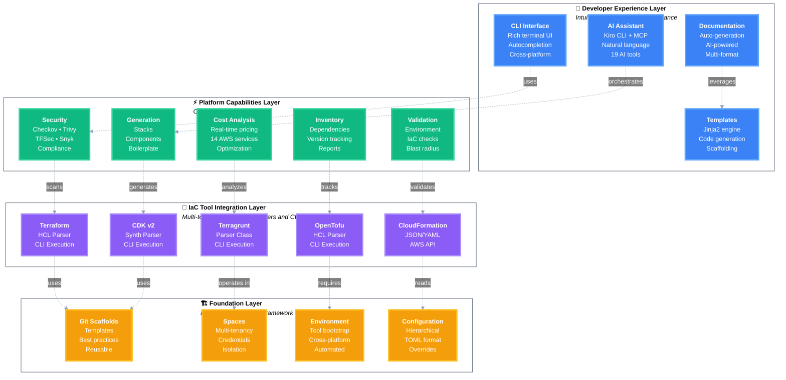

# ThothCTL Framework Architecture

> **Note**: This document provides a high-level overview of the framework architecture. For technical implementation details, see [Software Architecture](software_architecture.md).

## Overview

ThothCTL is an Internal Developer Platform (IDP) framework built on a **4-layer architecture** that enables teams to build, manage, and operate infrastructure as code with built-in best practices, security, and AI assistance.



## Framework Principles

ThothCTL aligns with IDP business objectives through five core principles:

| Principle | Mechanism | Implementation |
|-----------|-----------|----------------|
| **Minimize Mistakes** | Meaningful defaults | Templates & scaffolds |
| **Increase Velocity** | Automation | IaC scripts & workflows |
| **Improve Products** | Fill product gaps | New components & tools |
| **Enforce Compliance** | Restrict choices | Wrappers & policies |
| **Reduce Lock-in** | Abstraction | Service layers & adapters |

## Architecture Layers

### Layer 1: Foundation Layer 🏗️

**Building blocks for the framework**

| Component | Purpose | Key Features |
|-----------|---------|--------------|
| **Git Scaffolds** | Project templates | Pre-configured structures, best practices, rapid creation |
| **Spaces** | Multi-tenancy | VCS integration, credential isolation, project organization |
| **Environment** | Tool bootstrap | Automated setup, version management, cross-platform |
| **Configuration** | Settings management | Hierarchical TOML, environment overrides, secure credentials |

**Official Scaffolds:**
- [terraform-scaffold](https://github.com/thothforge/terraform_project_scaffold) - Standard Terraform projects
- [terragrunt-scaffold](https://github.com/thothforge/terragrunt_project_scaffold) - Multi-environment Terragrunt
- [terraform-module-scaffold](https://github.com/thothforge/terraform_module_scaffold) - Reusable modules

**Commands:** `thothctl init env`, `thothctl init space`, `thothctl init project`

---

### Layer 2: IaC Tool Integration Layer 🔧

**Multi-tool support through parsers and CLI wrappers**

| Tool | Parser | Execution | Status |
|------|--------|-----------|--------|
| **Terraform** | HCL Parser | CLI Wrapper | ✅ Full Support |
| **Terragrunt** | Custom Parser | CLI Wrapper | ✅ Full Support |
| **OpenTofu** | HCL Parser | CLI Wrapper | ✅ Full Support |
| **CloudFormation** | JSON/YAML | AWS API | ✅ Full Support |
| **CDK v2** | Synth Parser | CLI Wrapper | ✅ Full Support |

**Key Features:**
- Unified interface across tools
- Tool-agnostic workflows
- Version management
- Execution orchestration

**Commands:** `thothctl project iac`, `thothctl generate`

---

### Layer 3: Platform Capabilities Layer ⚡

**Core IDP functionality**

#### Security & Compliance
Multi-tool security scanning with Checkov, Trivy, TFSec, and Snyk.

**Commands:** `thothctl scan iac`, `thothctl scan iac -t checkov -t trivy -t tfsec`

📖 **Details:** [Security Scanning](commands/scan/scan_overview.md)

#### Cost Analysis
Real-time AWS cost estimation with 14 services, automated HTML/JSON reports.

**Commands:** `thothctl check iac -type cost-analysis`

📖 **Details:** [Cost Analysis](commands/check/cost-analysis.md)

#### Inventory Management
Dependency tracking, version checking, professional HTML reports.

**Commands:** `thothctl inventory iac --check-versions`

📖 **Details:** [Inventory Management](commands/inventory/inventory_overview.md)

#### Validation
Environment validation, IaC checks, blast radius analysis.

**Commands:** `thothctl check environment`, `thothctl check iac -type blast-radius`

📖 **Details:** [Validation](commands/check/check_overview.md)

#### Code Generation
Stack generation, component creation, boilerplate automation.

**Commands:** `thothctl generate`

📖 **Details:** [Code Generation](commands/generate/generate_stacks.md)

---

### Layer 4: Developer Experience Layer 🎨

**Intuitive interfaces and AI assistance**

#### CLI Interface
Rich terminal UI with autocompletion, cross-platform support, and modern UX.

**Features:**
- Click-based command structure
- Rich console output
- Shell autocompletion (bash, zsh, fish)
- Progress indicators and spinners

#### AI Assistant (Kiro CLI)
Amazon Q integration with 19 specialized tools via Model Context Protocol (MCP).

**Capabilities:**
- Natural language infrastructure queries
- Code generation and modification
- Documentation generation
- Cost analysis assistance

📖 **Details:** [AI-Powered Development](use_cases/ai_dlc.md)

#### Documentation Generation
Automated documentation with AI-powered content generation.

**Commands:** `thothctl document iac`, `thothctl document iac --ai`

📖 **Details:** [Documentation](commands/document/document_overview.md)

#### Template Engine
Jinja2-based code generation with scaffolding support.

**Features:**
- Variable substitution
- Conditional logic
- Loops and filters
- Custom functions

📖 **Details:** [Template Engine](../template_engine/template_engine.md)

---

## Use Cases

ThothCTL supports comprehensive IDP workflows:

| Use Case | Commands | Documentation |
|----------|----------|---------------|
| **Project Initialization** | `init env`, `init space`, `init project` | [Getting Started](use_cases/README.md#getting-started) |
| **Security Scanning** | `scan iac` | [Security](use_cases/README.md#security--compliance) |
| **Cost Analysis** | `check iac -type cost-analysis` | [Cost Analysis](commands/check/cost-analysis.md) |
| **Dependency Management** | `inventory iac --check-versions` | [Inventory](use_cases/README.md#dependency-management) |
| **Documentation** | `document iac --ai` | [Documentation](use_cases/README.md#documentation) |
| **AI Development** | Kiro CLI integration | [AI-DLC](use_cases/ai_dlc.md) |

📖 **Complete Use Cases:** [Use Cases Documentation](use_cases/README.md)

---

## Integration Points

### Version Control Systems
- GitHub (OAuth, Personal Access Tokens)
- GitLab (OAuth, Personal Access Tokens)
- Azure DevOps (Personal Access Tokens)

### Cloud Providers
- AWS (IAM credentials, SSO)
- Azure (Service Principal)
- GCP (Service Account)

### CI/CD Platforms
- GitHub Actions
- GitLab CI
- Azure Pipelines
- Jenkins

### AI Services
- Amazon Q (via Kiro CLI)
- Model Context Protocol (MCP)

---

## Configuration Hierarchy

```
1. Global Config      (~/.thothctl/config.toml)
2. Space Config       (.thothcf-<space>.toml)
3. Project Config     (.thothcf.toml)
4. Environment Vars   (THOTHCTL_*)
```

**Example Configuration:**
```toml
[project]
name = "my-infrastructure"
type = "terraform"

[space]
name = "lab-github"
vcs = "github"

[tools]
terraform_version = "1.6.0"
terragrunt_version = "0.54.0"
```

---

## Next Steps

- **Getting Started:** [Quick Start Guide](../quick_start.md)
- **Commands Reference:** [Commands Documentation](commands/)
- **Use Cases:** [Use Cases & Examples](use_cases/)
- **Technical Details:** [Software Architecture](software_architecture.md)
- **Template Engine:** [Template System](../template_engine/template_engine.md)
