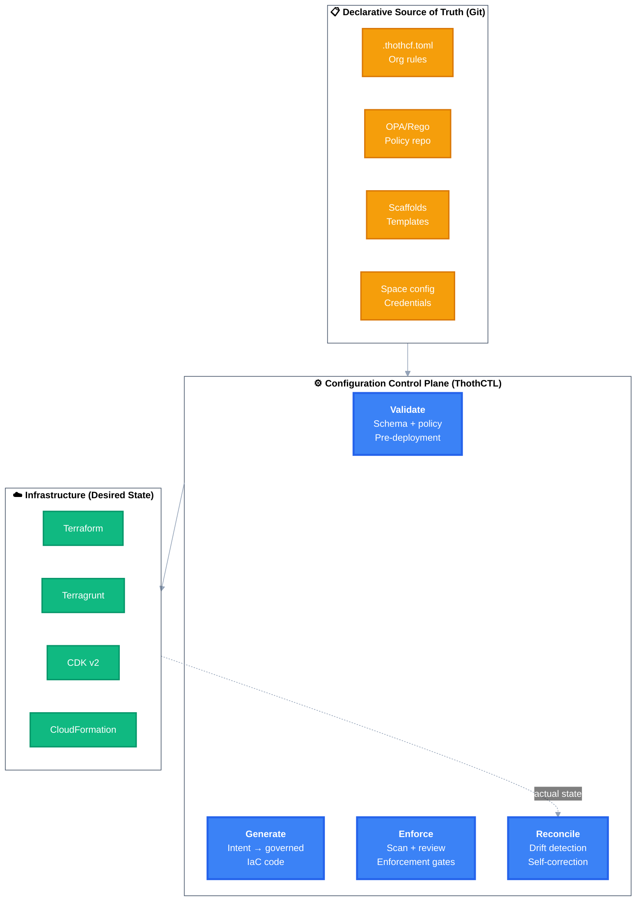
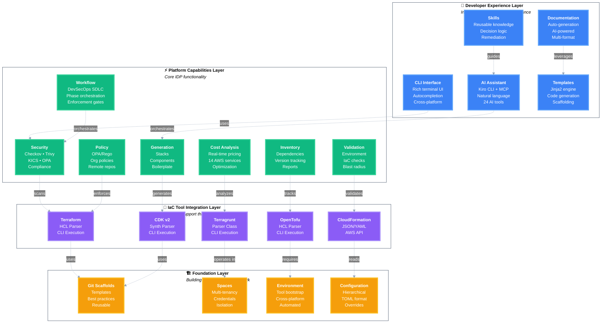

# ThothCTL Framework Architecture

> **Note**: This document provides a high-level overview of the framework architecture. For technical implementation details, see [Software Architecture](software_architecture.md).

## Overview

The **Thoth Framework** is a Configuration Control Plane for Infrastructure as Code — a system that treats IaC configuration not as static files applied at deploy time, but as a continuously validated, policy-enforced control surface distributed via Git.

**ThothCTL** is the CLI that implements this control plane. It combines a 4-layer architecture with the safety patterns that hyperscalers use for configuration management at scale: staged rollout, blast-radius containment, dependency-aware validation, and automated correction.

---

## Thoth as a Configuration Control Plane

In modern distributed systems, [configuration is a control plane operation](https://www.infoq.com/articles/configuration-control-plane/) — it directly alters system behavior and must be treated with the same rigor as production code. The Thoth Framework applies this principle to Infrastructure as Code:


```mermaid
%%{init: {'theme':'base', 'themeVariables': {
  'primaryColor':'#3b82f6',
  'primaryTextColor':'#ffffff',
  'primaryBorderColor':'#2563eb',
  'lineColor':'#94a3b8',
  'secondaryColor':'#10b981',
  'tertiaryColor':'#8b5cf6',
  'background':'transparent',
  'mainBkg':'#3b82f6',
  'secondBkg':'#10b981',
  'tertiaryBkg':'#8b5cf6',
  'clusterBkg':'rgba(241, 245, 249, 0.05)',
  'clusterBorder':'#475569',
  'titleColor':'currentColor',
  'edgeLabelBackground':'transparent',
  'nodeTextColor':'#ffffff',
  'textColor':'currentColor',
  'nodeBorder':'#1e293b',
  'fontSize':'14px'
}}}%%
graph TB
    subgraph source["<b>📋 Declarative Source of Truth (Git)</b>"]
        direction LR
        RULES[".thothcf.toml<br/>Org rules"]
        POLICY["OPA/Rego<br/>Policy repo"]
        SCAFFOLDS["Scaffolds<br/>Templates"]
        TOML["Space config<br/>Credentials"]
    end

    subgraph controlplane["<b>⚙️ Configuration Control Plane (ThothCTL)</b>"]
        direction LR
        VALIDATE["<b>Validate</b><br/>Schema + policy<br/>Pre-deployment"]
        GENERATE["<b>Generate</b><br/>Intent → governed<br/>IaC code"]
        ENFORCE["<b>Enforce</b><br/>Scan + review<br/>Enforcement gates"]
        RECONCILE["<b>Reconcile</b><br/>Drift detection<br/>Self-correction"]
    end

    subgraph targets["<b>☁️ Infrastructure (Desired State)</b>"]
        direction LR
        TF["Terraform"]
        TG["Terragrunt"]
        CDK["CDK v2"]
        CFN["CloudFormation"]
    end

    source --> controlplane
    controlplane --> targets
    targets -.->|"actual state"| RECONCILE

    classDef sourceStyle fill:#f59e0b,stroke:#d97706,stroke-width:2px,color:#fff
    classDef cpStyle fill:#3b82f6,stroke:#2563eb,stroke-width:3px,color:#fff
    classDef targetStyle fill:#10b981,stroke:#059669,stroke-width:2px,color:#fff

    class RULES,POLICY,SCAFFOLDS,TOML sourceStyle
    class VALIDATE,GENERATE,ENFORCE,RECONCILE cpStyle
    class TF,TG,CDK,CFN targetStyle
```

### Control Plane Primitives

The Thoth Framework maps directly to the industry-standard configuration safety patterns:

| Control Plane Pattern | Thoth Implementation | How It Works |
|---|---|---|
| **Declarative source of truth** | Git repos (org policies, scaffolds, `.thothcf.toml`) | All configuration rules, templates, and governance live in version-controlled Git. No ad-hoc changes. |
| **Schema validation** | `.thothcf.toml` rules + OPA/Rego | Naming conventions, required tags, security policies, and architectural constraints are validated before and during changes. |
| **Staged rollout** | `workflow devsecops` phases + enforcement gates | Changes progress through Plan → Build → Test → Secure → Deploy with hard/soft gates at each phase. |
| **Blast-radius containment** | Spaces + per-stack scoping + `--changed-only` | Spaces isolate projects with credential boundaries. Workflow scopes execution to changed stacks only. |
| **Pre-deployment validation** | `scan iac` + `check iac` + plan validation | Multi-scanner security checks, cost analysis, and `terragrunt plan` validation before any apply. |
| **Continuous reconciliation** | `check iac -type drift` + scan history | Drift detection compares live state against declared IaC. Scan history tracks compliance trends over time. |
| **Policy enforcement** | OPA/Rego evaluated at generation + scan time | Org policies enforced both when generating new code and when validating existing code. |
| **Automated rollback / correction** | Self-correction loops (generate → validate → fix → retry) | AI generates code, scanner validates, violations fed back to AI for correction (max 3 iterations). |
| **Dependency-aware impact analysis** | Blast radius (ITIL v4) + cost analysis | Changes assessed for risk score, affected resource count, and cost impact before promotion. |
| **Non-human identity & audit** | Agent governance (Phase 2.5) + memory persistence | Every AI agent action logged with identity, budget tracked, decisions auditable. |

### Git as the Configuration Plane

Unlike traditional configuration management (Chef, Puppet, Ansible) where a central server pushes state to agents, Thoth uses **Git as the distributed configuration plane**:

```
Organization Git Repos (Source of Truth)
├── org-iac-policies/              ← OPA/Rego rules (security, compliance)
├── terraform-scaffold/            ← Terraform project structure
├── terragrunt-scaffold/           ← Multi-environment Terragrunt
├── terraform-module-scaffold/     ← Reusable module patterns
├── cdk-scaffold/                  ← AWS CDK v2 (TypeScript/Python)
├── cloudformation-scaffold/       ← CloudFormation / SAM
└── per-project .thothcf.toml      ← Local overrides within org bounds

ThothCTL (Reconciler)
├── Reads org policies from Git (THOTH_ORG_POLICY env var)
├── Reads scaffolds from Git (thothforge org or custom)
├── Merges hierarchical rules (org → space → project)
├── Validates, generates, and enforces against this compiled context
└── Detects drift between declared (Git) and actual (cloud) state
```

This means:

- **No central server** — ThothCTL runs locally or in CI/CD, pulling configuration from Git on demand
- **Offline capable** — all policies cached locally after first fetch
- **Auditable** — every rule change is a Git commit with author, timestamp, and diff
- **Distributed** — teams fork and extend org policies; hierarchy resolves conflicts

### Why This Matters for Platform Engineering

Traditional IaC tools treat configuration as a static file problem: write HCL, apply, done. The control plane model recognizes that IaC configuration is **a live system** that:

1. **Changes faster than code** — a tag policy update affects all future projects immediately
2. **Propagates broadly** — one scaffolding change shapes every new project that uses it
3. **Requires governance** — ungoverned AI-generated IaC floods PRs with non-compliant code
4. **Needs continuous reconciliation** — infrastructure drifts, dependencies become stale, costs creep

Thoth addresses this by embedding safety directly into the control plane — not as external gates bolted onto CI/CD, but as intrinsic properties of how configuration is authored, validated, and applied.

---

## 4-Layer Architecture

The control plane is implemented through a layered architecture with clear separation of concerns:


```mermaid
%%{init: {'theme':'base', 'themeVariables': {
  'primaryColor':'#3b82f6',
  'primaryTextColor':'#ffffff',
  'primaryBorderColor':'#2563eb',
  'lineColor':'#94a3b8',
  'secondaryColor':'#10b981',
  'tertiaryColor':'#8b5cf6',
  'background':'transparent',
  'mainBkg':'#3b82f6',
  'secondBkg':'#10b981',
  'tertiaryBkg':'#8b5cf6',
  'clusterBkg':'rgba(241, 245, 249, 0.05)',
  'clusterBorder':'#475569',
  'titleColor':'currentColor',
  'edgeLabelBackground':'transparent',
  'nodeTextColor':'#ffffff',
  'textColor':'currentColor',
  'nodeBorder':'#1e293b',
  'fontSize':'14px'
}}}%%
graph TB
    subgraph layer4["<b>🎨 Developer Experience Layer</b><br/><i>Intuitive interfaces and AI assistance</i>"]
        direction LR
        CLI["<b>CLI Interface</b><br/>Rich terminal UI<br/>Autocompletion<br/>Cross-platform"]
        AI["<b>AI Assistant</b><br/>Kiro CLI + MCP<br/>Natural language<br/>24 AI tools"]
        SKILLS["<b>Skills</b><br/>Reusable knowledge<br/>Decision logic<br/>Remediation"]
        DOCS["<b>Documentation</b><br/>Auto-generation<br/>AI-powered<br/>Multi-format"]
        TMPL["<b>Templates</b><br/>Jinja2 engine<br/>Code generation<br/>Scaffolding"]
    end
    
    subgraph layer3["<b>⚡ Platform Capabilities Layer</b><br/><i>Core IDP functionality</i>"]
        direction LR
        SEC["<b>Security</b><br/>Checkov • Trivy<br/>KICS • OPA<br/>Compliance"]
        COST["<b>Cost Analysis</b><br/>Real-time pricing<br/>14 AWS services<br/>Optimization"]
        INV["<b>Inventory</b><br/>Dependencies<br/>Version tracking<br/>Reports"]
        VAL["<b>Validation</b><br/>Environment<br/>IaC checks<br/>Blast radius"]
        GEN["<b>Generation</b><br/>Stacks<br/>Components<br/>Boilerplate"]
        WF["<b>Workflow</b><br/>DevSecOps SDLC<br/>Phase orchestration<br/>Enforcement gates"]
        POL["<b>Policy</b><br/>OPA/Rego<br/>Org policies<br/>Remote repos"]
    end
    
    subgraph layer2["<b>🔧 IaC Tool Integration Layer</b><br/><i>Multi-tool support through parsers and CLI</i>"]
        direction LR
        TF["<b>Terraform</b><br/>HCL Parser<br/>CLI Execution"]
        TG["<b>Terragrunt</b><br/>Parser Class<br/>CLI Execution"]
        TOFU["<b>OpenTofu</b><br/>HCL Parser<br/>CLI Execution"]
        CFN["<b>CloudFormation</b><br/>JSON/YAML<br/>AWS API"]
        CDK["<b>CDK v2</b><br/>Synth Parser<br/>CLI Execution"]
    end
    
    subgraph layer1["<b>🏗️ Foundation Layer</b><br/><i>Building blocks for the framework</i>"]
        direction LR
        SCAFFOLD["<b>Git Scaffolds</b><br/>Templates<br/>Best practices<br/>Reusable"]
        SPACE["<b>Spaces</b><br/>Multi-tenancy<br/>Credentials<br/>Isolation"]
        ENV["<b>Environment</b><br/>Tool bootstrap<br/>Cross-platform<br/>Automated"]
        CONFIG["<b>Configuration</b><br/>Hierarchical<br/>TOML format<br/>Overrides"]
    end
    
    CLI -.->|uses| SEC
    AI -.->|orchestrates| GEN
    DOCS -.->|leverages| TMPL
    
    SEC -.->|scans| TF
    COST -.->|analyzes| TG
    INV -.->|tracks| TOFU
    VAL -.->|validates| CFN
    GEN -.->|generates| CDK
    WF -.->|orchestrates| SEC
    POL -.->|enforces| TF
    
    TF -.->|uses| SCAFFOLD
    TG -.->|operates in| SPACE
    TOFU -.->|requires| ENV
    CFN -.->|reads| CONFIG
    CDK -.->|uses| SCAFFOLD

    SKILLS -.->|guides| AI
    
    classDef layer4Style fill:#3b82f6,stroke:#60a5fa,stroke-width:3px,color:#fff
    classDef layer3Style fill:#10b981,stroke:#34d399,stroke-width:3px,color:#fff
    classDef layer2Style fill:#8b5cf6,stroke:#a78bfa,stroke-width:3px,color:#fff
    classDef layer1Style fill:#f59e0b,stroke:#fbbf24,stroke-width:3px,color:#fff
    
    class CLI,AI,SKILLS,DOCS,TMPL layer4Style
    class SEC,COST,INV,VAL,GEN,WF,POL layer3Style
    class TF,TG,TOFU,CFN,CDK layer2Style
    class SCAFFOLD,SPACE,ENV,CONFIG layer1Style
```

## Framework Principles

ThothCTL aligns with IDP business objectives through five core principles:

| Principle | Mechanism | Implementation |
|-----------|-----------|----------------|
| **Minimize Mistakes** | Meaningful defaults | Templates & scaffolds |
| **Increase Velocity** | Automation | IaC scripts & workflows |
| **Improve Products** | Fill product gaps | New components & tools |
| **Enforce Compliance** | Restrict choices | Wrappers & policies |
| **Reduce Lock-in** | Abstraction | Service layers & adapters |

## Architecture Layers

### Layer 1: Foundation Layer 🏗️

**Building blocks for the framework**

| Component | Purpose | Key Features |
|-----------|---------|--------------|
| **Git Scaffolds** | Project templates | Pre-configured structures, best practices, rapid creation |
| **Spaces** | Multi-tenancy | VCS integration, credential isolation, project organization |
| **Environment** | Tool bootstrap | Automated setup, version management, cross-platform |
| **Configuration** | Settings management | Hierarchical TOML, environment overrides, secure credentials |

**Official Scaffolds:**
- [terraform-scaffold](https://github.com/thothforge/terraform_project_scaffold) - Standard Terraform projects
- [terragrunt-scaffold](https://github.com/thothforge/terragrunt_project_scaffold) - Multi-environment Terragrunt
- [terraform-module-scaffold](https://github.com/thothforge/terraform_module_scaffold) - Reusable modules
- [cdk-scaffold](https://github.com/thothforge/cdk_project_scaffold) - AWS CDK v2 (TypeScript/Python)
- [cloudformation-scaffold](https://github.com/thothforge/cloudformation_project_scaffold) - CloudFormation / SAM

**Commands:** `thothctl init env`, `thothctl init space`, `thothctl init project`

---

### Layer 2: IaC Tool Integration Layer 🔧

**Multi-tool support through parsers and CLI wrappers**

| Tool | Parser | Execution | Status |
|------|--------|-----------|--------|
| **Terraform** | HCL Parser | CLI Wrapper | ✅ Full Support |
| **Terragrunt** | Custom Parser | CLI Wrapper | ✅ Full Support |
| **OpenTofu** | HCL Parser | CLI Wrapper | ✅ Full Support |
| **CloudFormation** | JSON/YAML | AWS API | ✅ Full Support |
| **CDK v2** | Synth Parser | CLI Wrapper | ✅ Full Support |

**Key Features:**
- Unified interface across tools
- Tool-agnostic workflows
- Version management
- Execution orchestration

**Commands:** `thothctl project iac`, `thothctl generate`

---

### Layer 3: Platform Capabilities Layer ⚡

**Core IDP functionality**

#### Security & Compliance
Multi-tool security scanning with Checkov, Trivy, KICS, and Snyk.


📖 **Details:** [Security Scanning](commands/scan/scan_overview.md)

#### Cost Analysis
Real-time AWS cost estimation with 14 services, automated HTML/JSON reports.

**Commands:** `thothctl check iac -type cost-analysis`

📖 **Details:** [Cost Analysis](commands/check/cost-analysis.md)

#### Inventory Management
Dependency tracking, version checking, professional HTML reports.

**Commands:** `thothctl inventory iac --check-versions`

📖 **Details:** [Inventory Management](commands/inventory/inventory_overview.md)

#### Validation
Environment validation, IaC checks, blast radius analysis.

**Commands:** `thothctl check environment`, `thothctl check iac -type blast-radius`

📖 **Details:** [Validation](commands/check/check_overview.md)

#### Code Generation
Stack generation, component creation, boilerplate automation.

**Commands:** `thothctl generate`

📖 **Details:** [Code Generation](commands/generate/generate_stacks.md)

#### Workflow Engine
Composite DevSecOps pipeline orchestration — chains multiple commands into SDLC phases with enforcement gates and live progress.

**Phases:** plan → develop → build → test → secure → deploy → monitor

**Commands:** `thothctl workflow devsecops --phase all`, `--phase secure`, `--phase pre-deploy`

📖 **Details:** [Workflow Command](commands/workflow/workflow_overview.md) | [DevSecOps SDLC](use_cases/devsecops_sdlc.md)

#### Policy as Code
Organization-level governance via OPA/Rego policies distributed from centralized Git repositories.

**Features:**
- Remote policy repos (GitHub, Azure DevOps, GitLab)
- Auto-cloning and caching
- Multi-IaC support (HCL + CloudFormation policies)
- Parameterized configs (config.yaml → data namespace)

**Commands:** `thothctl scan iac -t opa --policy-dir <git-url>`

📖 **Details:** [Policy as Code](policy_as_code.md)

---

### Layer 4: Developer Experience Layer 🎨

**Intuitive interfaces and AI assistance**

#### CLI Interface
Rich terminal UI with autocompletion, cross-platform support, and modern UX.

**Features:**
- Click-based command structure
- Rich console output
- Shell autocompletion (bash, zsh, fish)
- Progress indicators and spinners

#### AI Assistant (Kiro CLI)
Amazon Q integration with 19 specialized tools via Model Context Protocol (MCP).

**Capabilities:**
- Natural language infrastructure queries
- Code generation and modification
- Documentation generation
- Cost analysis assistance
- DevSecOps workflow orchestration via `thothctl_workflow_devsecops` MCP tool

📖 **Details:** [AI-Powered Development](use_cases/ai_dlc.md)

#### Skills System
Reusable knowledge packages (`.kiro/skills/`) that teach AI agents domain-specific procedures, decision logic, and remediation patterns.

**Bundled Skills:**
- `devsecops` — DevSecOps SDLC orchestration, intent routing, remediation patterns
- `terraform-skill` — Terraform/Terragrunt patterns, module design, state management
- `iac-versioning-commits` — Conventional commits and versioning for IaC

**Structure:**
```
.kiro/skills/<skill-name>/
├── SKILL.md              # Decision logic, procedures, response patterns
└── references/           # Domain knowledge (commands, fixes, templates)
```

**Distribution:** Skills are included in scaffold templates and distributed to new projects automatically.

📖 **Details:** [DevSecOps Skill](https://github.com/thothforge/thothctl-devsecops-skill)

#### Documentation Generation
Automated documentation with AI-powered content generation.

**Commands:** `thothctl document iac`, `thothctl document iac --ai`

📖 **Details:** [Documentation](commands/document/document_overview.md)

#### Template Engine
Jinja2-based code generation with scaffolding support.

**Features:**
- Variable substitution
- Conditional logic
- Loops and filters
- Custom functions

📖 **Details:** [Template Engine](../template_engine/template_engine.md)

---

## Use Cases

ThothCTL supports comprehensive IDP workflows:

| Use Case | Commands | Documentation |
|----------|----------|---------------|
| **Project Initialization** | `init env`, `init space`, `init project` | [Getting Started](use_cases/README.md) |
| **DevSecOps Pipeline** | `workflow devsecops --phase all` | [DevSecOps SDLC](use_cases/devsecops_sdlc.md) |
| **Security Scanning** | `scan iac -t checkov -t trivy -t opa` | [Security](commands/scan/scan_overview.md) |
| **Policy Enforcement** | `scan iac -t opa --policy-dir <url>` | [Policy as Code](policy_as_code.md) |
| **Cost Analysis** | `check iac -type cost-analysis` | [Cost Analysis](commands/check/cost-analysis.md) |
| **Dependency Management** | `inventory iac --check-versions` | [Inventory](commands/inventory/inventory_overview.md) |
| **Drift Detection** | `check iac -type drift` | [Check Command](commands/check/check_overview.md) |
| **Documentation** | `document iac --ai` | [Documentation](commands/document/document_overview.md) |
| **AI Development** | Kiro CLI + MCP + Skills | [AI-DLC](use_cases/ai_dlc.md) |
| **Observability** | `dashboard launch` | [Dashboard](commands/dashboard/dashboard_overview.md) |

📖 **Complete Use Cases:** [Use Cases Documentation](use_cases/README.md)

---

## Integration Points

### Version Control Systems
- GitHub (OAuth, Personal Access Tokens)
- GitLab (OAuth, Personal Access Tokens)
- Azure DevOps (Personal Access Tokens)

### Cloud Providers
- AWS (IAM credentials, SSO)
- Azure (Service Principal)
- GCP (Service Account)

### CI/CD Platforms
- GitHub Actions
- GitLab CI
- Azure Pipelines
- Jenkins

### AI Services
- Amazon Q (via Kiro CLI)
- Model Context Protocol (MCP)

---

## Configuration Hierarchy

```
1. Global Config      (~/.thothctl/config.toml)
2. Space Config       (.thothcf-<space>.toml)
3. Project Config     (.thothcf.toml)
4. Environment Vars   (THOTHCTL_*)
```

**Example Configuration:**
```toml
[project]
name = "my-infrastructure"
type = "terraform"

[space]
name = "lab-github"
vcs = "github"

[tools]
terraform_version = "1.6.0"
terragrunt_version = "0.54.0"
```

---

## Next Steps

- **Getting Started:** [Quick Start Guide](../quick_start.md)
- **Commands Reference:** [Commands Documentation](commands/)
- **Use Cases:** [Use Cases & Examples](use_cases/)
- **Technical Details:** [Software Architecture](software_architecture.md)
- **Template Engine:** [Template System](../template_engine/template_engine.md)
