# ThothCTL Framework Architecture

This document describes the **conceptual architecture** of ThothCTL as an Internal Developer Platform (IDP) framework. For technical implementation details, see [Software Architecture](software_architecture.md).

## Framework Overview

ThothCTL is built on a **4-layer framework architecture** that enables teams to build, manage, and operate infrastructure as code with built-in best practices, security, and AI assistance.

```mermaid
%%{init: {'theme':'base', 'themeVariables': {
  'primaryColor':'#3b82f6',
  'primaryTextColor':'#ffffff',
  'primaryBorderColor':'#2563eb',
  'lineColor':'#94a3b8',
  'secondaryColor':'#10b981',
  'tertiaryColor':'#8b5cf6',
  'background':'transparent',
  'mainBkg':'#3b82f6',
  'secondBkg':'#10b981',
  'tertiaryBkg':'#8b5cf6',
  'clusterBkg':'rgba(241, 245, 249, 0.05)',
  'clusterBorder':'#475569',
  'titleColor':'currentColor',
  'edgeLabelBackground':'transparent',
  'nodeTextColor':'#ffffff',
  'textColor':'currentColor',
  'nodeBorder':'#1e293b',
  'fontSize':'14px'
}}}%%
graph TB
    subgraph layer4["<b>🎨 Developer Experience Layer</b><br/><i>Intuitive interfaces and AI assistance</i>"]
        direction LR
        CLI["<b>CLI Interface</b><br/>Rich terminal UI<br/>Autocompletion<br/>Cross-platform"]
        AI["<b>AI Assistant</b><br/>Kiro CLI + MCP<br/>Natural language<br/>19 AI tools"]
        DOCS["<b>Documentation</b><br/>Auto-generation<br/>AI-powered<br/>Multi-format"]
        TMPL["<b>Templates</b><br/>Jinja2 engine<br/>Code generation<br/>Scaffolding"]
    end
    
    subgraph layer3["<b>⚡ Platform Capabilities Layer</b><br/><i>Core IDP functionality</i>"]
        direction LR
        SEC["<b>Security</b><br/>Checkov • Trivy<br/>TFSec • Snyk<br/>Compliance"]
        COST["<b>Cost Analysis</b><br/>Real-time pricing<br/>12+ AWS services<br/>Optimization"]
        INV["<b>Inventory</b><br/>Dependencies<br/>Version tracking<br/>Reports"]
        VAL["<b>Validation</b><br/>Environment<br/>IaC checks<br/>Blast radius"]
        GEN["<b>Generation</b><br/>Stacks<br/>Components<br/>Boilerplate"]
    end
    
    subgraph layer2["<b>🔧 IaC Tool Integration Layer</b><br/><i>Multi-tool support through parsers and CLI</i>"]
        direction LR
        TF["<b>Terraform</b><br/>HCL Parser<br/>CLI Execution"]
        TG["<b>Terragrunt</b><br/>Parser Class<br/>CLI Execution"]
        TOFU["<b>OpenTofu</b><br/>HCL Parser<br/>CLI Execution"]
        CFN["<b>CloudFormation</b><br/>JSON/YAML<br/>AWS API"]
        CDK["<b>CDK v2</b><br/>Synth Parser<br/>CLI Execution"]
    end
    
    subgraph layer1["<b>🏗️ Foundation Layer</b><br/><i>Building blocks for the framework</i>"]
        direction LR
        SCAFFOLD["<b>Git Scaffolds</b><br/>Templates<br/>Best practices<br/>Reusable"]
        SPACE["<b>Spaces</b><br/>Multi-tenancy<br/>Credentials<br/>Isolation"]
        ENV["<b>Environment</b><br/>Tool bootstrap<br/>Cross-platform<br/>Automated"]
        CONFIG["<b>Configuration</b><br/>Hierarchical<br/>TOML format<br/>Overrides"]
    end
    
    CLI -.->|uses| SEC
    AI -.->|orchestrates| GEN
    DOCS -.->|leverages| TMPL
    
    SEC -.->|scans| TF
    COST -.->|analyzes| TG
    INV -.->|tracks| TOFU
    VAL -.->|validates| CFN
    GEN -.->|generates| CDK
    
    TF -.->|uses| SCAFFOLD
    TG -.->|operates in| SPACE
    TOFU -.->|requires| ENV
    CFN -.->|reads| CONFIG
    CDK -.->|uses| SCAFFOLD
    
    classDef layer4Style fill:#3b82f6,stroke:#60a5fa,stroke-width:3px,color:#fff
    classDef layer3Style fill:#10b981,stroke:#34d399,stroke-width:3px,color:#fff
    classDef layer2Style fill:#8b5cf6,stroke:#a78bfa,stroke-width:3px,color:#fff
    classDef layer1Style fill:#f59e0b,stroke:#fbbf24,stroke-width:3px,color:#fff
    
    class CLI,AI,DOCS,TMPL layer4Style
    class SEC,COST,INV,VAL,GEN layer3Style
    class TF,TG,TOFU,CFN,CDK layer2Style
    class SCAFFOLD,SPACE,ENV,CONFIG layer1Style
```



## Framework Principles

ThothCTL is designed around five core principles aligned with IDP business objectives:

| Principle | Mechanism | Implementation |
|-----------|-----------|----------------|
| **Minimize Mistakes** | Meaningful defaults | Templates & scaffolds |
| **Increase Velocity** | Automation | IaC scripts & workflows |
| **Improve Products** | Fill product gaps | New components & tools |
| **Enforce Compliance** | Restrict choices | Wrappers & policies |
| **Reduce Lock-in** | Abstraction | Service layers & adapters |

## Layer 1: Foundation Layer

The foundation layer provides the building blocks for the entire framework.

### Git Scaffolds (Templates)

Pre-configured project templates stored in Git repositories.

**Purpose:**

- Standardize project structure
- Encode best practices
- Enable rapid project creation
- Share knowledge across teams

**Official Scaffolds:**

- [terraform-scaffold](https://github.com/thothforge/terraform_project_scaffold) - Standard Terraform projects
- [terragrunt-scaffold](https://github.com/thothforge/terragrunt_project_scaffold) - Multi-environment Terragrunt
- [terraform-module-scaffold](https://github.com/thothforge/terraform_module_scaffold) - Reusable Terraform modules
- [tofu-scaffold](https://github.com/thothforge/terraform_project_scaffold) - OpenTofu projects

**Scaffold Structure:**
```
scaffold-project/
├── .kiro/                  # AI integration config
├── common/                 # Shared configurations
├── environments/           # Environment-specific (dev, staging, prod)
├── stacks/                 # Infrastructure components
├── docs/                   # Documentation
└── root.hcl               # Root configuration
```

**Usage:**
```bash
# Create project from scaffold
thothctl init project --project-name my-infra --reuse --space lab-github
```

### Spaces (Multi-tenancy)

Logical boundaries for organizing projects and credentials.

**Purpose:**
- Separate concerns (dev/prod, teams, customers)
- Isolate credentials and configurations
- Enable multi-tenancy
- Organize projects by context

**Space Components:**

- **VCS Integration**: GitHub, GitLab, Azure DevOps credentials
- **Cloud Credentials**: AWS, Azure, GCP access
- **Configuration**: Space-specific settings
- **Projects**: Multiple projects within the space

**Example Spaces:**
```
Organization
├── lab-github          # Development/testing space
│   ├── Project A
│   └── Project B
├── prod-gitlab         # Production space
│   ├── Project C
│   └── Project D
└── team-azure          # Team-specific space
    └── Project E
```

**Usage:**
```bash
# Create a space
thothctl init space --space-name lab-github

# List spaces
thothctl list spaces

# Work within a space
thothctl init project --space lab-github
```

### Environment Bootstrap

Automated setup of development environments with all required tools.

**Purpose:**
- Eliminate "works on my machine" problems
- Standardize tooling across teams
- Reduce onboarding time
- Ensure version consistency

**Installed Tools:**

| Category | Tools |
|----------|-------|
| **Infrastructure** | Terraform, Terragrunt, OpenTofu, TFSwitch |
| **Security** | Checkov, Trivy, TFSec, Snyk |
| **Development** | Pre-commit, Commitizen, TFLint, UV, Pipx |
| **Documentation** | Terraform-docs, Terramate |
| **AI** | Kiro CLI (Amazon Q) |

**Supported Environments:**
- Native OS (Linux, macOS, Windows)
- WSL (Windows Subsystem for Linux)
- DevContainers

**Usage:**
```bash
# Bootstrap complete environment
thothctl init env
```

### Configuration Management

Hierarchical configuration system with environment-based overrides.

**Purpose:**
- Centralize configuration
- Enable environment-specific settings
- Support configuration inheritance
- Secure credential management

**Configuration Hierarchy:**
```
1. Global Config      (~/.thothctl/config.toml)
2. Space Config       (.thothcf-<space>.toml)
3. Project Config     (.thothcf.toml)
4. Environment Vars   (THOTHCTL_*)
```

**Configuration Format (TOML):**
```toml
[project]
name = "my-infrastructure"
type = "terraform"

[space]
name = "lab-github"
vcs = "github"

[tools]
terraform_version = "1.6.0"
terragrunt_version = "0.54.0"
```

thothctl scan iac --path ./terraform

# Compliance review
thothctl scan iac --compliance --policies ./policies
```

### Cost Analysis

Real-time AWS cost estimation and optimization.

**Capabilities:**
- **Real-time Pricing**: AWS Pricing API integration
- **12+ AWS Services**: EC2, RDS, S3, Lambda, EKS, Bedrock, etc.
- **Cost Breakdown**: Service-by-service analysis
- **Optimization**: Cost-saving recommendations
- **Projections**: Monthly and annual estimates

**Cost Analysis Features:**
- Pre-deployment cost estimation
- Cost comparison (current vs. planned)
- Budget alerts
- Cost optimization suggestions

**Usage:**
```bash
# Analyze costs from Terraform plan
thothctl check iac --type cost-analysis --recursive
```

### Inventory & Dependencies

Track and manage IaC dependencies and versions.

**Capabilities:**
- **Module Discovery**: Find all Terraform modules
- **Provider Tracking**: Track provider versions
- **Version Checking**: Compare with latest versions
- **Dependency Graph**: Visualize dependencies
- **Professional Reports**: Modern HTML reports

**Inventory Features:**
- Recursive directory scanning
- Version comparison
- Outdated dependency detection
- Registry integration
- Export to JSON/HTML

**Usage:**
```bash
# Create inventory with version checking
thothctl inventory iac --check-versions --recursive
```

### Validation & Testing

Comprehensive validation and testing capabilities.

**Validation Types:**
- **Environment Validation**: Tool versions, dependencies
- **IaC Validation**: Syntax, configuration, best practices
- **Blast Radius Assessment**: ITIL v4 change impact analysis
- **Plan Validation**: Terraform plan analysis

**Blast Radius Assessment:**
- Resource change impact
- Risk categorization (Low, Medium, High, Critical)
- ITIL v4 change management alignment
- Impact visualization

**Usage:**
```bash
# Validate environment
thothctl check environment

# Validate IaC
thothctl check iac --path ./terraform

# Assess blast radius
thothctl check iac --type blast-radius
```

### Code Generation

Template-based code generation and scaffolding.

**Capabilities:**
- **Template Engine**: Jinja2-based templates
- **Component Generation**: Generate IaC components
- **Stack Generation**: Create complete stacks
- **Boilerplate**: Reduce repetitive code
- **Custom Templates**: Organization-specific templates

**Generation Features:**
- Variable substitution
- Conditional logic
- Loops and iterations
- Custom filters
- Template inheritance

**Usage:**
```bash
# Generate stack
thothctl generate stacks --name networking

# Generate component
thothctl generate components --type vpc
```

## Layer 4: Developer Experience Layer

The experience layer provides intuitive interfaces and AI assistance.

### CLI Interface

Modern, user-friendly command-line interface.

**Features:**
- **Intuitive Commands**: Clear, consistent command structure
- **Rich Output**: Tables, progress bars, syntax highlighting
- **Autocompletion**: Shell integration (Bash, Zsh, Fish, PowerShell)
- **Help System**: Comprehensive help documentation
- **Cross-Platform**: Linux, macOS, Windows support

**Command Categories:**
- `init`: Bootstrap and initialize
- `check`: Validate and analyze
- `scan`: Security and compliance
- `document`: Generate documentation
- `inventory`: Track dependencies
- `project`: Manage projects
- `generate`: Code generation
- `list`: Query resources
- `remove`: Cleanup
- `mcp`: AI integration
- `upgrade`: Self-update

### AI Assistant (Kiro CLI + MCP)

AI-powered development assistance through Model Context Protocol.

**Integration:**
- **Kiro CLI**: Amazon Q developer assistant
- **MCP Server**: 19 ThothCTL tools exposed to AI
- **Natural Language**: Interact with IaC using plain English
- **Context-Aware**: AI understands project context

**AI Capabilities:**
- Execute ThothCTL commands via natural language
- Analyze scan results and suggest fixes
- Generate documentation
- Review IaC changes
- Troubleshoot issues
- Optimize configurations

**Workflow Options:**

**Option 1: AI Orchestration**
```
User → Kiro CLI → MCP Server → ThothCTL → Results → AI Analysis
```

**Option 2: Manual + AI Analysis**
```
User → ThothCTL → Results → Kiro CLI → AI Analysis
```

**Usage:**
```bash
# Start MCP server
thothctl mcp server

# Use with Kiro CLI
kiro-cli chat --agent thoth

# Example conversation
User: "Scan my Terraform code for security issues"
AI: [Executes thothctl scan iac, analyzes results, suggests fixes]
```

[Learn more →](use_cases/ai_dlc.md)

### Documentation Generation

Automated documentation generation with AI support.

**Capabilities:**
- **Auto-generation**: Terraform-docs integration
- **AI-powered**: Generative AI documentation
- **Template-based**: Custom documentation templates
- **Multi-format**: Markdown, HTML, PDF
- **Living Documentation**: Keep docs in sync with code

**Documentation Types:**
- Module documentation
- Architecture diagrams
- Runbooks
- API documentation
- Change logs

**Usage:**
```bash
# Generate Terraform documentation
thothctl document iac --path ./terraform

# AI-powered documentation
thothctl document iac --ai --path ./terraform
```

### Template System

Flexible template system for code generation and scaffolding.

**Capabilities:**
- **Jinja2 Templates**: Full template language support
- **Variable Substitution**: Dynamic content
- **Conditional Logic**: If/else statements
- **Loops**: Iterate over collections
- **Custom Filters**: Transform data
- **Template Inheritance**: Reuse templates

**Template Use Cases:**
- Project scaffolding
- Component generation
- Documentation templates
- Configuration templates
- CI/CD pipeline templates

[Learn more →](../template_engine/template_engine.md)

## Framework Workflows

### Complete IDP Workflow

```mermaid
%%{init: {'theme':'base', 'themeVariables': {
  'primaryColor':'#3b82f6',
  'primaryTextColor':'#ffffff',
  'primaryBorderColor':'#2563eb',
  'lineColor':'#94a3b8',
  'secondaryColor':'#10b981',
  'tertiaryColor':'#8b5cf6',
  'background':'transparent',
  'mainBkg':'#3b82f6',
  'clusterBkg':'rgba(241, 245, 249, 0.05)',
  'clusterBorder':'#475569',
  'edgeLabelBackground':'transparent',
  'nodeTextColor':'#ffffff',
  'textColor':'currentColor'
}}}%%
graph TD
    START([👤 Developer Starts])
    
    STEP1[1️⃣ Bootstrap Environment<br/><code>thothctl init env</code>]
    STEP2[2️⃣ Create Space<br/><code>thothctl init space --space-name lab-github</code>]
    STEP3[3️⃣ Create Project from Scaffold<br/><code>thothctl init project --reuse --space lab-github</code>]
    STEP4[4️⃣ Develop Infrastructure<br/>Edit Terraform/Terragrunt files]
    STEP5A[5️⃣ Validate & Check<br/><code>thothctl check iac</code>]
    STEP5B[💰 Cost Analysis<br/><code>thothctl check iac --type cost-analysis</code>]
    STEP5C[💥 Blast Radius<br/><code>thothctl check iac --type blast-radius</code>]
    STEP6[6️⃣ Security Scan<br/><code>thothctl scan iac --path ./terraform</code>]
    
    DECISION{Issues Found?}
    
    STEP7[7️⃣ Generate Documentation<br/><code>thothctl document iac --ai</code>]
    STEP8[8️⃣ Track Dependencies<br/><code>thothctl inventory iac --check-versions</code>]
    STEP9[9️⃣ Deploy<br/>via CI/CD or manual]
    STEP10[🔟 Monitor & Iterate<br/>Observability & Feedback]
    
    END([✅ Complete])
    
    START --> STEP1
    STEP1 --> STEP2
    STEP2 --> STEP3
    STEP3 --> STEP4
    STEP4 --> STEP5A
    STEP5A --> STEP5B
    STEP5B --> STEP5C
    STEP5C --> STEP6
    STEP6 --> DECISION
    DECISION -->|Yes| STEP4
    DECISION -->|No| STEP7
    STEP7 --> STEP8
    STEP8 --> STEP9
    STEP9 --> STEP10
    STEP10 --> END
    
    classDef startEnd fill:#10b981,stroke:#059669,stroke-width:3px,color:#fff
    classDef stepStyle fill:#3b82f6,stroke:#2563eb,stroke-width:2px,color:#fff
    classDef decisionStyle fill:#f59e0b,stroke:#d97706,stroke-width:2px,color:#fff
    
    class START,END startEnd
    class STEP1,STEP2,STEP3,STEP4,STEP5A,STEP5B,STEP5C,STEP6,STEP7,STEP8,STEP9,STEP10 stepStyle
    class DECISION decisionStyle
```


```

### DevSecOps SDLC Integration

ThothCTL integrates into the 8-phase DevSecOps lifecycle:

1. **Plan**: Cost analysis, blast radius assessment
2. **Develop**: Template-based development, AI assistance
3. **Build**: Validation, dependency tracking
4. **Test**: Security scanning, compliance testing
5. **Release**: Documentation generation, approval gates
6. **Deploy**: Infrastructure provisioning
7. **Operate**: Monitoring, maintenance
8. **Monitor**: Observability, feedback loops

[Learn more →](use_cases/devsecops_sdlc.md)

## Framework Benefits

### For Developers

- **Faster Onboarding**: Bootstrap environment in minutes
- **Reduced Errors**: Templates with best practices
- **AI Assistance**: Natural language IaC operations
- **Self-Service**: Create projects without waiting
- **Consistent Experience**: Same tools, same workflows

### For Platform Teams

- **Standardization**: Enforce organizational standards
- **Governance**: Built-in compliance and security
- **Visibility**: Inventory and dependency tracking
- **Scalability**: Multi-tenancy with spaces
- **Extensibility**: Plugin architecture

### For Security Teams

- **Shift-Left Security**: Scan before deployment
- **Compliance**: Automated policy enforcement
- **Visibility**: Security dashboards and reports
- **Risk Assessment**: Blast radius analysis
- **Audit Trail**: Complete change history

### For Management

- **Cost Control**: Pre-deployment cost analysis
- **Risk Management**: Change impact assessment
- **Velocity**: Faster time to market
- **Quality**: Reduced production incidents
- **Compliance**: Regulatory adherence

## Extension Points

The framework is designed for extensibility:

### Custom Scaffolds

Create organization-specific templates:
```bash
# Use custom scaffold
thothctl init project --template https://github.com/myorg/custom-scaffold
```

### Custom Scanners

Add proprietary security scanners:
```python
# Implement scanner interface
class CustomScanner(IScanner):
    def scan(self, path: Path) -> ScanResults:
        # Custom scanning logic
```

### Custom Policies

Define organization-specific compliance policies:
```gherkin
# Terraform-compliance policy
Feature: Security Groups
  Scenario: No unrestricted ingress
    Given I have aws_security_group defined
    Then it must not have ingress.cidr_blocks containing "0.0.0.0/0"
```

### Custom Integrations

Integrate with proprietary tools:
```python
# Custom VCS adapter
class CustomVCS(IVCSAdapter):
    def create_repository(self, name: str) -> Repository:
        # Custom VCS integration
```

## Best Practices

### Project Organization

```
organization/
├── scaffolds/              # Template repositories
│   ├── terraform-aws/
│   ├── terragrunt-multi-env/
│   └── custom-templates/
├── spaces/                 # Space configurations
│   ├── lab-github/
│   ├── prod-gitlab/
│   └── team-azure/
└── docs/                   # Documentation
    ├── runbooks/
    └── architecture/
```

### Configuration Management

- **Use Spaces**: Separate dev/prod, teams, customers
- **Secure Credentials**: Never commit credentials
- **Version Control**: Track configuration changes
- **Document Settings**: Explain custom configurations

### Security & Compliance

- **Scan Early**: Shift-left security
- **Automate Scanning**: CI/CD integration
- **Review Results**: Don't ignore warnings
- **Fix High-Severity**: Prioritize critical issues
- **Maintain Policies**: Keep compliance rules updated

### Cost Management

- **Analyze Before Deploy**: Use cost analysis
- **Set Budgets**: Define cost thresholds
- **Review Regularly**: Monitor actual costs
- **Optimize**: Act on recommendations
- **Tag Resources**: Enable cost allocation

## Next Steps

- **[Quick Start Guide](../quick_start.md)**: Get started in 5 minutes
- **[Software Architecture](software_architecture.md)**: Technical implementation details
- **[Use Cases](use_cases/)**: Real-world scenarios
- **[Command Reference](commands/)**: Complete command documentation
- **[Concepts](concepts.md)**: Core concepts explained
## Layer 2: IaC Tool Integration Layer

The integration layer provides direct support for multiple IaC tools through specialized parsers and CLI execution.

### Purpose

- **Multi-Tool Support**: Work with Terraform, Terragrunt, OpenTofu, CloudFormation, CDK
- **Direct Integration**: Native support through parsers and tool execution  
- **Unified Commands**: Same ThothCTL commands work across different IaC tools
- **Auto-Detection**: Automatically detect and handle different IaC formats

### Supported IaC Tools

| Tool | Detection | Implementation |
|------|-----------|----------------|
| **Terraform** | `*.tf` files | HCL parser + Terraform CLI |
| **Terragrunt** | `terragrunt.hcl` | TerragruntParser class |
| **OpenTofu** | `*.tf` files | HCL parser + Tofu CLI |
| **CloudFormation** | `*.template.json/yaml` | JSON/YAML parser |
| **CDK v2** | `cdk.json` | CDK CLI + synth output |

### Terraform Integration

**Implementation:**
- HCL2 parser for `.tf` files
- Direct Terraform CLI execution
- Module registry integration
- Provider version tracking

**Capabilities:**
- Parse Terraform configurations
- Execute `terraform init`, `validate`, `plan`
- Extract modules and providers
- Track dependencies

### Terragrunt Integration

**Implementation:**
- `TerragruntParser` class (`services/inventory/terragrunt_parser.py`)
- `TerragruntInfoGenerator` for documentation
- `TerragruntConfigGenerator` for stack generation
- Direct Terragrunt CLI execution

**Capabilities:**
- Parse `terragrunt.hcl` files
- Extract Terraform source references
- Handle multi-environment configs
- Generate dependency graphs (`terragrunt dag graph`)

### OpenTofu Integration

**Implementation:**
- Reuses Terraform HCL parser
- OpenTofu CLI execution
- Compatible with Terraform modules

**Capabilities:**
- Full Terraform compatibility
- Parse `.tf` files
- Execute OpenTofu commands

### CloudFormation Integration

**Implementation:**
- JSON/YAML parsers
- CloudFormation template validation
- AWS API integration

**Capabilities:**
- Parse CloudFormation templates
- Validate template syntax
- Extract resources and parameters
- Cost analysis support

### CDK v2 Integration

**Implementation:**
- CDK CLI execution
- CloudFormation synth output parsing
- Construct analysis

**Capabilities:**
- Detect CDK projects (`cdk.json`)
- Synthesize CloudFormation
- Support TypeScript/Python/Java
- Asset management

### Tool Detection

Auto-detection based on file patterns:

```python
def detect_iac_tool(path: Path) -> str:
    if (path / "terragrunt.hcl").exists():
        return "terragrunt"
    elif any(path.glob("*.tf")):
        return "terraform"  # or "tofu"
    elif any(path.glob("*.template.json")) or any(path.glob("*.template.yaml")):
        return "cloudformation"
    elif (path / "cdk.json").exists():
        return "cdk"
```

### Unified Operations

| Operation | Terraform | Terragrunt | OpenTofu | CloudFormation | CDK |
|-----------|-----------|------------|----------|----------------|-----|
| **Validate** | ✅ | ✅ | ✅ | ✅ | ✅ |
| **Inventory** | ✅ | ✅ | ✅ | ✅ | ✅ |
| **Cost Analysis** | ✅ | ✅ | ✅ | ✅ | ✅ |
| **Security Scan** | ✅ | ✅ | ✅ | ✅ | ✅ |
| **Documentation** | ✅ | ✅ | ✅ | ✅ | ✅ |

