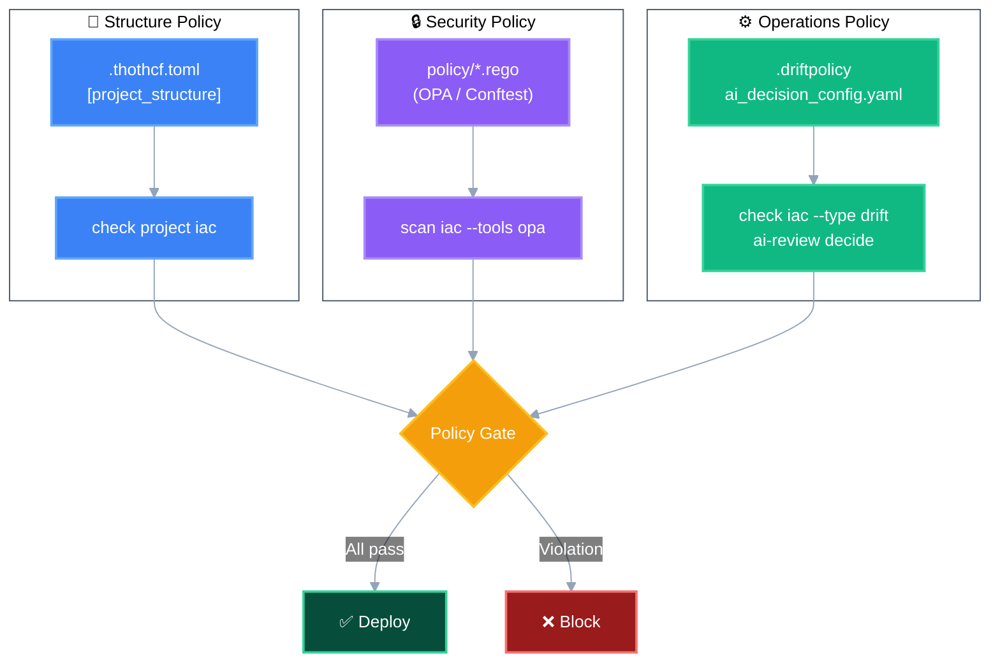
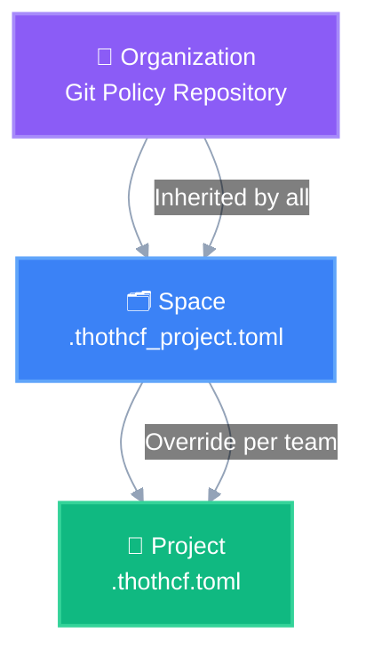
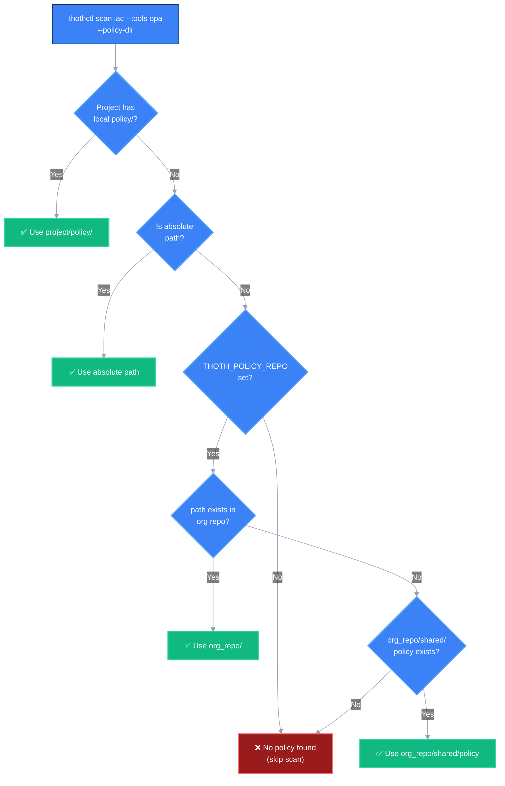

# Policy as Code in ThothCTL

## Overview

ThothCTL integrates policy-as-code at multiple layers of the IaC lifecycle. Policies define **what is allowed, enforced, or blocked** — from project structure to security posture to drift response to AI decision-making.



## Policy Types

### 1. Project Structure Policy

**File**: `.thothcf.toml` → `[project_structure]`  
**Evaluated by**: `thothctl check project iac`  
**Purpose**: Enforce that projects follow organizational folder/file conventions.

```toml
[project_structure]
root_files = [".gitignore", "README.md", ".thothcf.toml"]
ignore_folders = [".git", ".terraform", ".terragrunt-cache"]

[[project_structure.folders]]
name = "modules"
mandatory = true
type = "root"
content = ["main.tf", "variables.tf", "outputs.tf"]

[[project_structure.folders]]
name = "environments"
mandatory = true
type = "root"
```

**Enforcement**: Hard failure if mandatory folders/files are missing.

```bash
thothctl check project iac
# ✅ modules/ exists with required files
# ❌ FAIL: environments/ is missing (mandatory)
```

---

### 2. Security Policy (OPA/Rego)

**File**: `policy/*.rego`  
**Evaluated by**: `thothctl scan iac --tools opa`  
**Purpose**: Evaluate IaC code against custom security, naming, and compliance rules using the OPA policy language.

**Modes**:
- `conftest` (default): Static analysis of `.tf` / `.yaml` files
- `opa`: Plan-based evaluation against `tfplan.json`

```rego
# policy/s3.rego
package main

deny[msg] {
    resource := input.resource.aws_s3_bucket[name]
    not resource.server_side_encryption_configuration
    msg := sprintf("S3 bucket '%s' must have encryption enabled", [name])
}

deny[msg] {
    resource := input.resource.aws_s3_bucket[name]
    resource.acl == "public-read"
    msg := sprintf("S3 bucket '%s' must not be public", [name])
}
```

**Enforcement**:

```bash
# Static HCL analysis (conftest mode)
thothctl scan iac --tools opa

# Plan-based evaluation
thothctl scan iac --tools opa --opa-mode opa --policy-dir ./policy
```

**Options**:

| Option | Description |
|--------|-------------|
| `--opa-mode conftest` | Static file analysis (default) |
| `--opa-mode opa` | Plan-based evaluation via `opa exec` |
| `--policy-dir PATH` | Directory containing `.rego` files (default: `policy/`) |
| `--opa-namespace` | Rego namespace (conftest mode) |
| `--opa-data-dir` | Additional data directory for policies |

---

### 3. Drift Response Policy

**File**: `.driftpolicy` (YAML)  
**Evaluated by**: `thothctl check iac --type drift`  
**Purpose**: Define per-resource tolerance for infrastructure drift — block, alert, accept, or ignore.

```yaml
# .driftpolicy
coverage_threshold: 90.0

rules:
  - resource: "aws_security_group.*"
    severity_override: critical
    action: block_deploy

  - resource: "aws_instance.*"
    attribute: "tags.*"
    action: auto_accept

  - resource: "aws_db_instance.*"
    action: alert

  - resource: "aws_cloudwatch_log_group.*"
    action: ignore
```

**Actions**:

| Action | Behavior |
|--------|----------|
| `block_deploy` | Fail CI, prevent deployment until drift is resolved |
| `alert` | Warn but allow deployment |
| `auto_accept` | Silently accept the drift (e.g., tag-only changes) |
| `ignore` | Remove from report entirely |

**Enforcement**:

```bash
thothctl check iac --type drift --recursive
# Drift in aws_security_group.api → ACTION: block_deploy → ❌ CI fails
# Drift in aws_instance.web tags  → ACTION: auto_accept → ✅ Ignored
```

---

### 4. AI Decision Policy

**File**: `.thothctl/ai_decision_config.yaml`  
**Evaluated by**: `thothctl ai-review decide`  
**Purpose**: Define thresholds for automated PR approve/reject/request-changes decisions.

```yaml
# .thothctl/ai_decision_config.yaml
approve_thresholds:
  risk_score_max: 20
  confidence_min: 0.90
  critical_issues_max: 0
  high_issues_max: 0
  compliance_violations_max: 0

reject_thresholds:
  risk_score_min: 85
  confidence_min: 0.85
  critical_issues_min: 1

safety:
  max_auto_approvals_per_day: 50
  max_auto_rejections_per_day: 20
  cooldown_between_actions: 300  # seconds
  emergency_labels: ["emergency", "hotfix", "security-patch"]
  trusted_bots: ["dependabot", "renovate"]

blocking_patterns:
  - hardcoded_secrets
  - public_s3_buckets
  - unencrypted_databases
  - overly_permissive_iam
```

**Enforcement**:

```bash
thothctl ai-review decide --pr-number 42 --dry-run
# Risk score: 15 → below approve_thresholds.risk_score_max (20)
# Confidence: 0.95 → above confidence_min (0.90)
# Decision: APPROVE ✅
```

---

## Policy Hierarchy

Policies are resolved in this order (most specific wins):



| Level | Source | Scope |
|-------|--------|-------|
| **Organization** | Git repository (shared across all teams) | Global governance baseline |
| **Space** | `.thothcf_project.toml` in space root | Team/domain-specific overrides |
| **Project** | `.thothcf.toml` in project root | Project-specific exceptions |

**Resolution rule**: Project-level policies override Space-level, which override Organization-level. Structure policies are **replaced entirely** (no merge). Security policies (Rego) are **additive** (all levels evaluated).

---

## Organization Policy Repository

Organization-level policies live in a **dedicated Git repository** that acts as the single source of truth for governance across all teams, domains, and workloads.

### Repository Structure

```
org-iac-policies/
├── README.md
├── .thothcf.toml                    # Org-level defaults
│
├── domains/                          # Policies per business domain
│   ├── fintech/
│   │   ├── policy/                   # Rego policies for fintech
│   │   │   ├── encryption.rego       # PCI-DSS encryption requirements
│   │   │   ├── network.rego          # No public subnets
│   │   │   └── data.rego             # Data residency rules
│   │   ├── .thothcf.toml            # Structure rules for fintech projects
│   │   └── .driftpolicy             # Strict drift tolerance
│   │
│   ├── platform/
│   │   ├── policy/
│   │   │   ├── naming.rego           # Platform naming conventions
│   │   │   └── modules.rego          # Approved modules only
│   │   └── .thothcf.toml
│   │
│   └── data-engineering/
│       ├── policy/
│       │   ├── storage.rego          # S3/Glue/Redshift rules
│       │   └── compute.rego          # EMR/Spark guardrails
│       └── .thothcf.toml
│
├── workloads/                        # Policies per workload type
│   ├── containers/
│   │   ├── policy/
│   │   │   ├── ecs.rego              # ECS task hardening
│   │   │   └── eks.rego              # EKS cluster policies
│   │   └── .thothcf.toml
│   │
│   ├── serverless/
│   │   ├── policy/
│   │   │   ├── lambda.rego           # Lambda function constraints
│   │   │   └── api_gateway.rego      # API Gateway policies
│   │   └── .thothcf.toml
│   │
│   └── databases/
│       ├── policy/
│       │   ├── rds.rego              # Multi-AZ, encryption, backup
│       │   └── dynamodb.rego         # Capacity and encryption
│       └── .thothcf.toml
│
├── layers/                           # Policies per infrastructure layer
│   ├── networking/
│   │   ├── policy/
│   │   │   ├── vpc.rego              # VPC CIDR, flow logs
│   │   │   ├── security_groups.rego  # No 0.0.0.0/0 ingress
│   │   │   └── dns.rego              # Route53 conventions
│   │   └── .thothcf.toml
│   │
│   ├── security/
│   │   ├── policy/
│   │   │   ├── iam.rego              # Least privilege, no wildcard
│   │   │   ├── kms.rego              # Key rotation, deletion protection
│   │   │   └── secrets.rego          # Secrets Manager policies
│   │   └── .thothcf.toml
│   │
│   └── observability/
│       ├── policy/
│       │   ├── cloudwatch.rego       # Required alarms per service
│       │   └── logging.rego          # Log retention minimums
│       └── .thothcf.toml
│
├── compliance/                       # Framework-specific compliance mappings
│   ├── soc2/
│   │   ├── policy/
│   │   │   └── soc2_controls.rego    # SOC2 control enforcement
│   │   └── mapping.yaml             # Finding → SOC2 control mapping
│   ├── cis-aws/
│   │   └── policy/
│   │       └── cis_benchmark.rego
│   └── iso27001/
│       └── policy/
│           └── iso_controls.rego
│
└── shared/                           # Shared policies (applied everywhere)
    ├── policy/
    │   ├── tagging.rego              # Required tags for all resources
    │   ├── regions.rego              # Allowed regions
    │   └── cost_controls.rego        # Instance size limits
    ├── .driftpolicy                  # Default drift tolerance
    └── ai_decision_config.yaml       # Default AI decision thresholds
```

### How Projects Consume Organization Policies

ThothCTL resolves organization policies from a configured Git repository or local path. The policy repository can be set via:

**Option 1: Space initialization**

```bash
thothctl init space -s my-space --policy-repo https://github.com/my-org/org-iac-policies.git
```

This stores `governance.policy_repo` in `~/.thothcf/spaces.toml`.

**Option 2: Environment variable**

```bash
export THOTH_POLICY_REPO=/path/to/local/clone
# or
export THOTH_POLICY_REPO=https://github.com/my-org/org-iac-policies.git
```

**Option 3: Direct path on scan command**

```bash
# Point to a specific subfolder within your org repo
thothctl scan iac --tools opa --policy-dir layers/networking/policy

# Or absolute path
thothctl scan iac --tools opa --policy-dir /path/to/org-iac-policies/domains/fintech/policy
```

### Policy Resolution Order

When `thothctl scan iac --tools opa` runs, the OPA scanner resolves policies in this order:



**Resolution examples:**

| `--policy-dir` value | `THOTH_POLICY_REPO` | Resolved path |
|---------------------|--------------------|----|
| `policy` (default) | not set | `<project>/policy/` |
| `policy` (default) | `/path/to/org-repo` | `<org-repo>/shared/policy` (fallback) |
| `layers/networking/policy` | `/path/to/org-repo` | `<org-repo>/layers/networking/policy` |
| `domains/fintech/policy` | `/path/to/org-repo` | `<org-repo>/domains/fintech/policy` |
| `workloads/databases/policy` | `/path/to/org-repo` | `<org-repo>/workloads/databases/policy` |
| `/absolute/path/to/policies` | (ignored) | `/absolute/path/to/policies` |

### Configuration in `.thothcf.toml`

Projects declare which domain, workload, and layer they belong to. This determines which org policies apply when scanning:

```toml
[thothcf]
project_id = "payment-service"
project_type = "terraform-terragrunt"

# Policy selectors — determines which org policy subfolder to use
# with: thothctl scan iac --tools opa --policy-dir domains/fintech/policy
[thothcf.governance]
domain = "fintech"
workload = "containers"
layer = "networking"
compliance = ["soc2", "cis-aws"]
```

> **Note**: Automatic policy selection based on `[thothcf.governance]` selectors is on the roadmap. Currently, you specify the subfolder explicitly via `--policy-dir` or use the `shared/policy` fallback.

### Space Configuration

When a space is initialized with `--policy-repo`, the governance config is stored in `~/.thothcf/spaces.toml`:

```toml
[spaces.my-space.governance]
policy_repo = "https://github.com/my-org/org-iac-policies.git"
```

### Example: Organization Policy Repository

A reference implementation is available as a GitHub template:

🔗 **[thothforge/org-iac-policies](https://github.com/thothforge/org-iac-policies)** — Example organization policy repository with pre-built policies for AWS, naming conventions, tagging, and compliance frameworks.

```bash
# Use as a template for your organization
gh repo create my-org/iac-policies --template thothforge/org-iac-policies
```

---

## Integration Points

### Where policies are evaluated in the workflow

```
Developer writes IaC
       │
       ├──► thothctl check project iac        → Structure policy
       │
       ├──► thothctl scan iac --tools opa     → Security policy (Rego)
       │
       ├──► thothctl scan iac --tools checkov → Built-in CIS/AWS rules
       │
       ├──► thothctl check iac --type drift   → Drift policy
       │
       └──► thothctl ai-review decide         → Decision policy
                                                 (uses scan results as input)
```

### CI/CD Integration Example

```yaml
# .github/workflows/iac-policy.yml
name: IaC Policy Gate

on: [pull_request]

jobs:
  policy-check:
    runs-on: ubuntu-latest
    steps:
      - uses: actions/checkout@v4
      
      - name: Install ThothCTL
        run: pip install thothctl

      # Layer 1: Structure
      - name: Check project structure
        run: thothctl check project iac

      # Layer 2: Security (OPA + Checkov)
      - name: Security scan with policies
        run: |
          thothctl scan iac --tools checkov opa --recursive
      
      # Layer 3: Drift (if state available)
      - name: Drift detection
        run: thothctl check iac --type drift --recursive

      # Layer 4: AI decision
      - name: AI review decision
        run: |
          thothctl ai-review decide \
            --pr-number ${{ github.event.pull_request.number }} \
            --repository ${{ github.repository }}
```

---

## Writing Custom Policies

### OPA/Rego Quick Start

1. Create a `policy/` directory in your project root:

```bash
mkdir policy
```

2. Write a Rego policy:

```rego
# policy/naming.rego
package main

# Enforce resource naming convention
deny[msg] {
    resource := input.resource[type][name]
    not regex.match(`^(dev|stg|prd)-[a-z]+-[a-z0-9-]+$`, name)
    msg := sprintf(
        "Resource '%s.%s' violates naming convention: must be '{env}-{service}-{name}'",
        [type, name]
    )
}
```

3. Run:

```bash
thothctl scan iac --tools opa --policy-dir policy
```

### Policy Examples

| Policy | File | What It Enforces |
|--------|------|-----------------|
| Encryption required | `policy/encryption.rego` | All S3/RDS/EBS must have encryption |
| No public access | `policy/network.rego` | Security groups can't allow 0.0.0.0/0 ingress |
| Tag compliance | `policy/tags.rego` | Required tags: Environment, Owner, CostCenter |
| Module versioning | `policy/modules.rego` | All modules must pin exact versions |
| Region restriction | `policy/regions.rego` | Only approved regions allowed |

---

## Relationship to FdI (Framework-defined Infrastructure)

In the FdI model, policies become the **framework rules** that govern code generation:

```
Today:  Developer writes IaC → policies validate after the fact
Future: Policies constrain generation → code is compliant by construction
```

The intent-to-IaC generation engine (roadmap) will read these same policy files to produce code that already passes all checks:

| Policy Layer | FdI Role |
|-------------|----------|
| Structure (`[project_structure]`) | Generated code follows the required structure |
| Security (`policy/*.rego`) | Generated code uses only approved patterns |
| Drift (`.driftpolicy`) | Generated code accounts for drift tolerance |
| AI decisions (`ai_decision_config`) | Auto-approve low-risk generated changes |

---

## Related Documentation

- [Customizing Project Structure Rules](commands/check/customizing_rules.md)
- [Security Scanning with OPA](commands/scan/scan_iac.md)
- [Drift Detection & Policy](commands/check/drift-detection.md)
- [AI Decision Configuration](commands/ai-review/README.md)
- [GitHub Templates](../../template_engine/github_templates.md)
- [FdI Roadmap](roadmap_fdi.md)
- 🔗 [Organization Policy Repository Template](https://github.com/thothforge/org-iac-policies) — Reference implementation
