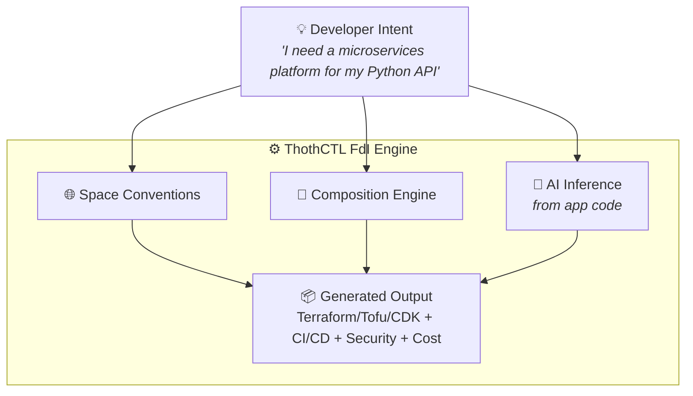
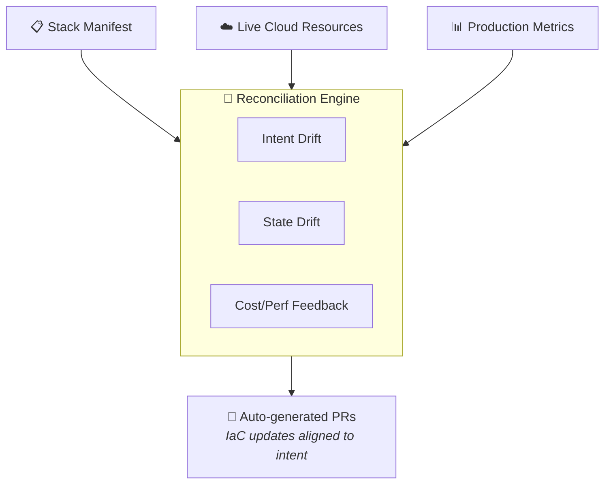

# Roadmap: ThothCTL as a Framework-Defined Infrastructure (FdI) Platform

## Vision

Transform ThothCTL from an IaC management CLI into an **IaC-native Framework-Defined Infrastructure platform** where business intent and application conventions automatically produce production-ready infrastructure code — without requiring developers to write Terraform manually.



---

## Current State (v0.15.0) — IaC Maturity Level 4+

| Capability | Status |
|-----------|--------|
| Template engine | ✅ Shipped |
| Space management (conventions, defaults) | ✅ Shipped |
| Security scanning (Checkov, KICS, Trivy) | ✅ Shipped |
| AI multi-agent review & fix generation | ✅ Shipped |
| Drift detection | ✅ Shipped |
| Cost analysis | ✅ Shipped |
| Inventory & dependency management | ✅ Shipped |
| OpenTelemetry observability | ✅ Shipped |
| MCP integration | ✅ Shipped |

---

## Phase 1: Stack Composition Engine (v0.16 – v0.17)

**Goal:** Declaratively define infrastructure stacks from reusable building blocks.

### Deliverables

| Feature | Description |
|---------|-------------|
| Stack manifest format | TOML/YAML manifest declaring desired components (VPC, EKS, RDS, etc.) |
| Component catalog | Library of composable infrastructure patterns per cloud provider |
| `thothctl generate stack` | Generates full IaC project from a stack manifest |
| Space-aware generation | Stack inherits provider versions, backend config, and orchestration from active Space |
| Dependency resolution | Automatic wiring between components (VPC → subnets → security groups → EKS) |
| Validation | Pre-generation checks for compatibility, quotas, and compliance rules |

### Example

```yaml
# stack.thoth.yaml
name: payments-platform
cloud: aws
region: us-east-1
components:
  - type: networking/vpc
    cidr: "10.0.0.0/16"
    availability_zones: 3
  - type: compute/eks
    version: "1.30"
    node_groups:
      - name: workers
        instance_type: m6i.large
        min_size: 3
        max_size: 10
  - type: database/rds-postgresql
    version: "16"
    instance_class: db.r6g.large
    multi_az: true
  - type: observability/cloudwatch
    dashboards: true
    alarms: true
```

```bash
thothctl generate stack --manifest stack.thoth.yaml --space production
# → outputs a complete Terraform/Terragrunt project
```

---

## Phase 2: App-to-Infra Inference (v0.18 – v0.19)

**Goal:** Scan application source code and automatically infer the required infrastructure.

### Deliverables

| Feature | Description |
|---------|-------------|
| App scanner | Detects runtime, dependencies, ports, storage needs from app code |
| Inference rules | Maps app patterns to infrastructure components (Dockerfile → ECS/EKS, requirements.txt → Lambda layer, etc.) |
| `thothctl generate stack --from-app ./src` | Generates stack manifest from application analysis |
| AI-assisted refinement | AI agent reviews inferred stack and suggests optimizations |
| Interactive confirmation | Developer reviews/edits inferred manifest before generation |

### Inference Examples

| App Signal | Inferred Infrastructure |
|-----------|------------------------|
| `Dockerfile` + `EXPOSE 8080` | ECS Fargate or EKS deployment + ALB |
| `requirements.txt` + `handler.py` | Lambda function + API Gateway |
| `docker-compose.yml` with Redis | ElastiCache cluster |
| PostgreSQL connection string in env | RDS PostgreSQL |
| S3 SDK usage in code | S3 bucket + IAM policy |
| `.github/workflows/` present | CI/CD pipeline scaffolding |

### Workflow

```bash
# Scan app and generate stack manifest
thothctl generate stack --from-app ./my-api --space production

# Output: inferred stack.thoth.yaml
# Developer reviews and approves

# Generate the IaC
thothctl generate stack --manifest stack.thoth.yaml
```

---

## Phase 3: Convention-Driven Automation (v0.20 – v0.21)

**Goal:** The Space becomes a full "framework" that encodes organizational standards — infra generation is fully governed by conventions.

### Deliverables

| Feature | Description |
|---------|-------------|
| Space policies | Define mandatory components per stack type (e.g., all prod stacks must have WAF, CloudTrail, backup) |
| Naming conventions | Auto-apply resource naming from Space rules (env, team, project) |
| Compliance templates | Auto-inject compliance controls based on Space's regulatory profile (SOC2, HIPAA, PCI) |
| Cost guardrails | Space-level budgets that reject stacks exceeding cost thresholds |
| `thothctl space policy add` | CLI to manage Space-level policies |
| Inheritance chain | Space → Stack Type → Component (cascading defaults) |

### Space Policy Example

```toml
# ~/.thothcf/spaces/production/policies.toml
[mandatory_components]
networking = ["waf", "vpc_flow_logs"]
compute = ["auto_scaling", "container_insights"]
data = ["encryption_at_rest", "automated_backups", "multi_az"]
security = ["cloudtrail", "guardduty", "security_hub"]

[naming]
pattern = "{space}-{project}-{component}-{env}"

[cost]
max_monthly_estimate = 50000  # USD
require_approval_above = 10000

[compliance]
frameworks = ["soc2", "hipaa"]
```

---

## Phase 4: Continuous Reconciliation (v0.22+)

**Goal:** Move from one-time generation to continuous alignment between intent and infrastructure state.

### Deliverables

| Feature | Description |
|---------|-------------|
| Intent drift detection | Compare live infra against the stack manifest (not just IaC state) |
| Auto-regeneration | When Space policies change, regenerate affected stacks and create PRs |
| Upgrade propagation | When a component pattern is updated in the catalog, propagate to all stacks using it |
| Feedback loop | Production metrics (cost spikes, incidents) feed back into the composition engine |
| `thothctl reconcile` | CLI command to align all stacks with current Space conventions |

### Architecture



---

## FdI Maturity Progression

| Phase | ThothCTL becomes... | Industry Equivalent |
|-------|--------------------|--------------------|
| Current | IaC lifecycle manager | Terraform Cloud + Checkov |
| Phase 1 | Declarative stack composer | Terramate / Pulumi Crosswalk |
| Phase 2 | Intent-driven IaC generator | SST / Nitro (but for enterprise IaC) |
| Phase 3 | Convention-governed IaC framework | Backstage + Terraform (unified) |
| Phase 4 | Self-reconciling IaC platform | Full FdI — no equivalent in IaC space today |

---

## Differentiation

Unlike existing FdI tools (Vercel, SST, Nitro) which target **frontend/serverless** apps:

- ThothCTL FdI targets **enterprise infrastructure compositions** (VPCs, EKS, RDS, multi-account)
- Works with **existing IaC tools** (Terraform, Tofu, Terragrunt) — not a replacement
- **Security-first** — compliance, scanning, and AI review baked into the generation pipeline
- **Multi-cloud** — not locked to a single provider's serverless platform
- **Organization-aware** — Spaces encode team conventions, not just technical defaults

---

## Success Metrics

| Metric | Target |
|--------|--------|
| Time from idea to deployable IaC | < 5 minutes (vs hours/days manually) |
| Manual Terraform lines written by developers | Reduced by 80% |
| Compliance violations at generation time | 0 (caught before code exists) |
| Infrastructure consistency across teams | 100% (governed by Space policies) |
| Cost surprises post-deployment | Eliminated (pre-generation estimates) |

---

## Timeline Estimate

| Phase | Target | Dependency |
|-------|--------|-----------|
| Phase 1 | v0.16 – v0.17 | Component catalog design |
| Phase 2 | v0.18 – v0.19 | Phase 1 + Strands Agents SDK |
| Phase 3 | v0.20 – v0.21 | Phase 2 + policy engine |
| Phase 4 | v0.22+ | Phase 3 + production integrations |
