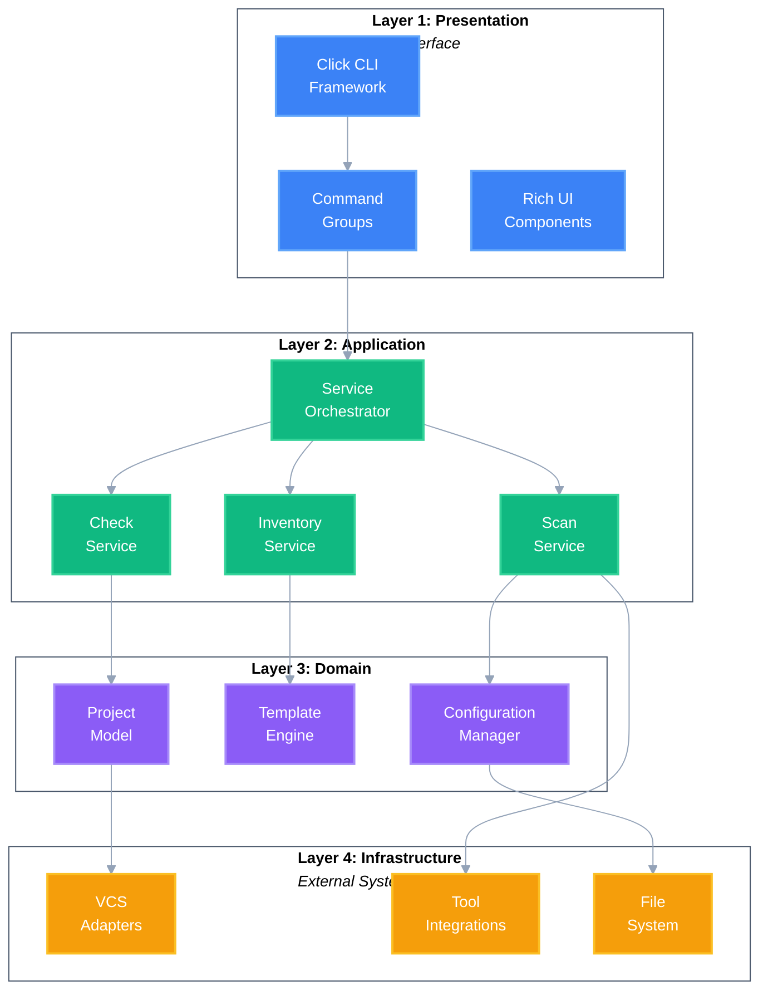
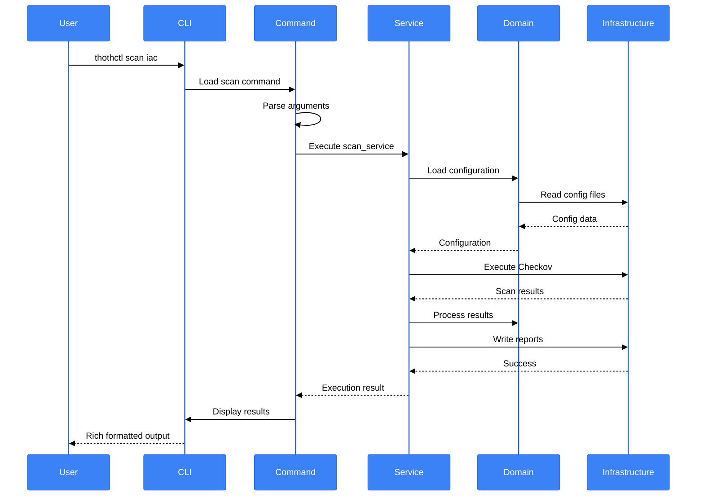
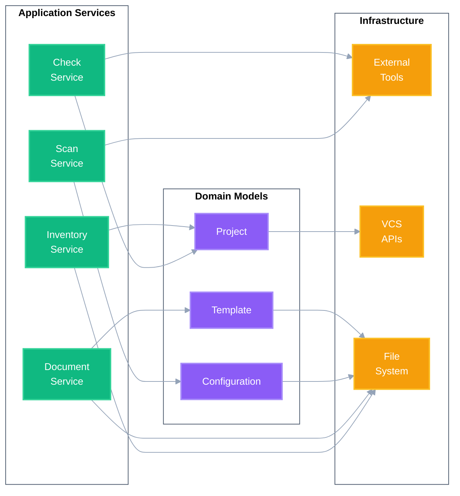
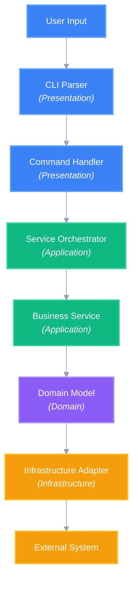
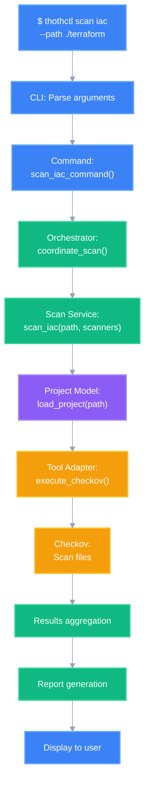

# ThothCTL Software Architecture

> **Note**: This document describes the technical implementation. For conceptual framework overview, see [Framework Architecture](framework_architecture.md).

ThothCTL follows a **4-layer software architecture** based on Clean Architecture principles, designed for extensibility, maintainability, and clear separation of concerns.

## Architecture Overview



## Command Execution Flow



## Service Interaction Flow



## Data Flow

### Command Execution Flow



### Example: Scan Command Flow



## Architectural Principles

1. **Separation of Concerns**: Each layer has distinct responsibilities
2. **Dependency Inversion**: Higher layers depend on abstractions
3. **Single Responsibility**: Each component has one reason to change
4. **Open/Closed**: Open for extension, closed for modification
5. **Interface Segregation**: Clients depend only on needed interfaces

## Layer 1: Presentation Layer (CLI Interface)

Handles all user interactions through the command-line interface.

### Click CLI Framework

Dynamic command loading with hierarchical structure.

**Command Structure:**
```python
@click.group()
def cli():
    """ThothForge CLI"""
    pass

@cli.group()
def init():
    """Initialize configurations"""
    pass

@init.command()
@click.option('--space-name', required=True)
def space(space_name):
    init_service.create_space(space_name)
```

### Rich UI Components

Modern terminal UI with visual feedback.

**Features:**
- Progress bars for long operations
- Formatted tables for data display
- Syntax highlighting for code
- Panels for grouped information
- Spinners for loading states

### Command Categories

| Command | Purpose | Service |
|---------|---------|---------|
| `init` | Bootstrap environments, spaces, projects | Init Service |
| `check` | Validate environment, IaC, costs, blast radius | Check Service |
| `scan` | Security and compliance scanning | Scan Service |
| `document` | Generate documentation | Document Service |
| `inventory` | Track dependencies and versions | Inventory Service |
| `project` | Manage project lifecycle | Project Service |
| `generate` | Code generation and scaffolding | Generate Service |
| `list` | Query resources | Multiple Services |
| `remove` | Cleanup resources | Multiple Services |
| `mcp` | MCP server for AI integration | MCP Service |
| `upgrade` | Self-update | Upgrade Service |

## Layer 2: Application Layer (Business Logic)

Contains business logic and orchestrates operations across services.

### Service Orchestrator

Coordinates multiple services for complex operations.

**Responsibilities:**
- Transaction management
- Centralized error handling
- Structured logging
- Input validation

### Core Services

#### Scan Service
**Purpose**: Security scanning and compliance

**Capabilities:**
- Execute scanners (Checkov, Trivy, TFSec, Snyk)
- Aggregate scan results
- Generate reports (HTML, JSON, SARIF)
- Compliance review

#### Inventory Service
**Purpose**: Track IaC dependencies

**Capabilities:**
- Discover modules and providers
- Track version information
- Compare with latest versions
- Generate professional reports

#### Check Service
**Purpose**: Validate and assess impact

**Capabilities:**
- Environment validation
- IaC validation
- AWS cost analysis (real-time pricing)
- Blast radius assessment (ITIL v4)

#### Document Service
**Purpose**: Generate documentation

**Capabilities:**
- Auto-generate Terraform docs
- AI-powered documentation
- Template-based docs
- Multi-format output

#### Project Service
**Purpose**: Manage project lifecycle

**Capabilities:**
- Create from scaffolds
- Configure VCS integration
- Manage settings
- Convert between frameworks

#### Init Service
**Purpose**: Bootstrap environments

**Capabilities:**
- Install development tools
- Create and configure spaces
- Initialize projects
- Setup CI/CD integration

#### Generate Service
**Purpose**: Code generation

**Capabilities:**
- Generate IaC from templates
- Create component boilerplate
- Generate stacks and modules
- Custom code generation

## Layer 3: Domain Layer (Core Models)

Contains core business models independent of external systems.

### Configuration Manager

Hierarchical configuration with environment overrides.

**Configuration Hierarchy:**
1. Global: `~/.thothctl/config.toml`
2. Space: `.thothcf-<space>.toml`
3. Project: `.thothcf.toml`
4. Environment: `THOTHCTL_*`

**Example Configuration:**
```toml
[project]
name = "my-infrastructure"
type = "terraform"
version = "1.0.0"

[space]
name = "lab-github"
vcs = "github"

[tools]
terraform_version = "1.6.0"
```

### Template Engine

Jinja2-based template processor.

**Features:**
- Variable substitution
- Conditional logic
- Loops and iterations
- Custom filters
- Template inheritance

### Project Model

Represents an IaC project.

**Project Types:**
- `terraform`: Standard Terraform
- `terragrunt`: Terragrunt-based
- `tofu`: OpenTofu
- `cdkv2`: AWS CDK v2
- `terraform_module`: Reusable modules
- `custom`: Custom types

**Project Structure:**
```
project/
├── .thothcf.toml          # Project configuration
├── common/                 # Shared configs
├── environments/           # Environment-specific
├── stacks/                 # Infrastructure stacks
└── docs/                   # Documentation
```

### Space Model

Logical boundary for IDP context.

**Space Components:**
- VCS credentials and endpoints
- Cloud provider credentials
- Configuration settings
- Associated projects

**Example Spaces:**
- `lab-github`: Development with GitHub
- `prod-gitlab`: Production with GitLab
- `team-azure`: Team space with Azure DevOps

### Environment Model

Development environment configuration.

**Components:**
- OS type (Linux, macOS, Windows)
- Shell type (Bash, Zsh, Fish, PowerShell)
- Installed tools and versions
- Environment paths

**Supported Tools:**
- Infrastructure: Terraform, Terragrunt, OpenTofu, TFSwitch
- Security: Checkov, Trivy, TFSec, Snyk
- Development: Pre-commit, Commitizen, TFLint
- Documentation: Terraform-docs, Terramate
- AI: Kiro CLI

## Layer 4: Infrastructure Layer (External Systems)

Handles all external integrations and I/O operations.

### VCS Adapters

Abstraction layer for version control systems.

**Supported VCS:**
- **GitHub**: Public/private repositories
- **GitLab**: Self-hosted and GitLab.com
- **Azure DevOps**: Azure Repos

**Operations:**
- Repository creation
- Branch management
- Pull request automation
- Webhook configuration

### Tool Integrations

Integration with external IaC and security tools.

**Tool Categories:**

| Category | Tools |
|----------|-------|
| **IaC** | Terraform, Terragrunt, OpenTofu, TFSwitch |
| **Security** | Checkov, Trivy, TFSec, Snyk |
| **Compliance** | Terraform-compliance |
| **Documentation** | Terraform-docs, Terramate |
| **Development** | Pre-commit, Commitizen, TFLint |

### Cloud Provider APIs

Direct integration with cloud providers.

**AWS Integration:**
- Real-time pricing API
- Cost estimation for 12+ services
- Optimization recommendations

**Supported AWS Services:**
EC2, RDS, S3, Lambda, ELB, VPC, EBS, CloudWatch, EKS, ECS, Secrets Manager, Bedrock

### MCP Server

Model Context Protocol server for AI integration.

**Capabilities:**
- 19 MCP tools covering all commands
- AI orchestration of ThothCTL
- Result analysis
- Natural language interface

**Integration:**
```json
{
  "mcpServers": {
    "thothctl": {
      "command": "thothctl",
      "args": ["mcp", "server"]
    }
  }
}
```

### File System Operations

Abstraction for file and Git operations.

**Operations:**
- File read/write
- Directory management
- Git clone/pull/push
- Template processing

## Data Flow

### Command Execution Flow


### Example: Scan Command Flow


## Scaffold Projects (Foundation)

Git-based templates for project creation.

**Official Scaffolds:**
- [terraform-scaffold](https://github.com/thothforge/terraform-scaffold)
- [terragrunt-scaffold](https://github.com/thothforge/terragrunt-scaffold)
- [tofu-scaffold](https://github.com/thothforge/tofu-scaffold)

**Scaffold Structure:**
```
scaffold/
├── .kiro/                  # Kiro CLI config
├── common/                 # Shared configs
├── environments/           # Environment-specific
├── stacks/                 # Infrastructure stacks
└── root.hcl               # Root configuration
```

## Cross-Cutting Concerns

### Logging

Structured logging across all layers.

**Log Levels:**
- `DEBUG`: Detailed debugging
- `INFO`: General information
- `WARNING`: Warning messages
- `ERROR`: Error messages

**Enable Debug:**
```bash
thothctl --debug <command>
export THOTHCTL_DEBUG=true
```

### Error Handling

Consistent error handling strategy.

**Error Types:**
- Validation errors
- Tool execution errors
- Network errors
- Permission errors

### Testing

Multi-level testing approach.

**Test Levels:**
- Unit tests (individual components)
- Integration tests (service integration)
- E2E tests (complete workflows)
- Security tests (compliance validation)

## Extension Points

### Custom Commands

Plugin system for custom commands.

### Custom Scanners

Implement custom security scanners.

### Custom Templates

Organization-specific templates.

### Custom Integrations

Integrate proprietary tools.

## Use Cases (Applications of Architecture)

The architecture enables these use cases:

- **[AI-DLC](use_cases/ai_dlc.md)**: AI-powered development lifecycle
- **[DevSecOps SDLC](use_cases/devsecops_sdlc.md)**: 8-phase DevSecOps lifecycle
- **[Template Engine](../template_engine/template_engine.md)**: Code generation system
- **IDP Workflows**: Self-service platform operations

## Best Practices

### Project Organization

```
organization/
├── scaffolds/              # Templates
├── projects/               # Active projects
└── docs/                   # Documentation
```

### Configuration Management

- Use spaces for logical separation
- Store credentials securely
- Version control configurations
- Document custom settings

### Security

- Run scans regularly
- Review results promptly
- Fix high-severity issues
- Maintain compliance policies

## Next Steps

- [Quick Start Guide](../quick_start.md)
- [Command Reference](commands/)
- [Use Cases](use_cases/)
- [Concepts](concepts.md)
