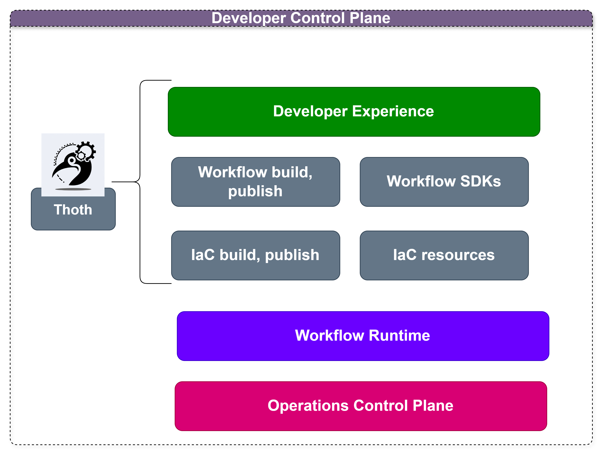

# Thoth Framework

Thoth Framework is a framework to create and manage the [Internal Developer Platform](https://internaldeveloperplatform.org/what-is-an-internal-developer-platform/) tasks for infrastructure, devops, devsecops, software developers, and platform engineering teams aligned with the business objectives:

1. [x] Minimize mistakes.
2. [x] Increase velocity
3. [x] Improve products
4. [x] Enforce compliance
5. [x] Reduce lock-in

## Mapping Mechanisms 
| Business Objective | Mechanism          | Implementation |
|-------------------|--------------------|----------------|
| Minimize mistakes | Meaninful defaults | Templates      |
| Increase velocity | Automation         | IaC Scripts    |
| Improve products | Fill product gaps  | New components |
| Enforce compliance | Restrict choinces  | Wrappers       |
| Reduce lock-in | Abstraction        | Service layers |

Thoth allows you to extend and operate your Developer Control Plane, and enable the developer experience with the internal developer platform trough command line.



# Tools

## ThothCTL

Package for accelerating the adoption of Internal Frameworks, enable reusing and interaction with the Internal Developer Platform. 

# Use cases
- **[Template Engine](template_engine/template_engine.md)**:
  - Build and configure any kind of template
  - Handling templates to create, add, remove or update components
  - Code generation
  
- **Automate tasks**:
  - Create and bootstrap local development environment
  - Extend CI/CD pull request workflow
  - Create documentation for projects (IaC), Generative AI doc generation

- **Check and compliance**:
  - Check project structure
    - DevSecOps for IaC (Terraform, tofu)
      - Scan your IaC terraform,tofu templates
      - Generate reports 
      - Manage inventory and dependencies
      - Review IaC changes and make suggestions (Generative AI)
      
- **Internal Developer Platform CLI**
  - Create projects from your templates
  - Source control setup
  - Scaffold - quickly set up the structure of a project.
  


# Getting Started

```bash
$ thothctl -h
thothctl --help
Usage: thothctl [OPTIONS] COMMAND [ARGS]...

  ThothForge CLI - The Internal Developer Platform CLI

Options:
  --version                  Show the version and exit.
  --debug                    Enable debug mode
  -d, --code-directory PATH  Configuration file path
  --help                     Show this message and exit.

Commands:
  check      Initialize and setup project configurations
  document   Initialize and setup project configurations
  generate   Generate IaC from rules, use cases, and components
  init       Initialize and setup project configurations
  inventory  Create Inventory for the iac composition.
  list       List Projects manage by thothctl locally
  project    Convert, clean up and manage the current project
  remove     Remove Projects manage by thothctl
  scan       Scan infrastructure code for security issues.


```


## Third Party Tools

### [OpenTofu](https://opentofu.org/)
OpenTofu is a fork of Terraform that is open-source, community-driven, and managed by the Linux Foundation.

### [Backstage](https://backstage.io/)
An open source framework for building developer portals.

### [Terragrunt](https://terragrunt.gruntwork.io/)
Terragrunt is a flexible orchestration tool that allows Infrastructure as Code to scale. 

### [Terraform-docs](https://terraform-docs.io/)
Generate Terraform modules documentation in various formats.

### [Checkov](https://www.checkov.io/)
Checkov scans cloud infrastructure configurations to find misconfigurations before they're deployed.

### [Trivy](https://trivy.dev/latest/)
Use Trivy to find vulnerabilities (CVE) & misconfigurations (IaC) across code repositories, binary artifacts, container images, Kubernetes clusters, and more. All in one tool! 


