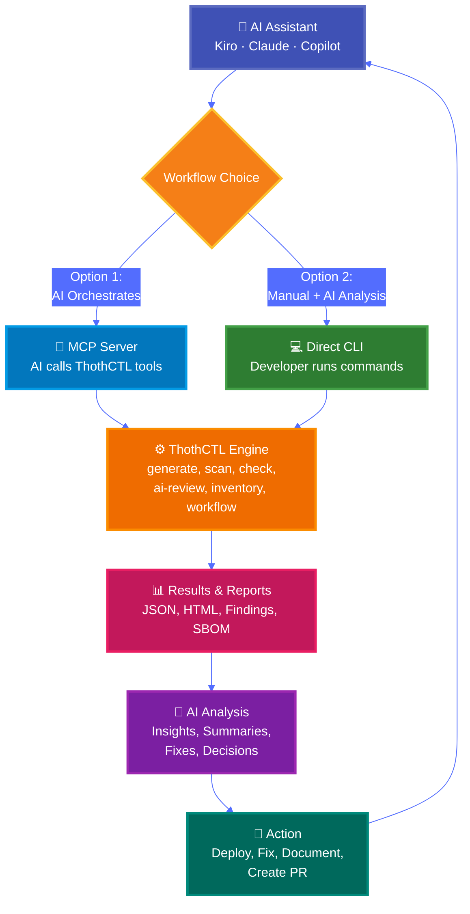
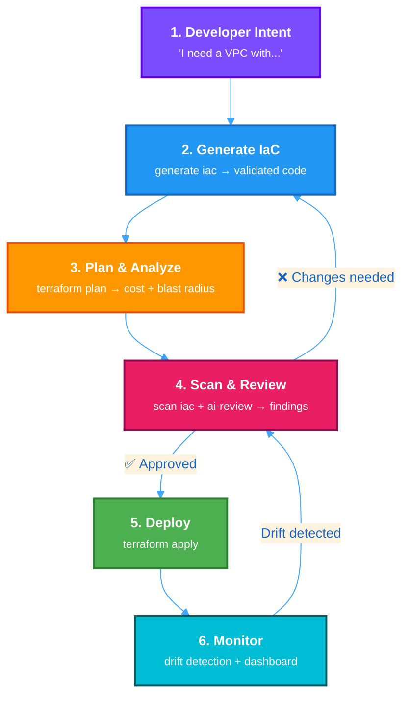

# AI-Powered Development Lifecycle (AI-DLC)

## What You Can Do

ThothCTL's AI-DLC lets you interact with your infrastructure lifecycle using AI assistants. Instead of memorizing CLI flags, you describe what you need — the AI executes the right commands and explains the results.

| Use Case | What You'll Achieve | Time |
|----------|--------------------|------|
| [Generate infrastructure from intent](#use-case-1-generate-infrastructure-from-natural-language) | Working Terraform/Terragrunt from a description | 2 min |
| [Security review with AI agents](#use-case-2-ai-powered-security-review) | Findings + auto-generated fixes + PR decision | 3 min |
| [Full DevSecOps pipeline via AI](#use-case-3-run-devsecops-pipeline-via-ai) | Cost + security + blast radius in one conversation | 5 min |
| [Analyze planned changes](#use-case-4-analyze-planned-changes-cost-blast-radius) | Cost estimate + risk assessment from plan files | 3 min |
| [Detect and fix drift](#use-case-5-detect-and-fix-drift) | Drifted resources + remediation guidance | 2 min |
| [Generate documentation](#use-case-6-generate-documentation) | README, dependency graphs, architecture diagrams | 1 min |

### The AI-DLC Workflow


```mermaid
%%{init: {'theme':'base', 'themeVariables': { 'primaryColor':'#3f51b5','primaryTextColor':'#fff','primaryBorderColor':'#303f9f','lineColor':'#536dfe','secondaryColor':'#536dfe','tertiaryColor':'#fff'}}}%%
graph TB
    A["🤖 AI Assistant<br/>Kiro · Claude · Copilot"] --> B{"Workflow Choice"}
    
    B -->|"Option 1:<br/>AI Orchestrates"| C["📡 MCP Server<br/>AI calls ThothCTL tools"]
    B -->|"Option 2:<br/>Manual + AI Analysis"| D["💻 Direct CLI<br/>Developer runs commands"]
    
    C --> E["⚙️ ThothCTL Engine<br/>generate, scan, check,<br/>ai-review, inventory, workflow"]
    D --> E
    
    E --> F["📊 Results & Reports<br/>JSON, HTML, Findings, SBOM"]
    
    F --> G["🧠 AI Analysis<br/>Insights, Summaries,<br/>Fixes, Decisions"]
    
    G --> H["🚀 Action<br/>Deploy, Fix, Document,<br/>Create PR"]
    
    H --> A
    
    classDef aiStyle fill:#3f51b5,stroke:#5c6bc0,stroke-width:3px,color:#fff
    classDef choiceStyle fill:#f57f17,stroke:#fbc02d,stroke-width:3px,color:#fff
    classDef mcpStyle fill:#0277bd,stroke:#039be5,stroke-width:3px,color:#fff
    classDef cliStyle fill:#2e7d32,stroke:#43a047,stroke-width:3px,color:#fff
    classDef engineStyle fill:#ef6c00,stroke:#fb8c00,stroke-width:3px,color:#fff
    classDef resultsStyle fill:#c2185b,stroke:#e91e63,stroke-width:3px,color:#fff
    classDef analysisStyle fill:#7b1fa2,stroke:#9c27b0,stroke-width:3px,color:#fff
    classDef actionStyle fill:#00695c,stroke:#00897b,stroke-width:3px,color:#fff
    
    class A aiStyle
    class B choiceStyle
    class C mcpStyle
    class D cliStyle
    class E engineStyle
    class F resultsStyle
    class G analysisStyle
    class H actionStyle
```

**Two ways to use it:**

- **Option 1 — AI Orchestrates**: Run `kiro-cli chat --agent thoth`, describe what you need in natural language, the agent executes ThothCTL commands via MCP and explains results.
- **Option 2 — Manual + AI Analysis**: Run `thothctl` commands yourself, then start `kiro-cli chat --agent thoth` to analyze results, prioritize findings, and get fix suggestions.

---

## Prerequisites

### 1. Install ThothCTL

```bash
# Install with pip
pip install thothctl

# Or install with pipx (recommended — isolated environment, no conflicts)
pipx install thothctl

# Already installed? Upgrade to latest version
thothctl upgrade

# Or with pip/pipx
pip install --upgrade thothctl
pipx upgrade thothctl
```

### 2. Configure MCP (for AI assistant integration)

Add ThothCTL to your AI assistant's MCP configuration:

=== "Kiro CLI (`~/.kiro/settings/mcp.json`)"

    ```json
    {
      "mcpServers": {
        "thothctl": {
          "command": "thothctl",
          "args": ["mcp", "server", "--stdio"]
        }
      }
    }
    ```

=== "Claude Code (`~/.claude/settings/mcp.json`)"

    ```json
    {
      "mcpServers": {
        "thothctl": {
          "command": "thothctl",
          "args": ["mcp", "server", "--stdio"]
        }
      }
    }
    ```

=== "Per-project (`.kiro/settings/mcp.json`)"

    ```json
    {
      "mcpServers": {
        "thothctl": {
          "command": "thothctl",
          "args": ["mcp", "server", "--stdio"]
        }
      }
    }
    ```

### 3. (Optional) Install a local LLM for AI Review

```bash
# For local AI review without cloud costs
# Install Ollama: https://ollama.ai
ollama pull llama3.1:8b
```

### Verify Setup

```bash
thothctl --version         # Should show v0.27+
thothctl mcp status        # Should show server available
ollama list                # (optional) Shows local models
```

---

## Use Case 1: Generate Infrastructure from Natural Language

**Goal**: Describe what you need → get working, compliant IaC code.

### Step 1: Initialize your project and start the AI agent

```bash
# Initialize a project first (sets up scaffold + org rules)
thothctl init project -p my-infrastructure --project-type terraform-terragrunt --space production

# Start Kiro CLI with the ThothCTL agent
cd my-infrastructure
kiro-cli chat --agent thoth
```

### Step 2: Describe your intent

=== "Via Kiro CLI (AI Agent)"

    Once inside the `kiro-cli chat --agent thoth` session:

    ```
    You: "Generate a VPC with 3 private subnets, NAT gateway, and flow logs 
          for production in us-east-1"
    ```

    The agent uses ThothCTL MCP tools to generate, validate, and self-correct automatically.

=== "Via CLI (no AI assistant)"

    ```bash
    thothctl generate iac \
      --intent "VPC with 3 private subnets, NAT gateway, and flow logs" \
      --project-type terraform-terragrunt \
      --provider ollama \
      --space production \
      --apply
    ```

### Step 2: ThothCTL generates, validates, and self-corrects

```
🔄 Generating infrastructure code...
   ├── Loading org rules from .thothcf.toml
   ├── Using scaffold: terraform-terragrunt
   ├── AI generating HCL code...
   ├── Validating with Checkov...
   │   └── ❌ 1 violation: VPC flow logs not enabled
   ├── Self-correcting (iteration 2/5)...
   ├── Re-validating...
   │   └── ✅ 0 violations
   └── Running terraform plan...
       └── ✅ Plan succeeded (7 resources to create)

✅ Generated files:
   stacks/foundation/network/vpc/
   ├── main.tf          (VPC + subnets + NAT + flow logs)
   ├── variables.tf     (region, cidr, environment)
   ├── outputs.tf       (vpc_id, subnet_ids, nat_gateway_ip)
   └── terragrunt.hcl   (backend + provider config)

📊 Estimated cost: $142/month
📐 Architecture diagram: docs/vpc-architecture.mmd
```

### Step 3: Review and deploy

```bash
cd stacks/foundation/network/vpc
terragrunt plan    # Verify the generated code
terragrunt apply   # Deploy when satisfied
```

### Supported Project Types

| Type | Flag | What Gets Generated |
|------|------|---------------------|
| **Terraform** | `--project-type terraform` | `main.tf`, `variables.tf`, `outputs.tf` |
| **Terragrunt** | `--project-type terraform-terragrunt` | Multi-stack with `terragrunt.hcl` per stack |
| **CloudFormation** | `--project-type cloudformation` | `template.yaml` with Parameters/Resources/Outputs |
| **CDK v2** | `--project-type cdkv2` | TypeScript/Python CDK constructs |

### Try It

```bash
# Requires an AI provider. Choose one:

# Option A: Local Ollama (free, private — install from https://ollama.ai)
ollama pull llama3.1:8b
thothctl generate iac \
  --intent "S3 bucket with encryption and versioning" \
  --project-type terraform \
  --provider ollama

# Option B: AWS Bedrock (requires AWS credentials with Bedrock access)
thothctl generate iac \
  --intent "S3 bucket with encryption and versioning" \
  --project-type terraform \
  --provider bedrock

# Option C: OpenAI (requires OPENAI_API_KEY env var)
thothctl generate iac \
  --intent "S3 bucket with encryption and versioning" \
  --project-type terraform \
  --provider openai

# Add --apply to write files to disk (dry-run by default)
```

!!! note "Provider Required"
    `generate iac` requires an AI provider to produce code. Without `--provider`, 
    ThothCTL will use the provider configured in `.thothcf.toml` or prompt you to set one up.

---

## Use Case 2: AI-Powered Security Review

**Goal**: Get AI agents to analyze your IaC, find security issues, suggest fixes, and decide if a PR is safe.

### Step 1: Run AI review on your code

=== "Via Kiro CLI (AI Agent)"

    ```bash
    # Start Kiro CLI with the ThothCTL agent
    kiro-cli chat --agent thoth
    ```

    Then in the chat session:
    ```
    You: "Review my Terraform code in ./stacks for security issues"
    ```

=== "Via CLI (direct)"

    ```bash
    # With local Ollama (free, private)
    thothctl ai-review analyze -d ./stacks -p ollama

    # With AWS Bedrock (Claude)
    thothctl ai-review analyze -d ./stacks -p bedrock --model us.anthropic.claude-sonnet-4-20250514-v1:0

    # With OpenAI
    thothctl ai-review analyze -d ./stacks -p openai
    ```

### Step 2: Four AI agents analyze in parallel

```
🔒 Security Agent:
   - IAM role has wildcard s3:* permissions (iam.tf:15) → HIGH
   - S3 bucket allows public access (storage.tf:8) → HIGH
   - RDS not encrypted at rest (database.tf:22) → MEDIUM

🏗️ Architecture Agent:
   - EKS on single AZ (cluster.tf:5) → Consider multi-AZ for HA
   - No autoscaling on node group → Add cluster-autoscaler

🔧 Fix Agent:
   - Generated fix for iam.tf: Replace "s3:*" with ["s3:GetObject", "s3:PutObject"]
   - Generated fix for storage.tf: Add aws_s3_bucket_public_access_block
   - Generated fix for database.tf: Add storage_encrypted = true

⚖️ Decision Agent:
   Verdict: REQUEST_CHANGES (confidence: 0.91)
   Reason: 2 HIGH security findings must be resolved before merge
```

### Step 3: Make a PR decision (optional)

```bash
# Dry-run — shows what decision would be posted
thothctl ai-review decide -d ./stacks --pr-number 42 --dry-run

# Post decision to PR (GitHub/GitLab/Azure DevOps)
thothctl ai-review decide -d ./stacks --pr-number 42
```

### Available Providers

| Provider | Flag | Cost | Best For |
|----------|------|------|----------|
| Ollama | `-p ollama` | Free | Local dev, privacy, testing |
| AWS Bedrock | `-p bedrock` | Pay-per-token | Enterprise, Claude models |
| OpenAI | `-p openai` | Pay-per-token | GPT-4o, broad availability |
| Azure OpenAI | `-p azure` | Pay-per-token | Azure compliance requirements |

### Try It

```bash
# Quickest test — uses local Ollama
ollama pull llama3.1:8b
thothctl ai-review analyze -d . -p ollama
```

---

## Use Case 3: Run DevSecOps Pipeline via AI

**Goal**: Execute the full DevSecOps lifecycle (cost → structure → inventory → security → blast radius → drift) in one conversation or one command.

### Option A: Via Kiro CLI (conversational)

```bash
# Start Kiro CLI with the ThothCTL agent
kiro-cli chat --agent thoth
```

Then in the chat session:
```
You: "Run the full DevSecOps pipeline on my infrastructure"

AI: [Executes thothctl workflow devsecops --phase all]

📋 Results:
┌───────────┬──────────┬───────────────────────────────┐
│ Phase     │ Status   │ Summary                       │
├───────────┼──────────┼───────────────────────────────┤
│ Plan      │ ✅ Pass  │ Cost: $2,847/mo               │
│ Develop   │ ✅ Pass  │ Structure valid               │
│ Build     │ ✅ Pass  │ 12 modules, 3 outdated        │
│ Test      │ ✅ Pass  │ 0 plan errors                 │
│ Secure    │ ⚠️ Warn  │ 3 HIGH, 5 MEDIUM findings     │
│ Deploy    │ ✅ Pass  │ Blast radius: Medium          │
│ Monitor   │ ✅ Pass  │ 0 drifted resources           │
└───────────┴──────────┴───────────────────────────────┘

⚠️ 3 HIGH severity findings in Secure phase.
Would you like me to show details and fixes?
```

### Option B: Via CLI (for CI/CD)

```bash
# Full pipeline (soft enforcement — report only)
thothctl workflow devsecops --phase all

# Pre-deploy gate (hard enforcement — fails on violations)
thothctl workflow devsecops --phase pre-deploy --enforcement hard

# Single phase
thothctl workflow devsecops --phase secure
```

### Option C: Custom YAML workflow

```bash
# Run a custom workflow DAG
thothctl workflow run --file .thothcf_workflow.yaml

# Dry-run to see execution plan
thothctl workflow run --file .thothcf_workflow.yaml --dry-run
```

### Available Phases

| Phase | What It Does | CLI Flag |
|-------|-------------|----------|
| **Plan** | Cost analysis + blast radius | `--phase plan` |
| **Develop** | Environment check + project structure | `--phase develop` |
| **Build** | Inventory + version checks (SBOM) | `--phase build` |
| **Test** | Terraform plan validation | `--phase test` |
| **Secure** | Multi-tool scanning (Checkov, Trivy, OPA) | `--phase secure` |
| **Deploy** | Security gate (hard enforcement) | `--phase deploy` |
| **Monitor** | Drift detection | `--phase monitor` |
| **Pre-deploy** | Test + Secure combined (CI/CD gate) | `--phase pre-deploy` |
| **All** | Full pipeline | `--phase all` |

### Try It

```bash
# Quickest test — just the security phase
thothctl workflow devsecops --phase secure

# Full pipeline
thothctl workflow devsecops --phase all
```

> 📖 For detailed phase descriptions, plan generation per framework, and CI/CD integration, see the [DevSecOps SDLC Guide](devsecops_sdlc.md).

---

## Use Case 4: Analyze Planned Changes (Cost + Blast Radius)

**Goal**: Before deploying, understand what it will cost and what could break.

### Step 1: Generate a plan file

Plans are framework-specific. Generate one using your IaC tool:

=== "Terragrunt (multi-stack)"

    ```bash
    terragrunt run \
      --working-dir stacks/ \
      --all \
      --out-dir tfplan \
      --json-out-dir tfplan \
      -- plan -lock=false
    ```

    Output: `tfplan/` directory with JSON plans per stack.

=== "Terraform / OpenTofu"

    ```bash
    terraform plan -out=tfplan.binary
    terraform show -json tfplan.binary > tfplan.json
    ```

    Output: single `tfplan.json` file.

=== "CloudFormation"

    ```bash
    # Create change set
    aws cloudformation create-change-set \
      --stack-name my-stack \
      --template-body file://template.yaml \
      --change-set-name analyze-changes
    ```

    Or analyze directly from template: `--template template.yaml`

=== "CDK v2"

    ```bash
    cdk synth --output cdk.out
    ```

    Analyze the synthesized template: `--template cdk.out/MyStack.template.json`

### Step 2: Ask AI to analyze

=== "Via Kiro CLI (AI Agent)"

    ```bash
    kiro-cli chat --agent thoth
    ```

    Then in the chat session:
    ```
    You: "Analyze the cost and blast radius for my planned changes"

    AI: [Calls cost_analysis + check_iac with blast-radius]

    💰 Cost Impact: +$340/month across 5 stacks
       - EKS node scaling: +$280/mo
       - New RDS read replica: +$60/mo
    
    📊 Blast Radius: HIGH
       - 14 resources affected
       - 3 cross-stack dependencies
       - EKS node group: rolling update (potential 5min downtime)
    
    Recommendation: Deploy foundation layer first, wait 10 min,
    then deploy platform layer.
    ```

=== "Via CLI"

    ```bash
    # Cost analysis
    thothctl check iac -type cost-analysis --plan-file tfplan/ --recursive

    # Blast radius
    thothctl check iac -type blast-radius --plan-file tfplan/ --recursive
    ```

### Try It

```bash
# Generate a plan and analyze it
terraform plan -out=tfplan.binary
terraform show -json tfplan.binary > tfplan.json
thothctl check iac -type cost-analysis --plan-file tfplan.json
thothctl check iac -type blast-radius --plan-file tfplan.json
```

---

## Use Case 5: Detect and Fix Drift

**Goal**: Find resources that have drifted from your IaC definition and get remediation guidance.

### Step 1: Run drift detection

=== "Via Kiro CLI (AI Agent)"

    ```bash
    kiro-cli chat --agent thoth
    ```

    Then in the chat session:
    ```
    You: "Check for drift in my production infrastructure"
    ```

=== "Via CLI (direct)"

    ```bash
    # Basic drift detection
    thothctl check iac -type drift --recursive

    # With AI-powered root cause analysis
    thothctl check iac -type drift --recursive --ai-provider ollama
    ```

### Step 2: Review findings

```
🔍 Drift Detection Results:
┌────────────────────────────┬──────────┬─────────────────────────┐
│ Resource                   │ Severity │ What Changed            │
├────────────────────────────┼──────────┼─────────────────────────┤
│ aws_security_group.web     │ HIGH     │ Ingress rule added      │
│ aws_s3_bucket.logs         │ MEDIUM   │ Lifecycle rule removed  │
│ aws_iam_role.lambda        │ LOW      │ Tag modified            │
└────────────────────────────┴──────────┴─────────────────────────┘

🔴 HIGH: aws_security_group.web
   Someone manually added an ingress rule allowing 0.0.0.0/0 on port 22.
   Your IaC restricts SSH to VPN CIDR (10.0.0.0/8) only.
   
   Remediation: Run `terraform apply` to reconcile back to desired state.
   This will REMOVE the dangerous rule.
```

### Step 3: Remediate

```bash
# Preview what terraform would change
terraform plan

# Apply to reconcile (removes manual drift)
terraform apply
```

### Try It

```bash
# Requires cloud credentials (reads actual state)
thothctl check iac -type drift --recursive
```

---

## Use Case 6: Generate Documentation

**Goal**: Auto-generate README, dependency graphs, and architecture diagrams from your IaC code.

### Step 1: Generate docs

=== "Via Kiro CLI (AI Agent)"

    ```bash
    kiro-cli chat --agent thoth
    ```

    Then in the chat session:
    ```
    You: "Generate documentation for my infrastructure project"
    ```

=== "Via CLI (direct)"

    ```bash
    # Generate docs for all stacks
    thothctl document iac --recursive

    # Terragrunt dependency graph
    thothctl document iac --framework terragrunt --graph-type mermaid
    ```

### Step 2: Review output

```
✅ Generated documentation:
   ├── stacks/foundation/network/vpc/README.md
   ├── stacks/foundation/iam/roles/README.md
   ├── stacks/platform/eks/cluster/README.md
   ├── docs/dependency-graph.mmd (Mermaid)
   └── docs/topology.png (architecture diagram)
```

### Try It

```bash
thothctl document iac --recursive
```

---

## How It All Works Together

The complete AI-DLC flow connects generation, validation, review, and monitoring:


```mermaid
%%{init: {'theme':'base', 'themeVariables': { 'primaryColor':'#e3f2fd','primaryTextColor':'#1565c0','primaryBorderColor':'#1976d2','lineColor':'#42a5f5','secondaryColor':'#fff3e0','tertiaryColor':'#f3e5f5','fontSize':'14px'}}}%%
graph TD
    intent["<b>1. Developer Intent</b><br/><small>'I need a VPC with...'</small>"]:::startNode
    gen["<b>2. Generate IaC</b><br/><small>generate iac → validated code</small>"]:::genNode
    plan["<b>3. Plan & Analyze</b><br/><small>terraform plan → cost + blast radius</small>"]:::planNode
    scan["<b>4. Scan & Review</b><br/><small>scan iac + ai-review → findings</small>"]:::scanNode
    deploy["<b>5. Deploy</b><br/><small>terraform apply</small>"]:::deployNode
    monitor["<b>6. Monitor</b><br/><small>drift detection + dashboard</small>"]:::monitorNode

    intent --> gen
    gen --> plan
    plan --> scan
    scan -->|"✅ Approved"| deploy
    scan -->|"❌ Changes needed"| gen
    deploy --> monitor
    monitor -->|"Drift detected"| scan

    classDef startNode fill:#7c4dff,stroke:#6200ea,stroke-width:2px,color:#fff
    classDef genNode fill:#2196f3,stroke:#1565c0,stroke-width:2px,color:#fff
    classDef planNode fill:#ff9800,stroke:#e65100,stroke-width:2px,color:#fff
    classDef scanNode fill:#e91e63,stroke:#880e4f,stroke-width:2px,color:#fff
    classDef deployNode fill:#4caf50,stroke:#2e7d32,stroke-width:2px,color:#fff
    classDef monitorNode fill:#00bcd4,stroke:#006064,stroke-width:2px,color:#fff
```

Each step can be run:

- **Manually** via individual CLI commands
- **Automatically** via `thothctl workflow devsecops --phase all`
- **Conversationally** via AI assistant + MCP

---

## MCP Tools Reference

ThothCTL exposes 26 tools via the Model Context Protocol. Your AI assistant can call any of these:

| Category | Tool | What It Does |
|----------|------|--------------|
| **Generation** | `thothctl_generate_iac` | Natural language → governed IaC code |
| | `thothctl_generate_stacks` | YAML-driven stack generation |
| **Security** | `thothctl_scan_iac` | Multi-tool scanning (Checkov, Trivy, KICS, OPA) |
| | `thothctl_ai_review` | Multi-agent AI security analysis + PR decisions |
| **Analysis** | `thothctl_check_iac` | Cost analysis, blast radius, drift, compliance |
| | `thothctl_cost_analysis` | AWS cost projections |
| | `thothctl_drift_detection` | Infrastructure drift detection |
| **Workflow** | `thothctl_workflow_devsecops` | Run DevSecOps SDLC phases |
| | `thothctl_workflow_run` | Execute custom YAML DAG workflows |
| **Inventory** | `thothctl_inventory_iac` | SBOM, dependencies, version checking |
| **Project** | `thothctl_init_project` | Initialize project from scaffold |
| | `thothctl_init_space` | Create organizational space |
| | `thothctl_init_env` | Bootstrap development environment |
| | `thothctl_remove_project` | Remove a project |
| | `thothctl_remove_space` | Remove a space |
| | `thothctl_list_projects` | List managed projects |
| | `thothctl_list_spaces` | List organizational spaces |
| | `thothctl_list_templates` | List available templates |
| | `thothctl_project_cleanup` | Clean temporary files |
| | `thothctl_project_convert` | Convert project ↔ template |
| **Docs** | `thothctl_document_iac` | Auto-generate documentation |
| **Ops** | `thothctl_check_project` | Project structure validation |
| | `thothctl_check_environment` | Dev environment verification |
| | `thothctl_quickstart` | Guided onboarding wizard |
| | `thothctl_upgrade` | Upgrade ThothCTL |
| | `thothctl_version` | Version info |

---

## Configuration

### AI Review Settings (`.thothcf.toml`)

```toml
[ai_review]
provider = "ollama"           # ollama | bedrock | openai | azure
model = "llama3.1:8b"         # Model name (provider-specific)

[ai_review.budget]
daily_limit_tokens = 1000000  # Daily token budget
monthly_limit_usd = 50.00     # Monthly cost cap
auto_fallback = true          # Fall back to offline on budget exceeded

[ai_review.safety]
require_human_approval = true # Require human for PR decisions
min_confidence = 0.85         # Minimum confidence for auto-decisions
```

### Environment Variables

| Variable | Purpose | Default |
|----------|---------|---------|
| `OLLAMA_HOST` | Ollama server URL | `http://localhost:11434` |
| `AWS_REGION` | AWS region for Bedrock | `us-east-1` |
| `OPENAI_API_KEY` | OpenAI API key | — |
| `AZURE_OPENAI_ENDPOINT` | Azure OpenAI endpoint | — |
| `THOTH_ORG_POLICY` | Git URL for org policies (OPA/Rego) | — |

---

## When to Use What

| Situation | Approach | Command |
|-----------|----------|---------|
| "I need new infrastructure" | Generate from intent | `generate iac --intent "..." --provider ollama` |
| "Is this PR safe to merge?" | AI review + decide | `ai-review decide --pr-number 42` |
| "Run all checks before deploy" | Workflow pipeline | `workflow devsecops --phase pre-deploy` |
| "What will this cost?" | Cost analysis | `check iac -type cost-analysis` |
| "Is production drifting?" | Drift detection | `check iac -type drift` |
| "Explain findings and fix them" | AI assistant via MCP | Chat: "Review scan results and fix issues" |
| "Full audit for compliance" | Workflow + scanning | `workflow devsecops --phase all --enforcement hard` |

---

## Next Steps

1. **Try generation**: `thothctl generate iac --intent "S3 bucket with encryption" --project-type terraform --provider ollama --apply`
2. **Try AI review**: `thothctl ai-review analyze -d . -p ollama`
3. **Try the pipeline**: `thothctl workflow devsecops --phase secure`
4. **Launch dashboard**: `thothctl dashboard launch`
5. **Explore interactively**: Configure MCP and ask your AI assistant "Scan my infrastructure"

---

## Related Docs

- [DevSecOps SDLC Guide](devsecops_sdlc.md) — Detailed phase-by-phase CLI reference with CI/CD examples
- [MCP Command Reference](../commands/mcp/mcp.md) — Server configuration and troubleshooting
- [AI Review Command](../commands/ai-review/README.md) — Multi-agent system details
- [Generate IaC Command](../commands/generate/generate_iac.md) — Intent-to-IaC full reference
- [Concepts: AI Workflows](../concepts.md#ai-workflows) — How the three AI workflows relate
