# AI-Powered Development Lifecycle (AI-DLC)

## Overview

ThothCTL Framework extends beyond CLI commands to provide a complete AI-powered development experience through:

- **MCP Server Integration** - Connect with AI assistants (Kiro CLI/Amazon Q)
- **Scaffold Templates** - Pre-built project structures with best practices
- **Natural Language Interface** - Interact with IaC using conversational AI
- **Automated Workflows** - AI-assisted DevSecOps automation

## The AI-DLC Workflow

```mermaid
%%{init: {'theme':'base', 'themeVariables': { 'primaryColor':'#3f51b5','primaryTextColor':'#fff','primaryBorderColor':'#303f9f','lineColor':'#536dfe','secondaryColor':'#536dfe','tertiaryColor':'#fff'}}}%%
graph TB
    A["🤖 Kiro CLI<br/>kiro-cli chat --agent thoth"] --> B{"Workflow Choice"}
    
    B -->|"Option 1:<br/>AI Orchestrates"| C["📡 MCP Server<br/>AI calls ThothCTL"]
    B -->|"Option 2:<br/>Manual + AI Analysis"| D["💻 Direct CLI<br/>User runs ThothCTL"]
    
    C --> E["🎯 ThothCTL Commands<br/>scan, check, inventory, document"]
    D --> E
    
    E --> F["📦 Results & Reports<br/>JSON, HTML, Logs"]
    
    F --> G["📊 AI Analysis via MCP<br/>Insights, Summaries, Recommendations"]
    
    G --> H["☁️ Infrastructure Actions<br/>Deploy, Update, Monitor"]
    
    H --> A
    
    classDef aiStyle fill:#e8eaf6,stroke:#3f51b5,stroke-width:3px,color:#000
    classDef choiceStyle fill:#fff9c4,stroke:#f57f17,stroke-width:3px,color:#000
    classDef mcpStyle fill:#e1f5fe,stroke:#0277bd,stroke-width:3px,color:#000
    classDef cliStyle fill:#e8f5e9,stroke:#2e7d32,stroke-width:3px,color:#000
    classDef commandStyle fill:#fff3e0,stroke:#ef6c00,stroke-width:3px,color:#000
    classDef resultsStyle fill:#fce4ec,stroke:#c2185b,stroke-width:3px,color:#000
    classDef analysisStyle fill:#f3e5f5,stroke:#7b1fa2,stroke-width:3px,color:#000
    classDef infraStyle fill:#e0f2f1,stroke:#00695c,stroke-width:3px,color:#000
    
    class A aiStyle
    class B choiceStyle
    class C mcpStyle
    class D cliStyle
    class E commandStyle
    class F resultsStyle
    class G analysisStyle
    class H infraStyle
```



### Two Ways to Use AI-DLC

**Option 1: AI Orchestrates Everything**
- Start: `kiro-cli chat --agent thoth`
- Ask: "Run security scan with checkov"
- AI executes ThothCTL commands via MCP
- AI analyzes and presents results
- Best for: Conversational, exploratory workflows

**Option 2: Manual Execution + AI Analysis**
- Run: `thothctl scan iac --tool checkov`
- Start: `kiro-cli chat --agent thoth`
- Ask: "Analyze the scan results"
- AI accesses results via MCP and provides insights
- Best for: Scripted, CI/CD, controlled workflows

---

## Component 1: MCP Server Integration

### What is MCP?

Model Context Protocol (MCP) is an open protocol that enables AI assistants to interact with external tools and services. ThothCTL implements an MCP server that exposes all DevSecOps capabilities to AI assistants.

### Starting the MCP Server

```bash
# Start MCP server on default port (8080)
thothctl mcp server

# Start on custom port
thothctl mcp server --port 3000

# Check server status
thothctl mcp status
```

### Register with Kiro CLI

Kiro CLI uses JSON configuration files for MCP servers. Create or edit `.kiro/settings/mcp.json`:

```json
{
  "mcpServers": {
    "thothctl": {
      "command": "thothctl",
      "args": ["mcp", "server"]
    }
  }
}
```

Or add to your global config at `~/.kiro/settings/mcp.json`.

Once configured, restart Kiro CLI and you can interact with ThothCTL:

```bash
kiro-cli chat "List all ThothCTL projects"
```

### Available MCP Tools

ThothCTL exposes these capabilities through MCP:

| Tool | Description | Example Usage |
|------|-------------|---------------|
| `init_project` | Initialize new IaC project | "Create a new Terraform project for AWS" |
| `remove_project` | Remove a project | "Delete the old-project" |
| `list_all_projects` | List managed projects | "Show me all my projects" |
| `bootstrap_project` | Bootstrap project with configs | "Set up development environment" |
| `cleanup_project` | Clean up project files | "Clean up temporary files" |
| `convert_project` | Convert project to ThothCTL | "Convert my Terraform project" |
| `upgrade_project` | Upgrade project to latest | "Upgrade my project templates" |
| `init_space` | Create organizational space | "Set up a production space with GitHub" |
| `remove_space` | Remove a space | "Delete the test space" |
| `list_all_spaces` | List organizational spaces | "What spaces do I have?" |
| `get_projects_in_space` | List projects in a space | "Show projects in production space" |
| `scan_infrastructure` | Run security scans | "Scan my infrastructure for vulnerabilities" |
| `create_inventory` | Generate component inventory | "Create an inventory of all modules" |
| `generate_iac` | Generate IaC code | "Generate infrastructure code" |
| `document_project` | Generate documentation | "Document all Terraform modules" |
| `check_compliance` | Validate compliance | "Check if my IaC is compliant" |
| `manage_project` | Manage project operations | "Manage my infrastructure project" |
| `get_version` | Get ThothCTL version | "What version of ThothCTL is installed?" |
| `upgrade_thothctl` | Upgrade ThothCTL | "Upgrade ThothCTL to latest version" |

---

## Component 2: Scaffold Templates

### Official Templates

ThothCTL provides production-ready scaffold templates:

#### 1. Terraform + Terragrunt Scaffold
**Repository**: [terraform_terragrunt_scaffold_project](https://github.com/thothforge/terraform_terragrunt_scaffold_project)

**Features**:
- Multi-environment structure (dev, staging, prod)
- Terragrunt configuration for DRY code
- Pre-configured modules
- CI/CD integration
- Security scanning setup
- Documentation templates

**Structure**:
```
terraform_terragrunt_scaffold_project/
├── .kiro/                    # Kiro CLI integration
├── common/                   # Shared Terragrunt configurations
├── docs/
│   └── catalog/             # Backstage catalog integration
├── environments/            # Environment-specific configs
│   ├── dev/
│   ├── staging/
│   └── prod/
├── stacks/                  # Terragrunt stacks
├── .gitignore
├── .pre-commit-config.yaml  # Pre-commit hooks
├── .tflint.hcl             # TFLint configuration
├── .thothcf.toml           # ThothCTL configuration
├── README.md
└── root.hcl                # Root Terragrunt config
```

### Using Templates with AI

#### With Kiro CLI:
```bash
# Ask Kiro to create a project from template
kiro-cli chat "Create a new Terraform project using the ThothForge scaffold template"

# Kiro will:
# 1. Call ThothCTL MCP server
# 2. Clone the scaffold template
# 3. Initialize the project
# 4. Set up configuration
```

#### With Kiro CLI (Amazon Q):
```bash
# Natural language project creation
kiro-cli chat "I need a new AWS infrastructure project with Terragrunt"

# Kiro will use ThothCTL MCP to:
# - Select appropriate template
# - Initialize project structure
# - Configure for AWS
# - Set up Terragrunt
```

---

## Component 3: AI-Assisted Workflows

### Workflow 1: Project Initialization

#### Traditional Way:
```bash
git clone https://github.com/thothforge/terraform_terragrunt_scaffold_project.git
cd terraform_terragrunt_scaffold_project
# Manual configuration...
```

#### ThothCTL Way:
```bash
# Initialize project (downloads template, prompts for values)
thothctl init project --name my-aws-infra --template terraform_terragrunt

# Now use Kiro CLI with ThothCTL agent for AI assistance
kiro-cli chat --agent thoth
```

**In Kiro chat session:**
```
You: "Help me configure the VPC and subnets for this project"
You: "Add an EKS cluster configuration"
You: "Generate documentation for all modules"
```

**What happens:**
1. ThothCTL downloads scaffold template
2. Prompts for project-specific values (AWS region, environment, etc.)
3. Sets up project structure
4. Kiro CLI connects to ThothCTL via MCP
5. AI assists with configuration and development

### Workflow 2: Security Scanning

#### Traditional Way:
```bash
thothctl scan iac --tool checkov
thothctl scan iac --tool trivy
thothctl scan iac --tool tfsec
# Review multiple reports...
```

#### AI-Assisted Way (Option 1 - Direct execution):
```bash
kiro-cli chat --agent thoth
```

**In Kiro chat session:**
```
You: "Run a security scan with checkov on my infrastructure"
You: "Scan with trivy and summarize the findings"
```

**The AI will:**
1. Execute `thothctl scan iac` via MCP
2. Aggregate and analyze results
3. Prioritize findings by severity
4. Suggest remediation steps

#### AI-Assisted Way (Option 2 - Analysis of existing results):
```bash
# Run scans first
thothctl scan iac --tool checkov
thothctl scan iac --tool trivy

# Then use Kiro for analysis
kiro-cli chat --agent thoth
```

**In Kiro chat session:**
```
You: "Summarize the security scan findings"
You: "What are the critical issues I need to fix?"
You: "Help me remediate the S3 encryption issue"
```

### Workflow 3: Cost Optimization

#### Traditional Way:
```bash
terraform plan -out=tfplan.binary
terraform show -json tfplan.binary > tfplan.json
thothctl check iac --type cost-analysis --plan-file tfplan.json
# Analyze JSON output...
```

#### AI-Assisted Way (Option 1 - AI executes):
```bash
# Generate plan first
terraform plan -out=tfplan.binary
terraform show -json tfplan.binary > tfplan.json

# Use Kiro to run cost analysis
kiro-cli chat --agent thoth
```

**In Kiro chat session:**
```
You: "Run cost analysis on tfplan.json and suggest optimizations"
You: "What's the most expensive resource and how can I reduce costs?"
```

**The AI will:**
1. Execute `thothctl check iac --type cost-analysis` via MCP
2. Analyze cost breakdown
3. Identify expensive resources
4. Suggest alternatives and optimizations
5. Estimate potential savings

#### AI-Assisted Way (Option 2 - Analysis of existing results):
```bash
# Run cost analysis first
terraform plan -out=tfplan.binary
terraform show -json tfplan.binary > tfplan.json
thothctl check iac --type cost-analysis --plan-file tfplan.json

# Use Kiro for insights
kiro-cli chat --agent thoth
```

**In Kiro chat session:**
```
You: "Analyze the cost report and suggest optimizations"
You: "How can I reduce costs by 30%?"
```

### Workflow 4: Compliance Validation

#### ThothCTL + AI Workflow:
```bash
# Run compliance checks
thothctl scan iac --tool terraform-compliance --feature-path ./policies/

# Use Kiro for compliance review
kiro-cli chat --agent thoth
```

**In Kiro chat session:**
```
You: "Review compliance scan results for SOC2"
You: "What violations need immediate attention?"
You: "Help me fix the tagging policy violations"
```

**AI Assistant will:**
1. Access compliance scan results
2. Explain policy violations
3. Prioritize by severity
4. Suggest fixes
5. Generate compliance report

---

## Component 4: Kiro CLI Integration

### Setup Kiro with ThothCTL

#### 1. Install Kiro CLI
```bash
# Install Kiro CLI using ThothCTL's environment bootstrap
thothctl init env

# This will install:
# - Kiro CLI
# - Terraform/OpenTofu
# - Security scanners (Checkov, Trivy, TFSec)
# - Other DevSecOps tools
```

#### 2. Register ThothCTL MCP Server
```bash
# Create Kiro MCP configuration
mkdir -p ~/.kiro/settings
cat > ~/.kiro/settings/mcp.json << 'EOF'
{
  "mcpServers": {
    "thothctl": {
      "command": "thothctl",
      "args": ["mcp", "server"]
    }
  }
}
EOF
```

#### 3. Verify Integration
```bash
kiro-cli chat "List all available ThothCTL commands"
```

### Example Conversations

#### Example 1: Project Setup
```
You: "I need to set up a new AWS infrastructure project with Terraform"

Kiro: "I'll help you create a new project using ThothCTL. Let me:
1. Initialize a project from the scaffold template
2. Configure it for AWS
3. Set up the directory structure

[Calls ThothCTL MCP: init_project]

✅ Project created at: ./my-aws-infrastructure
✅ Template: terraform_terragrunt_scaffold_project
✅ Configured for: AWS
✅ Ready for development

Next steps:
- cd my-aws-infrastructure
- Review the README.md
- Configure your AWS credentials
- Run: terraform init"
```

#### Example 2: Security Review
```
You: "Review my infrastructure for security issues"

Kiro: "I'll run a comprehensive security scan using ThothCTL.

[Calls ThothCTL MCP: scan_infrastructure]

📊 Security Scan Results:
- Checkov: 3 HIGH, 5 MEDIUM, 12 LOW
- Trivy: 1 CRITICAL, 2 HIGH
- TFSec: 4 HIGH, 8 MEDIUM

🔴 Critical Issues:
1. S3 bucket without encryption (s3.tf:15)
2. RDS instance publicly accessible (rds.tf:23)

💡 Recommendations:
1. Enable S3 bucket encryption:
   aws_s3_bucket_server_side_encryption_configuration
2. Set RDS publicly_accessible = false

Would you like me to generate fixes for these issues?"
```

#### Example 3: Cost Analysis
```
You: "How much will this infrastructure cost?"

Kiro: "Let me analyze the costs using ThothCTL.

[Calls ThothCTL MCP: check_compliance with cost-analysis]

💰 Cost Estimate:
- Monthly: $2,847.50
- Annual: $34,170.00

📊 Breakdown by Service:
- EC2 (t3.large x3): $1,234.50/mo
- RDS (db.r5.xlarge): $876.00/mo
- EKS Cluster: $432.00/mo
- S3 Storage: $125.00/mo
- Other: $180.00/mo

💡 Optimization Opportunities:
1. Switch EC2 to t3.medium: Save $412/mo
2. Use RDS Reserved Instances: Save $263/mo
3. Enable S3 Intelligent Tiering: Save ~$40/mo

Potential savings: $715/mo ($8,580/year)

Would you like me to apply these optimizations?"
```

---

## Component 5: Complete AI-DLC Example

### Scenario: Deploy Production Infrastructure

#### Option 1: AI Orchestrates via MCP
```bash
# Initialize project first
thothctl init project --name aws-prod-infra --template terraform_terragrunt

# Start AI chat - AI will execute commands via MCP
kiro-cli chat --agent thoth
```

**In Kiro chat session:**
```
You: "Check my environment for required tools"
You: "Create an inventory with version checking"
You: "Generate documentation for all modules"
You: "Run security scans with checkov and trivy"
You: "Analyze costs from tfplan.json"
You: "Assess blast radius from tfplan.json"
You: "Create a deployment checklist based on all findings"
```

#### Option 2: Manual Execution + AI Analysis
```bash
# Step 1: Initialize project
thothctl init project --name aws-prod-infra --template terraform_terragrunt

# Step 2: Check environment
thothctl check environment

# Step 3: Create inventory
thothctl inventory iac --check-versions

# Step 4: Generate documentation
thothctl document iac --recursive

# Step 5: Run security scans
thothctl scan iac --tool checkov
thothctl scan iac --tool trivy
thothctl scan iac --tool tfsec

# Step 6: Create Terraform plan
terraform init
terraform plan -out=tfplan.binary
terraform show -json tfplan.binary > tfplan.json

# Step 7: Cost analysis
thothctl check iac --type cost-analysis --plan-file tfplan.json

# Step 8: Blast radius assessment
thothctl check iac --type blast-radius --plan-file tfplan.json

# Step 9: Start AI chat for insights
kiro-cli chat --agent thoth
```

**In Kiro chat session:**
```
You: "Summarize all findings and prioritize issues"
You: "What are the cost implications?"
You: "Help me understand the blast radius"
You: "Generate an executive summary for stakeholders"
```

**Both approaches leverage MCP:**
- Option 1: AI executes ThothCTL commands directly
- Option 2: AI analyzes results from manual execution
- Choose based on your workflow preference

---

## Benefits of AI-DLC

### For Beginners

| Traditional Approach | AI-DLC Approach |
|---------------------|-----------------|
| Learn complex CLI commands | Use natural language |
| Read extensive documentation | Ask questions conversationally |
| Manual configuration | AI-guided setup |
| Trial and error | AI suggests best practices |

### For Professionals

| Traditional Approach | AI-DLC Approach |
|---------------------|-----------------|
| Context switching between tools | Unified AI interface |
| Manual report aggregation | AI-generated summaries |
| Sequential task execution | Parallel AI orchestration |
| Manual optimization analysis | AI-powered recommendations |

### For Teams

| Traditional Approach | AI-DLC Approach |
|---------------------|-----------------|
| Knowledge silos | AI democratizes expertise |
| Inconsistent practices | AI enforces standards |
| Manual code reviews | AI-assisted reviews |
| Delayed feedback | Real-time AI insights |

---

## Advanced AI-DLC Patterns

### Pattern 1: Continuous Monitoring

```bash
# Set up scheduled scans (cron or CI/CD)
# Run scans regularly
thothctl scan iac --tool checkov --output json > scan-results.json
thothctl check iac --type cost-analysis --plan-file tfplan.json

# Use Kiro for analysis
kiro-cli chat --agent thoth
```

**In chat:**
```
You: "Review the latest scan results and alert me of critical issues"
You: "Compare costs with last week and identify anomalies"
```

### Pattern 2: AI-Assisted Remediation

```bash
# Run security scan
thothctl scan iac --tool checkov

# Use Kiro for remediation guidance
kiro-cli chat --agent thoth
```

**In chat:**
```
You: "Show me all HIGH severity issues"
You: "Help me fix the S3 encryption vulnerability"
You: "Generate the code to remediate IAM policy issues"
```

### Pattern 3: Documentation Maintenance

```bash
# Generate documentation after changes
thothctl document iac --recursive

# Use Kiro for documentation review
kiro-cli chat --agent thoth
```

**In chat:**
```
You: "Review the generated documentation for completeness"
You: "Add architecture diagrams for the new modules"
You: "Create a changelog for infrastructure updates"
```

### Pattern 4: AI Code Review

```bash
# Run checks on PR changes
thothctl scan iac --tool checkov
thothctl check iac --type cost-analysis --plan-file tfplan.json
thothctl check iac --type blast-radius --plan-file tfplan.json

# Use Kiro for comprehensive review
kiro-cli chat --agent thoth
```

**In chat:**
```
You: "Review all findings and create a PR comment summary"
You: "What security issues were introduced in this PR?"
You: "Assess the cost impact and blast radius of these changes"
```

---

## MCP Server Configuration

### Basic Configuration

Start the MCP server with command-line options:

```bash
# Start on default port (8080)
thothctl mcp server

# Start on custom port
thothctl mcp server --port 3000

# Enable debug logging
thothctl mcp server --log-level DEBUG
```

### Available Options

| Option | Description | Default |
|--------|-------------|---------|
| `--port` | Server port | 8080 |
| `--host` | Server host | localhost |
| `--log-level` | Logging level (DEBUG, INFO, WARNING, ERROR) | INFO |

> **Note**: Advanced configuration file support (`.thothctl-mcp.toml`) is planned for future releases.

---

## Integration Examples

### GitHub Actions with ThothCTL

```yaml
name: IaC DevSecOps Pipeline

on: [pull_request]

jobs:
  devsecops:
    runs-on: ubuntu-latest
    steps:
      - uses: actions/checkout@v3
      
      - name: Setup ThothCTL
        run: pip install thothctl
      
      - name: Security Scan
        run: |
          thothctl scan iac --tool checkov
          thothctl scan iac --tool trivy
      
      - name: Terraform Plan
        run: |
          terraform init
          terraform plan -out=tfplan.binary
          terraform show -json tfplan.binary > tfplan.json
      
      - name: Cost Analysis
        run: thothctl check iac --type cost-analysis --plan-file tfplan.json
      
      - name: Blast Radius Assessment
        run: thothctl check iac --type blast-radius --plan-file tfplan.json
```

### GitLab CI with ThothCTL

```yaml
devsecops:
  stage: review
  script:
    - pip install thothctl
    - thothctl scan iac --tool checkov
    - thothctl check iac --type cost-analysis --plan-file tfplan.json
  artifacts:
    reports:
      - security-scan-report.html
      - cost-analysis-report.json
```

> **Note**: AI-assisted CI/CD workflows with Kiro CLI integration are available when running in environments with Kiro CLI installed and configured.

---

## Troubleshooting

### MCP Server Issues

```bash
# Check server status
thothctl mcp status

# View server logs
thothctl mcp server --log-level DEBUG

# Test MCP connection
curl http://localhost:8080/health
```

### Kiro Integration Issues

```bash
# Verify Kiro can see ThothCTL
kiro mcp list

# Test MCP call
kiro-cli chat "Test ThothCTL connection"

# Re-register if needed
thothctl mcp register --client kiro --force
```

---

## Best Practices

### 1. Security
- Use API keys for MCP authentication in production
- Limit MCP server access to localhost in development
- Review AI-suggested changes before applying

### 2. Performance
- Keep MCP server running for faster responses
- Use caching for frequently accessed data
- Set appropriate timeouts

### 3. Collaboration
- Share AI conversation logs with team
- Document AI-assisted decisions
- Use AI for knowledge transfer

### 4. Governance
- Audit AI-initiated changes
- Require human approval for critical operations
- Track AI usage metrics

---

## Resources

### Official Templates
- [Terraform + Terragrunt Scaffold](https://github.com/thothforge/terraform_terragrunt_scaffold_project)
- More templates coming soon!

### Documentation
- [MCP Integration Guide](../commands/mcp/mcp.md)
- [Kiro CLI Documentation](https://docs.aws.amazon.com/kiro/)
- [ThothCTL API Reference](https://thothctl.readthedocs.io)

### Community
- [GitHub Discussions](https://github.com/thothforge/thothctl/discussions)
- [Issue Tracker](https://github.com/thothforge/thothctl/issues)

---

## Next Steps

1. **Install ThothCTL**: `pip install thothctl`
2. **Bootstrap Environment** (includes Kiro CLI): `thothctl init env`
3. **Configure Kiro MCP**: Add ThothCTL to `~/.kiro/settings/mcp.json`
4. **Initialize Project**: `thothctl init project --name my-infra`
5. **Start AI Chat**: `kiro-cli chat --agent thoth`
6. **Explore Templates**: Visit [ThothForge GitHub](https://github.com/thothforge)

---

## Conclusion

The AI-DLC approach transforms infrastructure development from a command-driven process to a conversational, AI-assisted experience. By combining ThothCTL's DevSecOps capabilities with AI assistants through MCP, teams can:

- **Accelerate development** with natural language interfaces
- **Improve quality** through AI-powered analysis
- **Reduce errors** with AI validation
- **Enhance collaboration** through shared AI insights
- **Scale expertise** by democratizing best practices

Welcome to the future of Infrastructure as Code! 🚀
