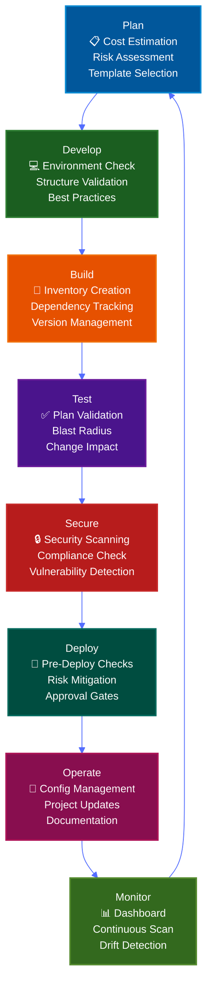

# DevSecOps SDLC for IaC with ThothCTL

## Overview

This guide demonstrates how ThothCTL enables a complete DevSecOps Software Development Lifecycle (SDLC) for Infrastructure as Code, from planning to production deployment.

## The DevSecOps SDLC Phases


```mermaid
%%{init: {'theme':'base', 'themeVariables': { 'primaryColor':'#3f51b5','primaryTextColor':'#ffffff','primaryBorderColor':'#303f9f','lineColor':'#536dfe','secondaryColor':'#536dfe','tertiaryColor':'#fff','background':'transparent','mainBkg':'#3f51b5','secondBkg':'#536dfe','tertiaryBkg':'#90caf9','textColor':'#ffffff','nodeTextColor':'#ffffff','fontSize':'14px'}}}%%
graph TB
    A["Plan<br/>📋 Cost Estimation<br/>Risk Assessment<br/>Template Selection"] --> B["Develop<br/>💻 Environment Check<br/>Structure Validation<br/>Best Practices"]
    B --> C["Build<br/>🔨 Inventory Creation<br/>Dependency Tracking<br/>Version Management"]
    C --> D["Test<br/>✅ Plan Validation<br/>Blast Radius<br/>Change Impact"]
    D --> E["Secure<br/>🔒 Security Scanning<br/>Compliance Check<br/>Vulnerability Detection"]
    E --> F["Deploy<br/>🚀 Pre-Deploy Checks<br/>Risk Mitigation<br/>Approval Gates"]
    F --> G["Operate<br/>🔧 Config Management<br/>Project Updates<br/>Documentation"]
    G --> H["Monitor<br/>📊 Dashboard<br/>Continuous Scan<br/>Drift Detection"]
    H --> A
    
    classDef planStyle fill:#01579b,stroke:#0288d1,stroke-width:2px,color:#ffffff
    classDef devStyle fill:#1b5e20,stroke:#2e7d32,stroke-width:2px,color:#ffffff
    classDef buildStyle fill:#e65100,stroke:#ef6c00,stroke-width:2px,color:#ffffff
    classDef testStyle fill:#4a148c,stroke:#6a1b9a,stroke-width:2px,color:#ffffff
    classDef secureStyle fill:#b71c1c,stroke:#c62828,stroke-width:2px,color:#ffffff
    classDef deployStyle fill:#004d40,stroke:#00695c,stroke-width:2px,color:#ffffff
    classDef operateStyle fill:#880e4f,stroke:#ad1457,stroke-width:2px,color:#ffffff
    classDef monitorStyle fill:#33691e,stroke:#558b2f,stroke-width:2px,color:#ffffff
    
    class A planStyle
    class B devStyle
    class C buildStyle
    class D testStyle
    class E secureStyle
    class F deployStyle
    class G operateStyle
    class H monitorStyle
```

### ThothCTL Coverage by Phase

| Phase | DevSecOps Practices | ThothCTL Commands |
|-------|---------------------|-------------------|
| **Plan** | Cost estimation, Risk assessment, Template selection | `init project`, `check iac --type cost-analysis` |
| **Develop** | Environment validation, Structure enforcement, Standards | `check environment`, `check iac --type structure` |
| **Build** | Dependency management, Version tracking, SBOM | `inventory iac --check-versions --check-provider-versions` |
| **Test** | Plan validation, Impact analysis, Change assessment | `check iac --type plan`, `--type blast-radius` |
| **Secure** | Security scanning, Compliance validation, CVE detection | `scan iac -t checkov -t trivy -t opa` |
| **Deploy** | Pre-deployment validation, Risk gates, Approval workflow | `check iac --type all`, `scan iac --enforcement hard` |
| **Operate** | Configuration management, Updates, Documentation | `project upgrade`, `document iac` |
| **Monitor** | Continuous monitoring, Drift detection, Dashboards | `dashboard launch`, `check iac --type drift` |

## Phase 1: Plan 📋

### Objective
Define infrastructure requirements, estimate costs, and assess risks before writing code.

### ThothCTL Commands

#### 1.1 Initialize Project Space
```bash
# Create a new space for your organization/team
thothctl init space --name production \
  --vcs github \
  --ci-system github-actions
```

**What it does:**
- Sets up organizational structure
- Configures VCS integration
- Establishes CI/CD pipelines

#### 1.2 Initialize Project
```bash
# Create new IaC project from template
thothctl init project --name my-infrastructure \
  --template terraform-aws \
  --space production
```

**What it does:**
- Scaffolds project structure
- Applies best practices
- Sets up configuration files

#### 1.3 Cost Estimation (Before Writing Code)
```bash
# Estimate costs from Terraform plan
terraform plan -out=tfplan.binary
terraform show -json tfplan.binary > tfplan.json

thothctl check iac --type cost-analysis --plan-file tfplan.json
```

**Output:**
- Monthly/annual cost projections
- Service-by-service breakdown
- Optimization recommendations
- Budget alerts

---

## Phase 2: Develop 💻

### Objective
Write IaC code following best practices and organizational standards.

### ThothCTL Commands

#### 2.1 Check Environment Setup
```bash
# Verify all required tools are installed
thothctl check environment
```

**Validates:**
- Terraform/OpenTofu/Terragrunt
- Security scanners (Checkov, Trivy, KICS)
- Documentation tools
- Version control

#### 2.2 Validate Project Structure
```bash
# Ensure project follows standards
thothctl check iac --type structure --mode hard
```

**Checks:**
- Directory structure
- File naming conventions
- Required files (README, .gitignore)
- Configuration standards

#### 2.3 Generate Documentation
```bash
# Auto-generate documentation
thothctl document iac --recursive
```

**Creates:**
- README.md with module descriptions
- Input/output documentation
- Dependency graphs
- Architecture diagrams

---

## Phase 3: Build 🔨

### Objective
Create infrastructure inventory, validate dependencies, and generate Software Bill of Materials (SBOM).

### ThothCTL Commands

#### 3.1 Create Infrastructure Inventory
```bash
# Scan and catalog all IaC components (modules + providers)
thothctl inventory iac --check-versions --check-provider-versions --recursive

# Specify framework type explicitly
thothctl inventory iac --check-versions --framework-type terragrunt

# Generate CycloneDX SBOM (OWASP standard)
thothctl inventory iac --check-versions --report-type cyclonedx
```

**Generates:**
- Component catalog (modules, providers, resources)
- Module dependencies with source URLs
- Provider versions and registries
- CycloneDX 1.6 SBOM with formulation, evidence, and attestations
- Technical debt scoring with risk levels

#### 3.2 Check for Updates
```bash
# Full version analysis: modules + providers + schema compatibility
thothctl inventory iac \
  --check-versions \
  --check-provider-versions \
  --check-schema-compatibility \
  --report-type html

# Check only provider versions (faster, no module analysis)
thothctl inventory iac --check-provider-versions --report-type json

# Use OpenTofu registry instead of Terraform
thothctl inventory iac --check-versions --provider-tool tofu

# Include hidden folders (.terraform, .terragrunt-cache) for full analysis
thothctl inventory iac --check-versions --complete

# Custom project name for reports
thothctl inventory iac --check-versions --project-name "my-platform" --report-type all
```

**Available flags:**

| Flag | Short | Description |
|------|-------|-------------|
| `--check-versions` | `-cv` | Check latest versions for modules against Terraform Registry |
| `--check-provider-versions` | `-cpv` | Check latest versions for providers (Terraform/OpenTofu registry) |
| `--check-schema-compatibility` | | Analyze breaking changes between current and latest provider versions |
| `--report-type` | `-r` | Output format: `html`, `json`, `cyclonedx`, or `all` |
| `--framework-type` | `-ft` | Framework: `auto`, `terraform`, `terragrunt`, `terraform-terragrunt`, `module`, `cdkv2` |
| `--provider-tool` | | Registry to query: `tofu` (default) or `terraform` |
| `--complete` | | Include .terraform/.terragrunt-cache in analysis |
| `--check-providers` | | Report provider information for each stack |
| `--project-name` | `-pj` | Custom project name for report headers |
| `--inventory-path` | `-iph` | Custom path for saving reports (default: `./Reports`) |
| `--post-to-pr` | | Post inventory summary as PR comment (GitHub/Azure DevOps) |
| `--vcs-provider` | | VCS for PR comments: `auto`, `azure_repos`, `github` |
| `--space` | | Space name for credential resolution |
| `--terragrunt-args` | `-tg-args` | Additional terragrunt arguments (e.g., `--feature=ci=false`) |

**Provides:**
- Latest available versions (modules and providers)
- Staleness classification (current, outdated, unknown)
- Breaking changes warnings (via schema compatibility analysis)
- Update recommendations with risk levels
- Technical debt score (0–100) with remediation guidance
- Module compatibility analysis for safe upgrades
- Professional HTML reports with collapsible stack groups

#### 3.3 Update Dependencies
```bash
# Update dependencies based on inventory analysis (interactive)
thothctl inventory iac --inventory-action update --inventory-path ./Reports/inventory.json

# Auto-approve updates (for CI/CD)
thothctl inventory iac --inventory-action update --auto-approve
```

---

## Phase 4: Test ✅

### Objective
Validate infrastructure changes before deployment.

### ThothCTL Commands

#### 4.1 Terraform Plan Validation
```bash
# Validate Terraform plan
terraform plan -out=tfplan.binary
terraform show -json tfplan.binary > tfplan.json

thothctl check iac --type plan --plan-file tfplan.json
```

**Validates:**
- Resource changes
- Dependency order
- Configuration syntax
- State consistency

#### 4.2 Blast Radius Assessment
```bash
# Assess impact of changes
thothctl check iac --type blast-radius --plan-file tfplan.json
```

**Analyzes:**
- Affected resources
- Change propagation
- Risk levels (Low/Medium/High/Critical)
- Rollback complexity
- Mitigation strategies

---

## Phase 5: Secure 🔒

### Objective
Identify and remediate security vulnerabilities using multi-tool scanning.

### ThothCTL Commands

#### 5.1 Multi-Tool Security Scanning
```bash
# Run all available scanners
thothctl scan iac -t checkov -t trivy -t kics -t opa -t terraform-compliance

# Single tool scan (default: checkov)
thothctl scan iac -t checkov

# With hard enforcement (fails pipeline on violations)
thothctl scan iac -t checkov -t trivy --enforcement hard

# With organization policies (OPA/Rego)
thothctl scan iac -t opa --policy-dir git::https://github.com/myorg/iac-policies.git

# Post results to PR comment
thothctl scan iac -t checkov -t trivy --post-to-pr

# Output as SARIF for GitHub Code Scanning
thothctl scan iac -t checkov --output sarif
```

**Available tools:**

| Tool | Flag | Detects |
|------|------|---------|
| Checkov | `-t checkov` | Misconfigurations, compliance (CIS/SOC2/HIPAA), best practices |
| Trivy | `-t trivy` | CVEs, exposed secrets, insecure configs, license issues |
| KICS | `-t kics` | Security vulnerabilities (requires Docker) |
| OPA/Conftest | `-t opa` | Custom policy-as-code (Rego), org policies |
| Terraform Compliance | `-t terraform-compliance` | BDD-style compliance testing |

**Scan options:**

| Flag | Description |
|------|-------------|
| `--enforcement` | `soft` (report only, exit 0) or `hard` (fail pipeline, exit 1) |
| `--policy-dir` | Policy directory or Git URL for OPA/Conftest |
| `--post-to-pr` | Post scan summary as PR comment |
| `--output` | Output format: `text`, `json`, or `sarif` |
| `--reports-dir` / `-r` | Directory for reports (default: `Reports`) |
| `--tftool` | Use `terraform` or `tofu` |
| `--max-workers` | Parallel checkov scans (default: 2) |
| `--compact` | Reduce memory usage on constrained CI agents |
| `--verbose` | Enable verbose output |

#### 5.2 Organization Policy Enforcement
```bash
# Use org policies from Git repo (auto-detected from space config)
export THOTH_ORG_POLICY="git::https://github.com/myorg/iac-policies.git@main"
thothctl scan iac -t opa

# Or pass explicitly
thothctl scan iac -t opa --policy-dir ./policies/

# Terraform-compliance with BDD features
thothctl scan iac -t terraform-compliance --policy-dir ./compliance/
```

**Validates:**
- Regulatory compliance (SOC2, HIPAA, PCI-DSS, CIS)
- Organizational policies (naming, tagging, architecture)
- Security baselines (encryption, network exposure, IAM)
- Custom rules (OPA/Rego)

---

## Phase 6: Deploy 🚀

### Objective
Deploy infrastructure safely with proper validation.

### ThothCTL Commands

#### 6.1 Pre-Deployment Checks
```bash
# Run all checks before deployment
thothctl check iac --type all --plan-file tfplan.json
```

**Performs:**
- Cost analysis
- Blast radius assessment
- Security scanning
- Compliance validation

#### 6.2 Generate Deployment Report
```bash
# Create comprehensive deployment report
thothctl check iac --type blast-radius \
  --plan-file tfplan.json \
  --output deployment-report.html
```

**Includes:**
- Change summary
- Risk assessment
- Cost impact
- Security findings
- Approval checklist

---

## Phase 7: Operate 🔧

### Objective
Manage and maintain deployed infrastructure.

### ThothCTL Commands

#### 7.1 Update Project Configuration
```bash
# Convert existing project to ThothCTL
thothctl project convert --project-type terraform
```

**Adds:**
- ThothCTL configuration
- Metadata tracking
- Version control integration

#### 7.2 Upgrade Project
```bash
# Update project to latest template
thothctl project upgrade --interactive
```

**Updates:**
- Template files
- Best practices
- Configuration standards
- Documentation

#### 7.3 Bootstrap Development Environment
```bash
# Set up local development
thothctl project bootstrap --dry-run
```

**Creates:**
- Pre-commit hooks
- Git configuration
- IDE settings
- Documentation

---

## Phase 8: Monitor 📊

### Objective
Track infrastructure health, detect drift, and maintain compliance.

### ThothCTL Commands

#### 8.1 Launch Dashboard
```bash
# Start web dashboard with all reports
thothctl dashboard launch

# Custom port
thothctl dashboard launch --port 9090
```

**Displays:**
- Security scan findings (filter by tool/severity/search)
- SBOM details (CycloneDX metadata, dependency graph)
- Inventory explorer (collapsible stacks, module/provider tabs)
- Cost analysis (service breakdown, monthly/annual projections)
- Drift detection (severity-classified drifted resources)
- Blast radius visualization (topology + risk)
- AI usage tracking (token counts, costs)

#### 8.2 Drift Detection
```bash
# Detect configuration drift
thothctl check iac --type drift --recursive

# With AI-powered analysis (root cause, remediation plan)
thothctl check iac --type drift --recursive --ai-provider ollama

# Filter by tags
thothctl check iac --type drift --filter-tags "env=prod,team=platform"
```

**Detects:**
- Resources that have drifted from desired state
- Severity classification (critical/high/medium/low)
- AI-powered root cause analysis
- Remediation recommendations
- Historical drift tracking

#### 8.3 Continuous Monitoring (CI/CD)
```bash
# Scheduled scan with enforcement
thothctl scan iac -t checkov -t trivy --enforcement hard --output sarif

# Inventory freshness check
thothctl inventory iac --check-versions --check-provider-versions --report-type json

# Cost drift monitoring
thothctl check iac --type cost-analysis --recursive
```

**Tracks:**
- Security posture over time (SQLite history)
- Compliance drift
- Cost trends
- Version staleness
- Infrastructure drift

---

## Complete Workflow Example

### Scenario: Deploy New AWS Infrastructure

```bash
# 1. PLAN: Initialize project
thothctl init project --name aws-prod --template terraform-aws

# 2. DEVELOP: Check environment
thothctl check environment

# 3. BUILD: Create inventory with version checks
thothctl inventory iac --check-versions --check-provider-versions --report-type html

# 4. TEST: Validate plan
terraform plan -out=tfplan.binary
terraform show -json tfplan.binary > tfplan.json
thothctl check iac --type plan --plan-file tfplan.json

# 5. SECURE: Run security scans (multi-tool)
thothctl scan iac -t checkov -t trivy -t opa --enforcement hard

# 6. ASSESS: Check blast radius
thothctl check iac --type blast-radius --plan-file tfplan.json

# 7. COST: Estimate expenses
thothctl check iac --type cost-analysis --plan-file tfplan.json

# 8. DEPLOY: Apply changes
terraform apply tfplan.binary

# 9. DOCUMENT: Generate docs
thothctl document iac --recursive

# 10. MONITOR: Launch dashboard
thothctl dashboard launch
```

---

## CI/CD Integration

### GitHub Actions Example

```yaml
name: IaC DevSecOps Pipeline

on: [pull_request, push]

jobs:
  devsecops:
    runs-on: ubuntu-latest
    steps:
      - uses: actions/checkout@v3

      - name: Setup ThothCTL
        run: pip install thothctl

      - name: Check Environment
        run: thothctl check environment

      - name: Validate Structure
        run: thothctl check iac --type structure

      - name: Create Inventory
        run: thothctl inventory iac --check-versions --check-provider-versions --report-type json

      - name: Security Scan
        run: thothctl scan iac -t checkov -t trivy --enforcement hard --output sarif

      - name: Terraform Plan
        run: |
          terraform init
          terraform plan -out=tfplan.binary
          terraform show -json tfplan.binary > tfplan.json

      - name: Blast Radius Assessment
        run: thothctl check iac --type blast-radius --plan-file tfplan.json

      - name: Cost Analysis
        run: thothctl check iac --type cost-analysis --plan-file tfplan.json

      - name: Generate Documentation
        run: thothctl document iac --recursive
```

---

## Best Practices

### For Beginners

1. **Start with templates**: Use `thothctl init project` with templates
2. **Check environment first**: Run `thothctl check environment`
3. **Use interactive mode**: Add `--interactive` flag for guidance
4. **Review reports**: Always check HTML reports for details
5. **Start with soft validation**: Use `--mode soft` initially

### For Professionals

1. **Automate everything**: Integrate into CI/CD pipelines
2. **Use strict validation**: Apply `--mode hard` for enforcement
3. **Track inventory**: Regular `inventory iac` scans
4. **Monitor costs**: Set up cost alerts and budgets
5. **Enforce compliance**: Use terraform-compliance policies
6. **Version control**: Track all changes with Git
7. **Document continuously**: Auto-generate docs on every change

---

## Key Benefits

| Phase | Without ThothCTL | With ThothCTL |
|-------|------------------|---------------|
| **Plan** | Manual cost estimation | Automated cost analysis with AWS pricing |
| **Develop** | Inconsistent structure | Enforced standards and templates |
| **Build** | Manual dependency tracking | Automated inventory with version checking |
| **Test** | Basic terraform validate | Comprehensive plan validation + blast radius |
| **Secure** | Manual security reviews | Automated multi-tool scanning |
| **Deploy** | High risk | Risk-assessed with mitigation strategies |
| **Operate** | Manual updates | Automated upgrade paths |
| **Monitor** | Scattered metrics | Unified dashboard |

---

## Next Steps

1. **Install ThothCTL**: `pip install thothctl`
2. **Initialize your first project**: `thothctl init project`
3. **Run your first scan**: `thothctl scan iac -t checkov`
4. **Explore the dashboard**: `thothctl dashboard launch`
5. **Read detailed docs**: Visit [thothctl.readthedocs.io](https://thothctl.readthedocs.io)

---

## Support

- **Documentation**: [https://thothctl.readthedocs.io](https://thothctl.readthedocs.io)
- **GitHub**: [https://github.com/thothforge/thothctl](https://github.com/thothforge/thothctl)
- **Issues**: [Report bugs or request features](https://github.com/thothforge/thothctl/issues)
