# DevSecOps SDLC for IaC with ThothCTL

## Overview

This guide demonstrates how ThothCTL enables a complete DevSecOps Software Development Lifecycle (SDLC) for Infrastructure as Code, from planning to production deployment.

## The DevSecOps SDLC Phases

```mermaid
%%{init: {'theme':'base', 'themeVariables': { 'primaryColor':'#3f51b5','primaryTextColor':'#fff','primaryBorderColor':'#303f9f','lineColor':'#536dfe','secondaryColor':'#536dfe','tertiaryColor':'#fff','background':'#ffffff','mainBkg':'#e3f2fd','secondBkg':'#bbdefb','tertiaryBkg':'#90caf9','textColor':'#000000','fontSize':'14px'}}}%%
graph TB
    A["Plan<br/>📋 Cost Estimation<br/>Risk Assessment<br/>Template Selection"] --> B["Develop<br/>💻 Environment Check<br/>Structure Validation<br/>Best Practices"]
    B --> C["Build<br/>🔨 Inventory Creation<br/>Dependency Tracking<br/>Version Management"]
    C --> D["Test<br/>✅ Plan Validation<br/>Blast Radius<br/>Change Impact"]
    D --> E["Secure<br/>🔒 Security Scanning<br/>Compliance Check<br/>Vulnerability Detection"]
    E --> F["Deploy<br/>🚀 Pre-Deploy Checks<br/>Risk Mitigation<br/>Approval Gates"]
    F --> G["Operate<br/>🔧 Config Management<br/>Project Updates<br/>Documentation"]
    G --> H["Monitor<br/>📊 Dashboard<br/>Continuous Scan<br/>Drift Detection"]
    H --> A
    
    classDef planStyle fill:#e1f5ff,stroke:#01579b,stroke-width:2px,color:#000
    classDef devStyle fill:#e8f5e9,stroke:#1b5e20,stroke-width:2px,color:#000
    classDef buildStyle fill:#fff3e0,stroke:#e65100,stroke-width:2px,color:#000
    classDef testStyle fill:#f3e5f5,stroke:#4a148c,stroke-width:2px,color:#000
    classDef secureStyle fill:#ffebee,stroke:#b71c1c,stroke-width:2px,color:#000
    classDef deployStyle fill:#e0f2f1,stroke:#004d40,stroke-width:2px,color:#000
    classDef operateStyle fill:#fce4ec,stroke:#880e4f,stroke-width:2px,color:#000
    classDef monitorStyle fill:#f1f8e9,stroke:#33691e,stroke-width:2px,color:#000
    
    class A planStyle
    class B devStyle
    class C buildStyle
    class D testStyle
    class E secureStyle
    class F deployStyle
    class G operateStyle
    class H monitorStyle
```



### ThothCTL Coverage by Phase

| Phase | DevSecOps Practices | ThothCTL Commands |
|-------|---------------------|-------------------|
| **Plan** | Cost estimation, Risk assessment, Template selection | `init project`, `check iac --type cost-analysis` |
| **Develop** | Environment validation, Structure enforcement, Standards | `check environment`, `check iac --type structure` |
| **Build** | Dependency management, Version tracking, Inventory | `inventory iac --check-versions` |
| **Test** | Plan validation, Impact analysis, Change assessment | `check iac --type plan`, `--type blast-radius` |
| **Secure** | Security scanning, Compliance validation, CVE detection | `scan iac --tool checkov/trivy/tfsec` |
| **Deploy** | Pre-deployment validation, Risk gates, Approval workflow | `check iac --type all` |
| **Operate** | Configuration management, Updates, Documentation | `project upgrade`, `document iac` |
| **Monitor** | Continuous monitoring, Drift detection, Dashboards | `dashboard launch`, scheduled scans |

## Phase 1: Plan 📋

### Objective
Define infrastructure requirements, estimate costs, and assess risks before writing code.

### ThothCTL Commands

#### 1.1 Initialize Project Space
```bash
# Create a new space for your organization/team
thothctl init space --name production \
  --vcs github \
  --ci-system github-actions
```

**What it does:**
- Sets up organizational structure
- Configures VCS integration
- Establishes CI/CD pipelines

#### 1.2 Initialize Project
```bash
# Create new IaC project from template
thothctl init project --name my-infrastructure \
  --template terraform-aws \
  --space production
```

**What it does:**
- Scaffolds project structure
- Applies best practices
- Sets up configuration files

#### 1.3 Cost Estimation (Before Writing Code)
```bash
# Estimate costs from Terraform plan
terraform plan -out=tfplan.binary
terraform show -json tfplan.binary > tfplan.json

thothctl check iac --type cost-analysis --plan-file tfplan.json
```

**Output:**
- Monthly/annual cost projections
- Service-by-service breakdown
- Optimization recommendations
- Budget alerts

---

## Phase 2: Develop 💻

### Objective
Write IaC code following best practices and organizational standards.

### ThothCTL Commands

#### 2.1 Check Environment Setup
```bash
# Verify all required tools are installed
thothctl check environment
```

**Validates:**
- Terraform/OpenTofu/Terragrunt
- Security scanners (Checkov, Trivy, TFSec)
- Documentation tools
- Version control

#### 2.2 Validate Project Structure
```bash
# Ensure project follows standards
thothctl check iac --type structure --mode hard
```

**Checks:**
- Directory structure
- File naming conventions
- Required files (README, .gitignore)
- Configuration standards

#### 2.3 Generate Documentation
```bash
# Auto-generate documentation
thothctl document iac --recursive
```

**Creates:**
- README.md with module descriptions
- Input/output documentation
- Dependency graphs
- Architecture diagrams

---

## Phase 3: Build 🔨

### Objective
Create infrastructure inventory and validate dependencies.

### ThothCTL Commands

#### 3.1 Create Infrastructure Inventory
```bash
# Scan and catalog all IaC components
thothctl inventory iac --check-versions --recursive
```

**Generates:**
- Component catalog
- Module dependencies
- Provider versions
- Compatibility matrix

#### 3.2 Check for Updates
```bash
# Identify outdated modules and providers
thothctl inventory iac --check-versions --report-type html
```

**Provides:**
- Latest available versions
- Breaking changes warnings
- Update recommendations
- Security advisories

---

## Phase 4: Test ✅

### Objective
Validate infrastructure changes before deployment.

### ThothCTL Commands

#### 4.1 Terraform Plan Validation
```bash
# Validate Terraform plan
terraform plan -out=tfplan.binary
terraform show -json tfplan.binary > tfplan.json

thothctl check iac --type plan --plan-file tfplan.json
```

**Validates:**
- Resource changes
- Dependency order
- Configuration syntax
- State consistency

#### 4.2 Blast Radius Assessment
```bash
# Assess impact of changes
thothctl check iac --type blast-radius --plan-file tfplan.json
```

**Analyzes:**
- Affected resources
- Change propagation
- Risk levels (Low/Medium/High/Critical)
- Rollback complexity
- Mitigation strategies

---

## Phase 5: Secure 🔒

### Objective
Identify and remediate security vulnerabilities.

### ThothCTL Commands

#### 5.1 Security Scanning with Checkov
```bash
# Comprehensive security scan
thothctl scan iac --tool checkov --recursive
```

**Detects:**
- Misconfigurations
- Security vulnerabilities
- Compliance violations
- Best practice deviations

#### 5.2 Scan with Trivy
```bash
# Vulnerability scanning
thothctl scan iac --tool trivy --recursive
```

**Finds:**
- CVEs in dependencies
- Exposed secrets
- Insecure configurations
- License issues

#### 5.3 Scan with TFSec
```bash
# Terraform-specific security
thothctl scan iac --tool tfsec --recursive
```

**Checks:**
- AWS/Azure/GCP security
- Encryption settings
- Network exposure
- IAM policies

#### 5.4 Compliance Testing
```bash
# Policy-as-code validation
thothctl scan iac --tool terraform-compliance \
  --feature-path ./compliance/
```

**Validates:**
- Regulatory compliance (SOC2, HIPAA, PCI-DSS)
- Organizational policies
- Tagging standards
- Naming conventions

---

## Phase 6: Deploy 🚀

### Objective
Deploy infrastructure safely with proper validation.

### ThothCTL Commands

#### 6.1 Pre-Deployment Checks
```bash
# Run all checks before deployment
thothctl check iac --type all --plan-file tfplan.json
```

**Performs:**
- Cost analysis
- Blast radius assessment
- Security scanning
- Compliance validation

#### 6.2 Generate Deployment Report
```bash
# Create comprehensive deployment report
thothctl check iac --type blast-radius \
  --plan-file tfplan.json \
  --output deployment-report.html
```

**Includes:**
- Change summary
- Risk assessment
- Cost impact
- Security findings
- Approval checklist

---

## Phase 7: Operate 🔧

### Objective
Manage and maintain deployed infrastructure.

### ThothCTL Commands

#### 7.1 Update Project Configuration
```bash
# Convert existing project to ThothCTL
thothctl project convert --project-type terraform
```

**Adds:**
- ThothCTL configuration
- Metadata tracking
- Version control integration

#### 7.2 Upgrade Project
```bash
# Update project to latest template
thothctl project upgrade --interactive
```

**Updates:**
- Template files
- Best practices
- Configuration standards
- Documentation

#### 7.3 Bootstrap Development Environment
```bash
# Set up local development
thothctl project bootstrap --dry-run
```

**Creates:**
- Pre-commit hooks
- Git configuration
- IDE settings
- Documentation

---

## Phase 8: Monitor 📊

### Objective
Track infrastructure health and compliance.

### ThothCTL Commands

#### 8.1 Generate Compliance Dashboard
```bash
# Create visual dashboard
thothctl dashboard launch
```

**Displays:**
- Security scan results
- Cost analysis
- Blast radius metrics
- Inventory status

#### 8.2 Continuous Monitoring
```bash
# Schedule regular scans
thothctl scan iac --tool checkov --recursive --output json
```

**Tracks:**
- Security posture
- Compliance drift
- Cost trends
- Version updates

---

## Complete Workflow Example

### Scenario: Deploy New AWS Infrastructure

```bash
# 1. PLAN: Initialize project
thothctl init project --name aws-prod --template terraform-aws

# 2. DEVELOP: Check environment
thothctl check environment

# 3. BUILD: Create inventory
thothctl inventory iac --check-versions

# 4. TEST: Validate plan
terraform plan -out=tfplan.binary
terraform show -json tfplan.binary > tfplan.json
thothctl check iac --type plan --plan-file tfplan.json

# 5. SECURE: Run security scans
thothctl scan iac --tool checkov
thothctl scan iac --tool trivy
thothctl scan iac --tool tfsec

# 6. ASSESS: Check blast radius
thothctl check iac --type blast-radius --plan-file tfplan.json

# 7. COST: Estimate expenses
thothctl check iac --type cost-analysis --plan-file tfplan.json

# 8. DEPLOY: Apply changes
terraform apply tfplan.binary

# 9. DOCUMENT: Generate docs
thothctl document iac --recursive

# 10. MONITOR: Launch dashboard
thothctl dashboard launch
```

---

## CI/CD Integration

### GitHub Actions Example

```yaml
name: IaC DevSecOps Pipeline

on: [pull_request, push]

jobs:
  devsecops:
    runs-on: ubuntu-latest
    steps:
      - uses: actions/checkout@v3
      
      - name: Setup ThothCTL
        run: pip install thothctl
      
      - name: Check Environment
        run: thothctl check environment
      
      - name: Validate Structure
        run: thothctl check iac --type structure
      
      - name: Create Inventory
        run: thothctl inventory iac --check-versions
      
      - name: Security Scan
        run: |
          thothctl scan iac --tool checkov
          thothctl scan iac --tool trivy
      
      - name: Terraform Plan
        run: |
          terraform init
          terraform plan -out=tfplan.binary
          terraform show -json tfplan.binary > tfplan.json
      
      - name: Blast Radius Assessment
        run: thothctl check iac --type blast-radius --plan-file tfplan.json
      
      - name: Cost Analysis
        run: thothctl check iac --type cost-analysis --plan-file tfplan.json
      
      - name: Generate Documentation
        run: thothctl document iac --recursive
```

---

## Best Practices

### For Beginners

1. **Start with templates**: Use `thothctl init project` with templates
2. **Check environment first**: Run `thothctl check environment`
3. **Use interactive mode**: Add `--interactive` flag for guidance
4. **Review reports**: Always check HTML reports for details
5. **Start with soft validation**: Use `--mode soft` initially

### For Professionals

1. **Automate everything**: Integrate into CI/CD pipelines
2. **Use strict validation**: Apply `--mode hard` for enforcement
3. **Track inventory**: Regular `inventory iac` scans
4. **Monitor costs**: Set up cost alerts and budgets
5. **Enforce compliance**: Use terraform-compliance policies
6. **Version control**: Track all changes with Git
7. **Document continuously**: Auto-generate docs on every change

---

## Key Benefits

| Phase | Without ThothCTL | With ThothCTL |
|-------|------------------|---------------|
| **Plan** | Manual cost estimation | Automated cost analysis with AWS pricing |
| **Develop** | Inconsistent structure | Enforced standards and templates |
| **Build** | Manual dependency tracking | Automated inventory with version checking |
| **Test** | Basic terraform validate | Comprehensive plan validation + blast radius |
| **Secure** | Manual security reviews | Automated multi-tool scanning |
| **Deploy** | High risk | Risk-assessed with mitigation strategies |
| **Operate** | Manual updates | Automated upgrade paths |
| **Monitor** | Scattered metrics | Unified dashboard |

---

## Next Steps

1. **Install ThothCTL**: `pip install thothctl`
2. **Initialize your first project**: `thothctl init project`
3. **Run your first scan**: `thothctl scan iac --tool checkov`
4. **Explore the dashboard**: `thothctl dashboard launch`
5. **Read detailed docs**: Visit [thothctl.readthedocs.io](https://thothctl.readthedocs.io)

---

## Support

- **Documentation**: [https://thothctl.readthedocs.io](https://thothctl.readthedocs.io)
- **GitHub**: [https://github.com/thothforge/thothctl](https://github.com/thothforge/thothctl)
- **Issues**: [Report bugs or request features](https://github.com/thothforge/thothctl/issues)
