# Platform Engineering: Template Creation & Publishing

## Overview

Platform engineers can create reusable infrastructure templates from existing projects (blueprints, POCs, or reference architectures) and publish them for consumption through Internal Developer Platforms like Backstage.

**Template Format**: ThothCTL uses `#{ }#` placeholder expressions for parameterization, not Jinja2 syntax.

**Example Blueprint**: [terragrunt_ecs_blueprint](https://github.com/velez94/terragrunt_ecs_blueprint) - Production-ready ECS Fargate architecture with ALB, RDS, and multi-AZ deployment.

## Use Case: From Project to Template

### Scenario

A platform engineering team has developed a production-ready reference architecture for a microservices platform. They want to:

1. Convert the working project into a reusable template
2. Parameterize environment-specific values using `#{ }#` expressions
3. Publish to a Git repository
4. Make it available in Backstage for self-service

### Workflow

```mermaid
%%{init: {'theme':'base', 'themeVariables': {
  'primaryColor':'#3b82f6',
  'primaryTextColor':'#ffffff',
  'primaryBorderColor':'#2563eb',
  'lineColor':'#94a3b8',
  'secondaryColor':'#10b981',
  'tertiaryColor':'#8b5cf6',
  'background':'transparent',
  'mainBkg':'#3b82f6',
  'secondBkg':'#10b981',
  'tertiaryBkg':'#8b5cf6',
  'clusterBkg':'rgba(241, 245, 249, 0.05)',
  'clusterBorder':'#475569',
  'titleColor':'currentColor',
  'edgeLabelBackground':'transparent',
  'nodeTextColor':'#ffffff',
  'textColor':'currentColor',
  'nodeBorder':'#1e293b',
  'fontSize':'14px'
}}}%%
graph LR
    A["Working<br/>Project"] --> B["Convert to<br/>Template"]
    B --> C["Parameterize<br/>Values"]
    C --> D["Test<br/>Template"]
    D --> E["Publish to<br/>Git"]
    E --> F["Register in<br/>Backstage"]
    F --> G["Self-Service<br/>Consumption"]
    
    classDef projectStyle fill:#3b82f6,stroke:#60a5fa,stroke-width:2px,color:#fff
    classDef processStyle fill:#10b981,stroke:#34d399,stroke-width:2px,color:#fff
    classDef publishStyle fill:#8b5cf6,stroke:#a78bfa,stroke-width:2px,color:#fff
    
    class A projectStyle
    class B,C,D processStyle
    class E,F,G publishStyle
```



## Step-by-Step Guide

### Step 1: Prepare Your Reference Architecture

Ensure your project is production-ready:

```bash
# Navigate to your reference architecture
cd /path/to/microservices-platform

# Verify structure
tree -L 2
```

**Example Project Structure:**
```
microservices-platform/
├── common/
│   ├── backend.tf
│   └── variables.tf
├── environments/
│   ├── dev/
│   ├── staging/
│   └── prod/
├── stacks/
│   ├── networking/
│   ├── compute/
│   ├── database/
│   └── monitoring/
├── docs/
│   └── README.md
└── root.hcl
```

### Step 2: Convert Project to Template

Use ThothCTL to convert your project into a reusable template:

```bash
# Convert project to template
thothctl project convert --make-template --template-project-type terraform

# Or for Terraform with Terragrunt
thothctl project convert --make-template --template-project-type terraform-terragrunt

# Or for standalone Terragrunt
thothctl project convert --make-template --template-project-type terragrunt

# Or for OpenTofu
thothctl project convert --make-template --template-project-type tofu

# Or for CDK v2
thothctl project convert --make-template --template-project-type cdkv2

# Or for Terraform modules
thothctl project convert --make-template --template-project-type terraform_module

# Or for custom project types
thothctl project convert --make-template --template-project-type custom
```

**What This Does:**
- Identifies hardcoded values
- Creates `#{ }#` placeholder expressions
- Generates `template.yaml` configuration
- Preserves project structure
- Creates parameterized files

### Step 3: Review Generated Template

The conversion creates template files with `#{ }#` placeholder expressions:

**Before (Project):**
```hcl
# environments/prod/main.tf
resource "aws_vpc" "main" {
  cidr_block = "10.0.0.0/16"
  
  tags = {
    Name        = "microservices-vpc"
    Environment = "production"
    Team        = "platform-engineering"
  }
}
```

**After (Template):**
```hcl
# environments/#{environment}#/main.tf
resource "aws_vpc" "main" {
  cidr_block = "#{vpc_cidr}#"
  
  tags = {
    Name        = "#{project_name}#-vpc"
    Environment = "#{environment}#"
    Team        = "#{team_name}#"
  }
}
```

**Example from Blueprint:**
```hcl
# common/common.tfvars
project_name = "#{project}#"
environment  = "#{environment}#"
region       = "#{backend_region}#"
dynamodb_table = "#{dynamodb_backend}#"
backend_bucket = "#{backend_bucket}#"
```

### Step 3.1: Manual Replacement (Alternative)

You can also manually replace values using your IDE or shell script:

```bash
# Example replacements from terragrunt_ecs_blueprint
project_name = "#{project}#"
environment  = "#{environment}#"
region       = "#{backend_region}#"
dynamodb_table = "#{dynamodb_backend}#"
backend_bucket = "#{backend_bucket}#"
```

**Using find and replace in your IDE:**
1. Find: `"my-project-name"` → Replace: `"#{project}#"`
2. Find: `"production"` → Replace: `"#{environment}#"`
3. Find: `"us-east-1"` → Replace: `"#{backend_region}#"`

**Generated `template.yaml`:**
```yaml
name: microservices-platform
description: Production-ready microservices platform on AWS
version: 1.0.0
type: terraform  # Options: terraform, terraform-terragrunt, terragrunt, tofu, cdkv2, terraform_module, custom

parameters:
  project:
    type: string
    description: Name of the project
    required: true
  
  environment:
    type: string
    description: Environment name
    default: dev
    enum: [dev, staging, prod]
  
  vpc_cidr:
    type: string
    description: VPC CIDR block
    default: "10.0.0.0/16"
  
  team_name:
    type: string
    description: Team responsible for the infrastructure
    required: true
  
  backend_region:
    type: string
    description: AWS region for backend
    default: us-east-1
  
  backend_bucket:
    type: string
    description: S3 bucket for Terraform state
    required: true
  
  dynamodb_backend:
    type: string
    description: DynamoDB table for state locking
    required: true

stacks:
  - networking
  - compute
  - database
  - monitoring
```

### Step 4: Test Template Locally

Before publishing, test the template:

```bash
# Create a test project from template
thothctl init project \
  --project-name test-microservices \
  --reuse \
  --template-path ./microservices-platform

# Verify generated project
cd test-microservices
terraform init
terraform plan
```

### Step 5: Publish Template to Git

Push your template to a Git repository:

```bash
# Initialize Git repository
cd microservices-platform
git init
git add .
git commit -m "feat: create microservices platform template"

# Push to remote (GitHub, GitLab, Azure DevOps)
git remote add origin https://github.com/your-org/microservices-platform-template.git
git push -u origin main

# Tag the release
git tag -a v1.0.0 -m "Release v1.0.0"
git push origin v1.0.0
```

### Step 6: Register in Backstage

Create a Backstage template definition:

**`template.yaml` (Backstage format):**
```yaml
apiVersion: scaffolder.backstage.io/v1beta3
kind: Template
metadata:
  name: microservices-platform
  title: Microservices Platform on AWS
  description: Production-ready microservices infrastructure with networking, compute, database, and monitoring
  tags:
    - terraform
    - aws
    - microservices
    - platform-engineering
spec:
  owner: platform-team
  type: infrastructure
  
  parameters:
    - title: Project Information
      required:
        - project_name
        - team_name
      properties:
        project_name:
          title: Project Name
          type: string
          description: Name for your microservices platform
        team_name:
          title: Team Name
          type: string
          description: Team responsible for this infrastructure
        environment:
          title: Environment
          type: string
          description: Target environment
          enum:
            - dev
            - staging
            - prod
          default: dev
    
    - title: Network Configuration
      properties:
        vpc_cidr:
          title: VPC CIDR Block
          type: string
          description: CIDR block for the VPC
          default: "10.0.0.0/16"
        aws_region:
          title: AWS Region
          type: string
          description: AWS region for deployment
          default: us-east-1
          enum:
            - us-east-1
            - us-west-2
            - eu-west-1
  
  steps:
    - id: fetch-template
      name: Fetch Template
      action: fetch:template
      input:
        url: https://github.com/your-org/microservices-platform-template
        values:
          project_name: ${{ parameters.project_name }}
          team_name: ${{ parameters.team_name }}
          environment: ${{ parameters.environment }}
          vpc_cidr: ${{ parameters.vpc_cidr }}
          aws_region: ${{ parameters.aws_region }}
    
    - id: publish
      name: Publish to GitHub
      action: publish:github
      input:
        allowedHosts: ['github.com']
        description: ${{ parameters.project_name }} - Microservices Platform
        repoUrl: github.com?owner=your-org&repo=${{ parameters.project_name }}
    
    - id: register
      name: Register Component
      action: catalog:register
      input:
        repoContentsUrl: ${{ steps.publish.output.repoContentsUrl }}
        catalogInfoPath: '/catalog-info.yaml'
  
  output:
    links:
      - title: Repository
        url: ${{ steps.publish.output.remoteUrl }}
      - title: Open in Backstage
        icon: catalog
        entityRef: ${{ steps.register.output.entityRef }}
```

### Step 7: Self-Service Consumption

Developers can now use the template through Backstage:

1. Navigate to Backstage Software Catalog
2. Click "Create Component"
3. Select "Microservices Platform on AWS"
4. Fill in parameters
5. Click "Create"

**Result:** A new repository with fully configured infrastructure ready for deployment.

## Advanced: Converting Between Frameworks

### Terragrunt to Terramate

For advanced deployment patterns:

```bash
# Convert to Terramate stacks
thothctl project convert \
  --make-terramate-stacks \
  --branch-name main

# This creates Terramate stack structure
# with proper dependencies and ordering
```

### Template to Project

Convert a template back to a working project:

```bash
# Create project from template
thothctl project convert \
  --make-project \
  --template-project-type terraform
```

## Use Cases

### 1. Blueprint Templates

**Scenario:** Create standardized blueprints for common architectures

**Examples:**
- Three-tier web application
- Serverless API platform
- Data lake infrastructure
- ML/AI platform

**Command:**
```bash
thothctl project convert --make-template --template-project-type terraform
```

### 2. POC to Production Template

**Scenario:** Convert successful POC into production-ready template

**Workflow:**
1. Develop and validate POC
2. Harden security and compliance
3. Convert to template
4. Publish for team use

**Command:**
```bash
thothctl project convert --make-template --template-project-type terraform
```

### 3. Reference Architecture Library

**Scenario:** Build a library of reference architectures

**Structure:**
```
reference-architectures/
├── microservices-platform/
├── data-analytics-platform/
├── ml-training-platform/
└── serverless-api-platform/
```

**Each template includes:**
- Infrastructure code
- Documentation
- Best practices
- Cost estimates
- Security configurations

### 4. Multi-Cloud Templates

**Scenario:** Create templates for different cloud providers

**Examples:**
- AWS microservices template
- Azure microservices template
- GCP microservices template

**Benefit:** Consistent architecture across clouds

## Integration with CI/CD

### GitHub Actions

```yaml
name: Validate Template

on:
  push:
    branches: [main]
  pull_request:

jobs:
  validate:
    runs-on: ubuntu-latest
    steps:
      - uses: actions/checkout@v3
      
      - name: Install ThothCTL
        run: pip install thothctl
      
      - name: Test Template
        run: |
          thothctl init project \
            --project-name test-project \
            --reuse \
            --template-path .
          
          cd test-project
          terraform init
          terraform validate
```

### GitLab CI

```yaml
validate-template:
  stage: test
  script:
    - pip install thothctl
    - thothctl init project --project-name test --reuse --template-path .
    - cd test && terraform init && terraform validate
```

## Best Practices

### 1. Template Design

✅ **Do:**
- Use meaningful parameter names
- Provide sensible defaults
- Include comprehensive documentation
- Add validation rules
- Include examples

❌ **Don't:**
- Hardcode sensitive values
- Over-parameterize (keep it simple)
- Skip documentation
- Ignore security best practices

### 2. Version Control

✅ **Do:**
- Use semantic versioning (v1.0.0)
- Tag releases
- Maintain CHANGELOG.md
- Document breaking changes

### 3. Documentation

Include in your template:
- `README.md` - Overview and quick start
- `USAGE.md` - Detailed usage guide
- `ARCHITECTURE.md` - Architecture decisions
- `PARAMETERS.md` - Parameter reference
- `EXAMPLES.md` - Usage examples

### 4. Testing

Test your templates:
- Unit tests (Terraform validate)
- Integration tests (actual deployment)
- Security scans (Checkov, Trivy)
- Cost analysis (ThothCTL cost analysis)

## Template Repository Structure

```
microservices-platform-template/
├── .github/
│   └── workflows/
│       └── validate.yml
├── common/
│   ├── backend.tf.j2
│   └── variables.tf.j2
├── environments/
│   └── {{ environment }}/
├── stacks/
│   ├── networking/
│   ├── compute/
│   ├── database/
│   └── monitoring/
├── docs/
│   ├── README.md
│   ├── ARCHITECTURE.md
│   └── PARAMETERS.md
├── examples/
│   ├── dev-example.yaml
│   ├── staging-example.yaml
│   └── prod-example.yaml
├── template.yaml          # ThothCTL template config
├── backstage-template.yaml # Backstage template config
├── catalog-info.yaml      # Backstage catalog entry
├── CHANGELOG.md
└── LICENSE
```

## Commands Reference

| Command | Purpose |
|---------|---------|
| `thothctl project convert --make-template` | Convert project to template |
| `thothctl project convert --make-project` | Convert template to project |
| `thothctl project convert --make-terramate-stacks` | Create Terramate stacks |
| `thothctl init project --reuse --template-path` | Create project from template |
| `thothctl project bootstrap` | Add ThothCTL support to existing project |
| `thothctl project upgrade` | Upgrade project from template |

## Benefits

### For Platform Engineers

✅ **Standardization** - Consistent infrastructure across teams  
✅ **Reusability** - Write once, use many times  
✅ **Governance** - Enforce best practices and compliance  
✅ **Efficiency** - Reduce time from idea to deployment  
✅ **Quality** - Battle-tested, production-ready templates  

### For Development Teams

✅ **Self-Service** - Deploy infrastructure without platform team  
✅ **Speed** - Minutes instead of weeks  
✅ **Confidence** - Pre-validated, secure configurations  
✅ **Focus** - Spend time on features, not infrastructure  
✅ **Consistency** - Same patterns across projects  

## Next Steps

1. **Identify** your most common infrastructure patterns
2. **Create** reference implementations
3. **Convert** to templates using ThothCTL
4. **Publish** to Git repositories
5. **Register** in Backstage or your IDP
6. **Enable** self-service for development teams

## Related Documentation

- [Project Management](../commands/project/project_overview.md)
- [Template Engine](../../template_engine/template_engine.md)
- [Init Command](../commands/init/init.md)
- [Backstage Integration](https://backstage.io/docs/features/software-templates/)

---

**Platform Engineering Team**  
*Enabling developer velocity through self-service infrastructure*
