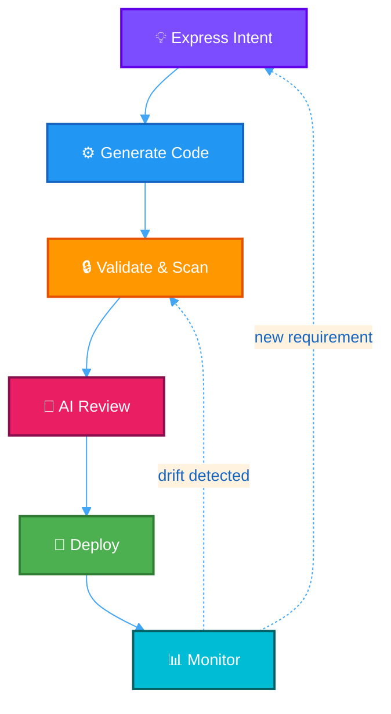

# How ThothCTL Works

ThothCTL covers the full infrastructure lifecycle — from generating code to monitoring drift in production. You can interact with it in two ways:

1. **Agent companion** — Chat with Kiro or Claude. The AI agent calls ThothCTL's MCP tools on your behalf.
2. **Direct CLI** — Run commands yourself. Scriptable, CI/CD-native, fully offline.

Both modes use the same governed engine underneath. The agent just gives you a conversational interface.

---

## Agent Companion Mode (Recommended for Builders)

Start the MCP server and connect your AI agent:

```bash
# Terminal 1: Start MCP server
thothctl mcp server

# Terminal 2: Connect with Kiro CLI
kiro-cli chat --agent thoth
```

Then just ask:

```
You: "Scan my terraform for security issues and summarize the critical findings"
You: "Generate a VPC with 3 private subnets and NAT gateway for production"
You: "What's the cost estimate for the stacks in this space?"
You: "Check if anything has drifted from the code"
```

The agent has access to **26 MCP tools** — scan, generate, review, inventory, cost analysis, drift detection, blast radius, documentation, and more. All governed by your org rules in `.thothcf.toml`.

!!! tip "Local-first: nothing leaves your machine"
    Use Ollama as the AI provider and the MCP server runs locally. Your code, prompts, and results stay on your machine. No API keys needed for local models.

    ```bash
    # AI-powered generation with local Ollama
    thothctl generate iac -i "EKS cluster with RDS" -p ollama --apply

    # AI review with local model
    thothctl ai-review analyze -d ./terraform -p ollama -m llama3
    ```

[:octicons-arrow-right-24: Full AI-DLC Guide](framework/use_cases/ai_dlc.md)

---

## Direct CLI Mode

For scripting, CI/CD, or when you prefer explicit control:

---

## The Core Loop

Every infrastructure project goes through the same cycle:



You can enter at any point. Already have Terraform code? Start at **Validate**. Greenfield project? Start at **Express Intent**.

---

## Step 1: Express Intent (or Bring Your Code)

### Option A: Start from natural language

Tell ThothCTL what you need:

```bash
thothctl generate iac \
  -i "VPC with 3 private subnets, NAT gateway, and flow logs" \
  -p ollama --apply
```

ThothCTL will:

1. Load your org rules from `.thothcf.toml` (naming conventions, required tags, security policies)
2. Fetch your organization's scaffold templates as grounding context
3. Generate Terraform/Tofu code that complies with your standards
4. Self-validate with Checkov/OPA — if violations are found, it regenerates (up to 3 times)
5. Write the files to disk

### Option B: Start from a template

```bash
thothctl init project -p my-infra -s my-space --reuse
```

Select a template from your organization's registry. Parameters are filled interactively.

### Option C: Bring existing code

Just point ThothCTL at your directory:

```bash
cd my-existing-terraform/
```

---

## Step 2: Validate & Scan

Run security scanning with one or more tools:

```bash
# Quick scan
thothctl scan iac -t checkov

# Full multi-tool scan
thothctl scan iac -t checkov -t trivy -t opa --enforcement hard
```

**What happens under the hood:**

- Each scanner runs against your IaC code
- Results are unified into a single report (HTML + JSON + SARIF)
- If `--enforcement hard` is set and critical findings exist, the command exits non-zero (blocks CI/CD)
- OPA evaluates your org policy repo (set via `THOTH_ORG_POLICY` env var)

Check dependencies for known issues:

```bash
thothctl inventory iac --check-versions
```

This produces a CycloneDX 1.6 SBOM with:

- Module and provider version tracking
- Staleness detection (how far behind latest?)
- Technical debt scoring
- Professional HTML report

---

## Step 3: AI Review

For deeper analysis beyond rule-based scanning:

```bash
# Local AI (nothing leaves your machine)
thothctl ai-review analyze -d . -p ollama

# Or cloud-based
thothctl ai-review analyze -d . -p bedrock
```

**4 specialized agents** analyze your code in parallel:

| Agent | What it does |
|---|---|
| **Security** | Finds vulnerabilities, misconfigurations, exposed secrets |
| **Architecture** | Evaluates design patterns, modularity, blast radius |
| **Fix** | Generates remediation code for each finding |
| **Decision** | Weighs severity and confidence to recommend approve/reject |

For PR automation:

```bash
thothctl ai-review decide -d . --pr-number 42 --dry-run
```

---

## Step 4: Assess Deployment Risk

Before applying:

```bash
# How much will this cost?
thothctl check iac -type cost-analysis

# What's the blast radius?
thothctl check iac -type blast-radius

# Generate a plan and validate
thothctl check iac -type plan
```

---

## Step 5: Monitor in Production

After deployment, keep watching:

```bash
# Has anything drifted from code?
thothctl check iac -type drift --recursive

# Launch the dashboard for a visual overview
thothctl dashboard launch
```

The dashboard shows security findings, inventory, cost trends, drift status, and AI usage — all in one place.

---

## The Workflow Engine: Run It All Together

Instead of running commands one by one, use the workflow engine:

```bash
# Full DevSecOps pipeline
thothctl workflow devsecops --phase all

# Pre-deployment gate (blocks on violations)
thothctl workflow devsecops --phase pre-deploy --enforcement hard

# Custom YAML workflow
thothctl workflow run --file .thothcf_workflow.yaml
```

The `--enforcement hard` flag is key: it makes the pipeline a real gate, not just an advisory.

---

## Organizational Governance

Everything above works at the individual level. To enforce standards across teams:

### 1. Define rules in `.thothcf.toml`

```toml
[rules.naming]
pattern = "{env}-{project}-{resource}"
environments = ["dev", "staging", "prod"]

[rules.tagging]
required = ["Environment", "Owner", "CostCenter"]

[rules.security]
public_access = "deny"
encryption_at_rest = "require"
```

### 2. Create a policy repo

```bash
export THOTH_ORG_POLICY=git::https://github.com/my-org/infra-policies.git
thothctl scan iac -t opa    # evaluates your Rego policies
```

### 3. Publish templates

```bash
# Convert a reference project into a reusable template
thothctl project convert --make-template
```

Teams then consume templates with `thothctl init project --reuse`.

---

## How It Connects to CI/CD

```yaml
# .github/workflows/infra.yml
- name: Security Scan
  run: thothctl scan iac -t checkov -t trivy --enforcement hard

- name: Inventory Check
  run: thothctl inventory iac --check-versions

- name: AI Review
  run: thothctl ai-review analyze -p bedrock --post-to-pr

- name: Cost Estimate
  run: thothctl check iac -type cost-analysis
```

Or use the single-command pipeline:

```yaml
- name: DevSecOps Gate
  run: thothctl workflow devsecops --phase pre-deploy --enforcement hard
```

---

## Where to Go Next

| Goal | Start here |
|---|---|
| Install and try it | [Quick Start](quick_start.md) |
| Full DevSecOps workflow | [DevSecOps SDLC Guide](framework/use_cases/devsecops_sdlc.md) |
| AI-powered development | [AI-DLC Use Case](framework/use_cases/ai_dlc.md) |
| Manage templates | [Template Engine](template_engine/template_engine.md) |
| Command reference | [Commands](framework/commands/scan/scan_overview.md) |
| Architecture deep-dive | [Software Architecture](framework/software_architecture.md) |
