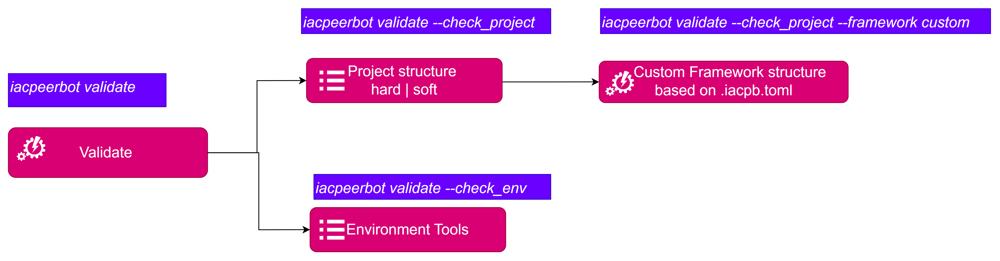
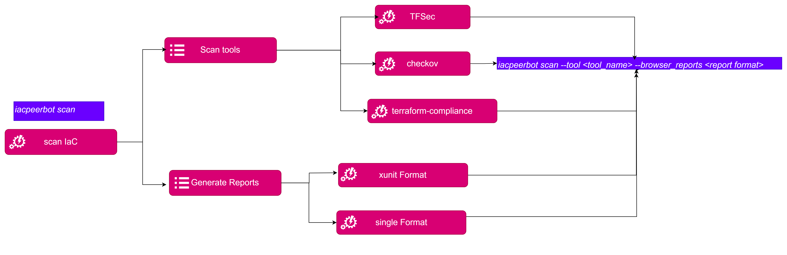
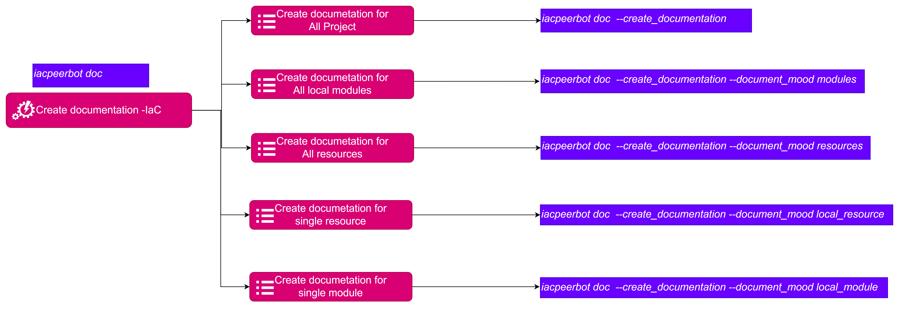
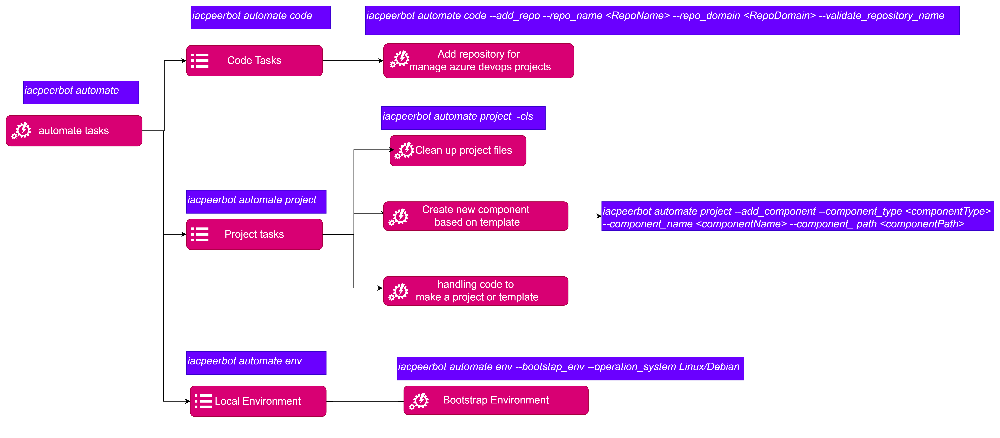
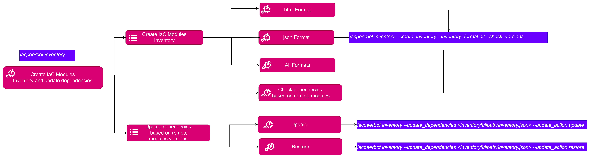
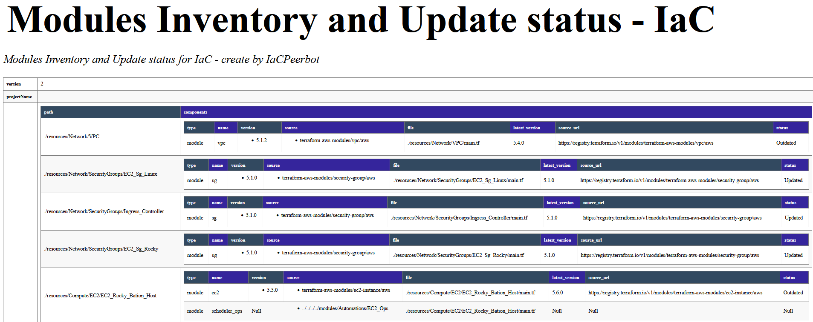
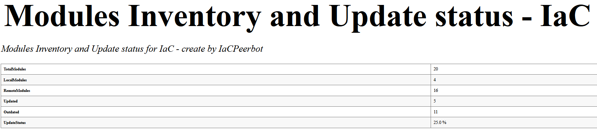

# DevSecOPS IaC Operations 

## Install Environment requirements

> At the moment only OS Linux/Debian is supported.

```commandline
thothctl automate env -bv -os Linux/Debian

```

## Validate
Check project structure based on default framework or custom framework. And validate developer environment requirements to create IaC.



```commandline

$ thothctl validate -h 
usage: thothctl validate [-h] [-ch] [-cp] [-fr {default,custom}] [-cm {hard,soft}]

Validation projects structure

optional arguments:
  -h, --help            show this help message and exit

Validation projects structure options and flags:
  -ch, --check_env      Check if your environment already have all tools for right framework use
  -cp, --check_project  Enable Check project structure and standard practices
  -fr {default,custom}, --framework {default,custom}
                        Specify the IaC framework, use default for Terraform-Terragrunt or custom for other. If custom, you must have a .thothcf.toml file, (default: default)
  -cm {hard,soft}, --check_project_mode {hard,soft}
                        Check project structure and standard practices, available values: soft or hard, (default: soft)

```
#### Validate the environment requirements
 Check if your environment already have all tools for right framework use.

```commandline
$  thothctl validate --check_env 
 
```


#### Validate project structure

Enable Check project structure and standard practices.

```commandline
  thothctl validate --check_project --check_project_mode hard --check_project_type project
 
```


## Scan Code
You can use the peerbot for scanning code using open source tools, the available tools are:
* tfsec
* checkov
* terraform-compliance

> We are working for integrating other tools.



```bash 
$ thothctl scan -h 
usage: thothctl scan [-h] [-s] [-t {tfsec,terraform-compliance,checkov}] [-op TOOL_OPTIONS] [-r REPORTS_PATH] [-b {single,xunit}] [-m {Teams}] [-w WEBHOOK] [-f FEATURE_PATH]

Scan code using tools like checkov, tfsec, terraform-compliance

optional arguments:
  -h, --help            show this help message and exit

Scan code options and flags:
  -s, --scan            Scan project
  -t {tfsec,terraform-compliance,checkov}, --tool {tfsec,terraform-compliance,checkov}
                        Use this flag for setting the tool of scanning tool. Allowed values are: tfsec, terraform-compliance or checkov, (default: checkov)
  -op TOOL_OPTIONS, --tool_options TOOL_OPTIONS
                        Use for passing more arguments for your tool. Use with -t option
  -r REPORTS_PATH, --reports_path REPORTS_PATH
                        Path for saving scanning reports
  -b {single,xunit}, --browser_reports {single,xunit}
                        Use if you want create a html reports, if you select xunit you must have installed xunit-viewer (npm -g install xunit-viewer), (default: single)
  -m {Teams}, --messages {Teams}
                        Use this flag to send messages to microsoft teams. Allowed values are: Teams, (default: None)
  -w WEBHOOK, --webhook WEBHOOK
                        Webhook url for Microsoft Teams channel, (default: )
  -f FEATURE_PATH, --feature_path FEATURE_PATH
                        The feature path for terraform-compliance, (default: )

```
The command line example:

```commandline
# thothctl -d . scan --tool tfsec   --browser_reports xunit


```


Finally, you can watch the reports into `Reports/<tool_name>` in html and xml format:

#### Scan Code and integrate with Microsoft Teams
You can scan code and integrate Microsoft Teams for getting notifications about the findings.

1. You need create or have a webhook for a channel. 
2. Export the webhook url as environment variable.

```commandline
$ export webhook=<webhook url>
```
3. Run command with flags:

```commandline
$ thothctl -d . scan -t checkov -b -m Teams -w $webhook 

```

Finally, in your teams channel you will get the notification for modules or resources that have miss configurations.


## Create Documentation

Create and document IaC using terraform-docs.

```commandline
 thothctl doc -h
usage: thothctl doc [-h] [-c] [-dm {modules,resources,local_resource,local_module}] [-tdcs TERRAFORM_DOCS_FILE]

Create and document IaC using terraform-docs

optional arguments:
  -h, --help            show this help message and exit

Documentation options and flags:
  -c, --create_documentation
                        Create code documentation base in terraform docs
  -dm {modules,resources,local_resource,local_module}, --document_mood {modules,resources,local_resource,local_module}
                        Activate documentation mood for modules or resources, available values: modules, resources, local_resource, local_module, (default: resources)
  -tdcs TERRAFORM_DOCS_FILE, --terraform_docs_file TERRAFORM_DOCS_FILE
                        Use to indicate the terraform docs config file, for example, ./.terraform-docs.yaml

```
#### Document Code automatically 

You can create code documentation base on best practices.

> For this activity the main tool is `terraform-docs`

The options are:

- Create documentation for all project.
>  Run in root project folder
> You can use custom terraform docs format using `--terraform_docs_file` flag or `-tdcs`



```commandline
# Using default values for all project
$ thothctl  doc --create_documentation
```


##### Create local documentation for single resource:
> This command could be run into resource path o specify the directory option with `--document_mood` and  option `local_resource` value.

##### Create local documentation for single module:
> This command could be run into modulo path o specify the directory option with  `--document_mood` and  option `local_module` value.

##### Create documentation for modules:
> This command could be run into modulo path o specify the directory option with  `--document_mood` and  option `modules` value.

##### Create documentation for resources:
> This command could be run into modulo path o specify the directory option with  `--document_mood` and  option `resources` value.

## Automate tasks 
There are many common tasks that require copy and paste code or interact with the IDE, these task could be accomplished using the thothctl command line. 



```commandline
$ thothctl automate -h 
usage: thothctl automate [-h] {env,code,project} ...

Automate tasks for resources folders based on your configurations

optional arguments:
  -h, --help          show this help message and exit

Automate tasks SubCommands:
  Sub Commands and functionalities for Add Command

  {env,code,project}  thothctl automate Commands
    env               Automate the boostrap local environment task and more
    code              Automate the code creation for specific use cases
    project           Handling code, clean folders, files, and add template resources, for example: thothctl automate automate project -cls -cfs file1,file2
```
You can find tree kinds of task: 

### Code tasks

The `code` subcommand. Here you can execute tasks to add code, for know just support a particular use case (add repository for manage azure devops projects).

```commandline
 thothctl automate code -h
usage: thothctl automate code [-h] [-arp] [-vlr] [-rn REPO_NAME] [-fhcl FILE_HCL] [-rdo REPO_DOMAIN]

add code command for insert some codes into a terraform file

optional arguments:
  -h, --help            show this help message and exit

Sub Commands for adding code actions:
  -arp, --add_repo      Add repository code
  -vlr, --validate_repository_name
                        Validate repository name
  -rn REPO_NAME, --repo_name REPO_NAME
                        Repository name
  -fhcl FILE_HCL, --file_hcl FILE_HCL
                        HCL to insert code name
  -rdo REPO_DOMAIN, --repo_domain REPO_DOMAIN
                        Repository Domain name where code is hcl is present, according to the project, example: data, terraform_projects

```

### Project tasks

Common task related with your project structure, handling templates and create new resources. 

```commandline
$ thothctl automate project -h
usage: thothctl automate project [-h] [-cls] [-cfs CLEAN_ADDITIONAL_FILES] [-cfd CLEAN_ADDITIONAL_FOLDERS] [-add] [-ht {make_template,make_project}] [-hd] [-cn COMPONENT_NAME] [-ct COMPONENT_TYPE] [-cph COMPONENT_PATH]

Handling code, clean folders, files, and add template resources

optional arguments:
  -h, --help            show this help message and exit

Handling code, clean folders, files, and add template resources:
  -cls, --clean_project
                        Clean project, remove .terraform, .terragrunt-cache and tfplan files recursively
  -cfs CLEAN_ADDITIONAL_FILES, --clean_additional_files CLEAN_ADDITIONAL_FILES
                        Add folders file to clean specify: -cfs file_1,file_2
  -cfd CLEAN_ADDITIONAL_FOLDERS, --clean_additional_folders CLEAN_ADDITIONAL_FOLDERS
                        Add folders file to clean specify: -cfd folder_1,folder_2
  -add, --add_component
                        Add component based on in .thothcf.toml specifications
  -ht {make_template,make_project}, --hand_template {make_template,make_project}
                        Create project template using .thothcf.toml parameters. This action clean the project and set #{values}# in project files for project attributes, (default: make_template)
  -hd, --handling_template_code
                        manipulate the template to convert it into a project or template Example: thothctl automate project init -hd -ht make_project
  -cn COMPONENT_NAME, --component_name COMPONENT_NAME
                        Component name for template
  -ct COMPONENT_TYPE, --component_type COMPONENT_TYPE
                        Component Type for base template, there are the names for your folder in p_structure.folders field in .thothcf.toml
  -cph COMPONENT_PATH, --component_path COMPONENT_PATH
                        Component path for base template, for example ./modules


```

#### Clean up project files

Use it when you need to clean some folders or files recursively o locally, for example, if you want to delete .terraform, .terragrunt-cache, tfplan, and tfplan.json files run:
```commandline
$ thothctl automate project --clean_project --clean_additional_files tfplan.json
```
> If you want to clean up more files or folders pass the list separated by `,` without whitespaces.

#### Create new component based on template

Use it when you need to add a new folder with the common structure defined in .thothcf.tmol file or default configuration.
For example if you want to add new resource whit name `demo_secret` in path `/resources/security/secrets_manager` run:


```commandline
$ thothctl automate project --add_component --component_type resources --component_name demo_secret -cph ./resources/security/secrets_manager

   _   _   _   _   _   _   _   _   _   _   
  / \ / \ / \ / \ / \ / \ / \ / \ / \ / \
 ( I | a | c | P | e | e | r | B | o | t )
  \_/ \_/ \_/ \_/ \_/ \_/ \_/ \_/ \_/ \_/

___ 🕵️   🕵️  ____
👷 Automating tasks 
👷 Creating resources demo_secret in ./resources/security/secrets_manager
No config file found. .thothcf.toml 
 Using default project structure 
 The resources structure is: ['main.tf', 'outputs.tf', 'parameters.tf', 'README.md', 'terragrunt.hcl', 'graph.svg']

$ tree -L 2 resources/security/secrets_manager
resources/security/secrets_manager
└── demo_secret
    ├── README.md
    ├── graph.svg
    ├── main.tf
    ├── outputs.tf
    ├── parameters.tf
    └── terragrunt.hcl

1 directory, 6 files

```
#### Create and move between project and templates
Use it when you need to create a template or setup parameters for you project. 

> This feature will be explained in deep in advance tasks section.

### Local Environment tasks
Automate some task for preparing or installing the recommended tools in your local environment with a command. 

> At the moment only OS Linux/Debian is supported.

```commandline
thothctl automate env -bv -os Linux/Debian

```

## Create project Inventory

Create Inventory in SBOM-Custom format for external modules and internal modules. You can create json, html and pdf reports.

> By default, the reports are stored into `Reports/inventory` folder.



```commandline
$ thothctl inventory -h
usage: thothctl inventory [-h] [-ci] [-ip INVENTORY_PATH] [-if {html,json,all}] [-check] [-updep UPDATE_DEPENDENCIES] [-av] [-upact {update,restore}]

Handling and transformer code to move and add metadata from terragrunt to terramate

options:
  -h, --help            show this help message and exit

Create, update and handling inventory options and flags:
  -ci, --create_inventory
                        Create inventory. Create a report with modules and versions
  -ip INVENTORY_PATH, --inventory_path INVENTORY_PATH
                        Path for saving inventory reports
  -if {html,json,all}, --inventory_format {html,json,all}
                        Use with -ci option for create a inventory report. Allowed values: html, json, all, (default: json)
  -check, --check_versions
                        Use with -ci option for creating a inventory report.
  -updep UPDATE_DEPENDENCIES, --update_dependencies UPDATE_DEPENDENCIES
                        Pass the inventory json file path for updating dependencies.
  -av, --auto_approve   Use with --update_dependencies option for auto approve updating dependencies.
  -upact {update,restore}, --update_action {update,restore}
                        Use with --update_action option to update or restore versions based on the inventory json file path for dependencies.
```
> Run command in the root project folder 

For example: 

```commandline
thothctl inventory --create_inventory --inventory_format all --check_versions 
```


The previous command return the following reports:

- Complete Report:



- summary Report:



### Update module version for all external modules
> Just support terraform public registry, we're working to integrate other public and private repositories.

```commandline
thothctl inventory -updep Reports/Inventory/InventoryIaC_xxxx.json --update_action update

```


#### Restore module version based on inventory file


```commandline
thothctl inventory -updep Reports/Inventory/InventoryIaC_xxxx.json --update_action restore

```

## Handling workspaces 
Handling workspaces operations for example, check if already exists the backend configuration, synchronize for modules and resources according to IaC Framework, example: thothctl hand-wk -sw


#### Sync terraform workspaces

This action is executed automatically when terragrunt commands are running. 

```hcl

//terragrunt.hcl
...
 after_hook "sync_workspace" {
    commands = ["workspace"]
    execute  = [
      "thothctl", "--sync_terraform_workspaces",

    ]

  }

  before_hook "sync_workspaces" {
    commands = ["plan", "apply", "destroy", "refresh", "state"]
    execute  = [
      "thothctl", "--sync_terraform_workspaces",

    ]

  }
...
```
The specific command if you want to run manually is:
> You must run in resource path.

```commandline
$ thothctl --sync_terraform_workspaces
```
or 

```commandline
$ thothctl hand-wk --sync_terraform_workspaces
```
## Transform tasks 

Task for create terramate project based on terragrunt. Also for detect changes in between commits for automating deployments.

