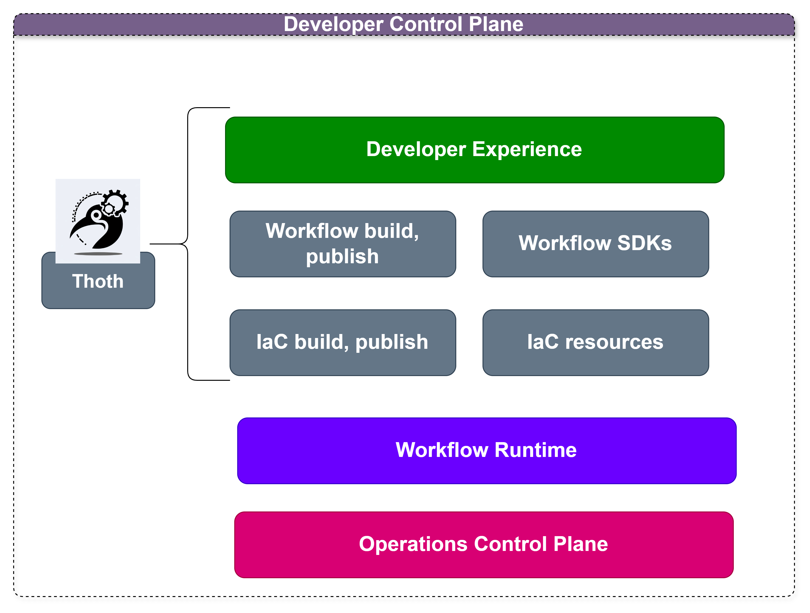

# Thoth Framework

Thoth Framework is a framework to create and manage the [Internal Developer Platform](https://internaldeveloperplatform.org/what-is-an-internal-developer-platform/) tasks for infrastructure, devops, devsecops, software developers, and platform engineering teams aligned with the business objectives:

1. [x] Minimize mistakes.
2. [x] Increase velocity
3. [x] Improve products
4. [x] Enforce compliance
5. [x] Reduce lock-in

## Mapping Mechanisms 
| Business Objective | Mechanism          | Implementation |
|-------------------|--------------------|----------------|
| Minimize mistakes | Meaninful defaults | Templates      |
| Increase velocity | Automation         | IaC Scripts    |
| Improve products | Fill product gaps  | New components |
| Enforce compliance | Restrict choinces  | Wrappers       |
| Reduce lock-in | Abstraction        | Service layers |

Thoth allows you to extend and operate your Developer Control Plane, and enable the developer experience with the internal developer platform trough command line.



# Tools

## ThothCTL

Package for accelerating the adoption of Internal Frameworks, enable reusing and interaction with the Internal Developer Platform. 

# Use cases
- **[Template Engine](template_engine/template_engine.md)**: 
  - Source control setup
  - Source code starter kit
  - Build and configure any kind of template
  - Handling templates to create, add, remove or update components
  
- **Automate tasks**:
  - Create and bootstrap local development environment
  - Extend CI/CD pull request workflow
  - Create documentation for projects (IaC), Generative AI doc generation

- **Check and compliance**:
  - Check project structure
    - DevSecOps for IaC (Terraform, tofu)
      - Scan your IaC terraform,tofu templates
      - Generate reports 
      - Manage inventory and dependencies
      - Review IaC changes and make suggestions (Generative AI)
      
- **Internal Developer Platform CLI**
  - Create projects from your templates
  


# Getting Started

```bash
$ thothctl -h

usage: thothctl [-h] [-d DIRECTORY_CODE] [-v] [-bv] [-os {Linux/Debian}] [-sw] [-l] {init,scan,doc,transform,validate,hand-wk,automate,inventory} ...

Accelerate DevSecOps IaC projects implementation and developer tasks.

options:
  -h, --help            show this help message and exit
  -d DIRECTORY_CODE, --directory_code DIRECTORY_CODE
                        Root path for code project (default: .)
  -v, --version         Get Version
  -bv, --bootstrap_env  Install base tools for you environment.
  -os {Linux/Debian}, --operation_system {Linux/Debian}
                        Install base tools for you environment, (default: Linux/Debian). Use with --bootstrap_env Allowed values: 'Linux/Debian'
  -sw, --sync_terraform_workspaces
                        Synchronize terraform workspaces for dependencies tree base on terragrunt + terraform framework
  -l, --verbose         Enable debug Mode

Commands:
  Command and functionalities

  {init,scan,doc,transform,validate,hand-wk,automate,inventory}
                        thothctl Commands
    init                Initialize project, provide project name,example: thothctl init -pj <project-name>
    scan                Scan code using tools example: thothctl scan -t checkov
    doc                 Create and document IaC using terraform-docsexample: thothctl doc -d . -dm local_module
    transform           Transform your code to use terramate and terragrunt together or singleexample: thothctl -d . -l transform -j -y $main_branch
    validate            Check project structure based on default framework or custom framework. For example: thothctl validate -cp -d -cm hard
    hand-wk             Handling workspaces operations for example, check if already exists the backend configuration, synchronize for modules and resources according to IaC Framework, example: thothctl hand-wk -sw
    automate            Automate tasks for example adding resources folders based on your configurations, Create code component template based on project structure define into .thothcf.tomlexample: thothctl add -cn test -ct     
                        resource -cph ./resources/myresource
    inventory           Transform your code to use terramate and terragrunt together or singleexample: thothctl inventory -ci -if all -check

Thanks for using thothctl!


```

# Requirements
 - Linux Environment or Windows environment

> This documentation uses wsl with ubuntu 20.04 but you can use other superior version

## OS Packages

- dot or graphviz

You can install them with:

### Windows
 Chocolatey packages Graphviz for **Windows**.

`choco install graphviz`
### Linux
Install packages with apt for Linux/Debian
- 
```bash 
sudo apt install graphviz -y
```
- python >= 3.8 
    - check: `python --version` 

- wkhtmltopdf

You can install it using: 

```commandline
apt-get install wkhtmltopdf
```

> Visit [wkhtmltopdf](https://github.com/JazzCore/python-pdfkit/wiki/Installing-wkhtmltopdf) for more.

### AddOns

If you are going to send messages to Microsoft Teams channel you must set an environment variable with name `webhook`
> Visit [Webhooks and connectors](https://docs.microsoft.com/en-us/microsoftteams/platform/webhooks-and-connectors/what-are-webhooks-and-connectors) for more.

### Python packages

There are many dependencies for thothctl functions, these dependencies are automatically installed when run `pip install` command.


# Install

```Bash
pip install --upgrade thothctl
```

## Extras
### Enable autocomplete
Argcomplete provides easy, extensible command line tab completion of arguments for your Python application.

It makes two assumptions:

* You’re using bash or zsh as your shell

* You’re using argparse to manage your command line arguments/options

Argcomplete is particularly useful if your program has lots of options or subparsers, and if your program can dynamically suggest completions for your argument/option values (for example, if the user is browsing resources over the network).
Run: 
```bash
activate-global-python-argcomplete
```
and to make sure that bash knows about this script, you use
```bash

echo 'eval "$(register-python-argcomplete thothctl)"' >> ~/.bashrc
source ~/.bashrc

```

## OpenTofu

## Backstage

## Terragrunt

## Version control Systems (Azure DevOps, Github, Gitlab)

# RoadMap

