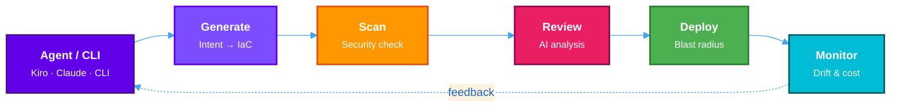

---
hide:
  - navigation
  - toc
---

# ThothCTL

**AI-Powered Infrastructure Lifecycle CLI** — scan, generate, review, and govern your IaC from a single tool.

<div class="grid cards" markdown>

-   :material-shield-check:{ .lg .middle } **Security Scanning**

    ---

    5 integrated scanners (Checkov, Trivy, KICS, OPA, TF-compliance) with unified reports and enforcement.

    [:octicons-arrow-right-24: Scan your code](framework/commands/scan/scan_overview.md)

-   :material-robot:{ .lg .middle } **Agent Companion Development**

    ---

    Build IaC with Kiro or Claude as your agent — ThothCTL's 26 MCP tools give AI agents hands to scan, generate, review, and deploy on your behalf.

    [:octicons-arrow-right-24: AI-DLC Workflow](framework/use_cases/ai_dlc.md)

-   :material-creation:{ .lg .middle } **Intent-to-IaC Generation**

    ---

    Natural language → governed Terraform via CLI or agent. Org rules enforced at generation time, scaffold-grounded, self-correcting.

    [:octicons-arrow-right-24: Generate IaC](framework/commands/generate/generate_iac.md)

-   :material-chart-timeline-variant:{ .lg .middle } **Inventory & SBOM**

    ---

    CycloneDX 1.6 compliant SBOM, technical debt scoring, and dependency staleness tracking.

    [:octicons-arrow-right-24: Track dependencies](framework/commands/inventory/inventory_overview.md)

-   :material-currency-usd:{ .lg .middle } **Cost & Drift**

    ---

    AWS cost projections, ITIL v4 blast radius, and AI-powered drift detection.

    [:octicons-arrow-right-24: Analyze costs](framework/commands/check/cost-analysis.md)

-   :material-pipe:{ .lg .middle } **DevSecOps Workflows**

    ---

    Composable YAML pipelines with 7 SDLC phases. Hard/soft enforcement. CI/CD ready.

    [:octicons-arrow-right-24: Run workflows](framework/commands/workflow/workflow_overview.md)

</div>

---

## 30 Seconds to First Result

```bash
pip install thothctl
thothctl scan iac -t checkov     # scan existing IaC
```

Or use the guided setup:

```bash
thothctl quickstart              # interactive onboarding
```

---

## How It Works


```mermaid
%%{init: {'theme':'base', 'themeVariables': { 'primaryColor':'#e3f2fd','primaryTextColor':'#1565c0','primaryBorderColor':'#1976d2','lineColor':'#42a5f5','secondaryColor':'#fff3e0','tertiaryColor':'#f3e5f5','fontSize':'14px'}}}%%
graph LR
    agent["<b>Agent / CLI</b><br/><small>Kiro · Claude · CLI</small>"]:::node0
    generate["<b>Generate</b><br/><small>Intent → IaC</small>"]:::node1
    scan["<b>Scan</b><br/><small>Security check</small>"]:::node2
    review["<b>Review</b><br/><small>AI analysis</small>"]:::node3
    deploy["<b>Deploy</b><br/><small>Blast radius</small>"]:::node4
    monitor["<b>Monitor</b><br/><small>Drift & cost</small>"]:::node5

    agent --> generate --> scan --> review --> deploy --> monitor
    monitor -.->|"feedback"| agent

    classDef node0 fill:#6200ea,stroke:#4a148c,stroke-width:2px,color:#fff
    classDef node1 fill:#7c4dff,stroke:#6200ea,stroke-width:2px,color:#fff
    classDef node2 fill:#ff9800,stroke:#e65100,stroke-width:2px,color:#fff
    classDef node3 fill:#e91e63,stroke:#880e4f,stroke-width:2px,color:#fff
    classDef node4 fill:#4caf50,stroke:#2e7d32,stroke-width:2px,color:#fff
    classDef node5 fill:#00bcd4,stroke:#006064,stroke-width:2px,color:#fff
```

**Two interaction modes — same governed lifecycle:**

- **Agent companion** (Kiro, Claude) — AI agent drives ThothCTL via MCP. You chat, it executes. [:octicons-arrow-right-24: AI-DLC Guide](framework/use_cases/ai_dlc.md)
- **Direct CLI** — You run commands directly. Scriptable, CI/CD-native. [:octicons-arrow-right-24: How It Works](how_it_works.md)

---

## Choose Your Path

=== "I want an AI agent to help me build"

    Use Kiro CLI or Claude as your companion — the agent calls ThothCTL via MCP:

    ```bash
    # Start the MCP server (agents connect to this)
    thothctl mcp server

    # In Kiro CLI:
    kiro-cli chat --agent thoth
    # → "Scan my terraform for security issues"
    # → "Generate a VPC with 3 private subnets"
    # → "What's the cost estimate for this stack?"
    ```

    The agent has access to 26 MCP tools: scan, generate, review, inventory, cost analysis, drift detection, and more — all governed by your org rules.

    [:octicons-arrow-right-24: Full AI-DLC Guide](framework/use_cases/ai_dlc.md)

=== "I have existing IaC"

    ```bash
    cd my-terraform-project
    thothctl scan iac -t checkov -t trivy     # security audit
    thothctl inventory iac --check-versions   # dependency check
    thothctl check iac -type cost-analysis    # cost estimate
    ```

=== "I'm starting fresh"

    ```bash
    thothctl quickstart                       # guided setup
    # or:
    thothctl init space -s my-space -vcs github
    thothctl init project -p my-infra -s my-space
    ```

=== "I want to generate IaC from intent"

    ```bash
    thothctl generate iac \
      -i "VPC with 3 private subnets and NAT gateway" \
      -p ollama --apply
    ```

=== "I'm integrating into CI/CD"

    ```yaml
    # GitHub Actions
    - run: thothctl scan iac -t checkov -t trivy --enforcement hard
    - run: thothctl inventory iac --check-versions
    - run: thothctl ai-review analyze -p bedrock
    ```

---

## What Makes ThothCTL Different

| | ThothCTL | Other tools |
|---|---|---|
| **Scope** | Full lifecycle (generate → scan → review → deploy → monitor) | Single-purpose |
| **Agent-native** | 26 MCP tools — agents (Kiro, Claude) use ThothCTL as their hands | No agent integration |
| **AI** | Multi-agent review + intent-to-IaC + agent companion workflow | None or basic |
| **Cost** | Open-source, local-first, offline capable (Ollama) | SaaS, vendor-locked |
| **Output** | Standard Terraform/HCL — no runtime lock-in | Proprietary formats |
| **Governance** | OPA/Rego + org rules enforced at generation time | Post-hoc scanning only |

---

## Supported Platforms

| Framework | Scan | Generate | Inventory | Check | Document |
|-----------|:----:|:--------:|:---------:|:-----:|:--------:|
| **Terraform** | ✅ | ✅ | ✅ | ✅ | ✅ |
| **OpenTofu** | ✅ | ✅ | ✅ | ✅ | ✅ |
| **Terragrunt** | ✅ | ✅ | ✅ | ✅ | ✅ |
| **CDK v2** | ✅ | ✅ | ✅ | ✅ | — |

**Requirements**: Python 3.10+ · Linux, macOS, or Windows (WSL)

---

## Next Steps

<div class="grid cards" markdown>

-   [:material-rocket-launch: **Quick Start Guide**](quick_start.md)

    Full installation and first project walkthrough.

-   [:material-book-open-variant: **Use Cases**](framework/use_cases/README.md)

    Real-world scenarios: DevSecOps, AI workflows, templates.

-   [:material-cog: **Command Reference**](framework/commands/scan/scan_overview.md)

    Complete documentation for all 15+ commands.

-   [:material-github: **GitHub**](https://github.com/thothforge/thothctl)

    Source code, issues, and contributions.

</div>
