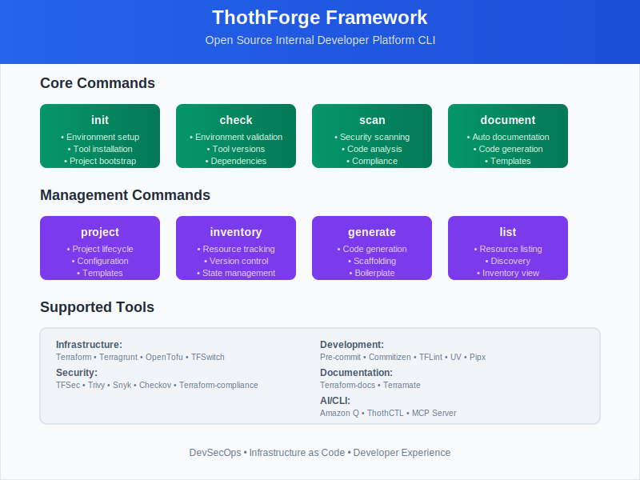

# Thoth Framework

Thoth Framework is a framework to create and manage the [Internal Developer Platform](https://internaldeveloperplatform.org/what-is-an-internal-developer-platform/) tasks for infrastructure, devops, devsecops, software developers, and platform engineering teams aligned with the business objectives:

1. ✔️ Minimize mistakes.
2. ✔️ Increase velocity
3. ✔️ Improve products
4. ✔️ Enforce compliance
5. ✔️ Reduce lock-in

## Cross-Platform Support

ThothCTL works seamlessly across all major platforms:

| Platform | Support Level | Shell Integration | Installation |
|----------|---------------|-------------------|--------------|
| **Windows 10/11** | ✅ Full | PowerShell autocomplete | `pip install thothctl` |
| **Linux** | ✅ Full | Bash/Zsh/Fish autocomplete | `pip install thothctl` |
| **macOS** | ✅ Full | Bash/Zsh/Fish autocomplete | `pip install thothctl` |

- **Native Windows Support**: PowerShell integration, Windows paths, `.exe` detection
- **Universal Installation**: Single `pip install` command works everywhere
- **Platform-Aware**: Automatic detection and adaptation to your environment

## Mapping Mechanisms 
| Business Objective | Mechanism          | Implementation |
|-------------------|--------------------|----------------|
| Minimize mistakes | Meaninful defaults | Templates      |
| Increase velocity | Automation         | IaC Scripts    |
| Improve products | Fill product gaps  | New components |
| Enforce compliance | Restrict choinces  | Wrappers       |
| Reduce lock-in | Abstraction        | Service layers |

Thoth allows you to extend and operate your Developer Control Plane, and enable the developer experience with the internal developer platform trough command line.

# Tools

## ThothCTL

Package for accelerating the adoption of Internal Frameworks, enable reusing and interaction with the Internal Developer Platform. 

# Use cases

- **[Template Engine](template_engine/template_engine.md)**:
  - Build and configure any kind of template
  - Handling templates to create, add, remove or update components
  - Code generation from scaffold projects
  
- **[AI-Powered Development Lifecycle (AI-DLC)](framework/use_cases/ai_dlc.md)**:
  - MCP Integration with Kiro CLI (Amazon Q)
  - AI orchestrates ThothCTL commands or analyzes results
  - Natural language interface for IaC operations
  - Scaffold templates from [ThothForge GitHub](https://github.com/thothforge)

- **[DevSecOps SDLC for IaC](framework/use_cases/devsecops_sdlc.md)**:
  - 8-phase lifecycle (Plan → Deploy → Monitor)
  - Security scanning (Checkov, Trivy, TFSec)
  - AWS cost analysis with real-time pricing
  - Blast radius assessment (ITIL v4)
  - [Quick Start Guide](framework/use_cases/devsecops_quickstart.md)
  
- **Automate tasks**:
  - Create and bootstrap local development environment
  - Extend CI/CD pull request workflow
  - Create documentation for projects (IaC), Generative AI doc generation

- **Check and compliance**:
  - Check project structure
    - DevSecOps for IaC (Terraform, OpenTofu, Terragrunt)
      - Scan your IaC templates
      - Generate professional reports
      - Manage inventory and dependencies
      - Review IaC changes and make suggestions (Generative AI)
      - **AWS Cost Analysis** - Estimate infrastructure costs from Terraform plans
      
- **Internal Developer Platform CLI**
  - Create projects from your templates
  - Source control setup (GitHub, GitLab, Azure DevOps)
  - Scaffold - quickly set up the structure of a project
  - Space management for organizational structure
  

