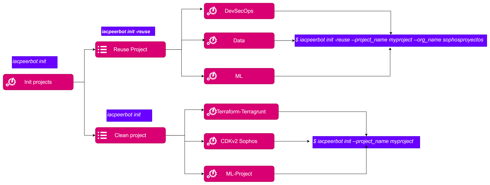

# Quick Start

## Help Command

For getting the use cases you can run `thothctl -h`
```commandline
$ thothctl -h
usage: thothctl [-h] [-d DIRECTORY_CODE] [-v] [-sw] [-l] {init,scan,doc,transform,validate,hand-wk,automate,inventory} ...

Accelerate DevSecOps IaC projects implementation and developer tasks.

options:
  -h, --help            show this help message and exit
  -d DIRECTORY_CODE, --directory_code DIRECTORY_CODE
                        Root path for code project (default: .)
  -v, --version         Get Version
  -sw, --sync_terraform_workspaces
                        Synchronize terraform workspaces for dependencies tree base on terragrunt + terraform framework
  -l, --verbose         Enable debug Mode

Commands:
  Command and functionalities

  {init,scan,doc,transform,validate,hand-wk,automate,inventory}
                        thothctl Commands
    init                Initialize project, provide project name,example: thothctl init -pj <project-name>
    scan                Scan code using tools example: thothctl scan -t checkov
    doc                 Create and document IaC using terraform-docsexample: thothctl doc -d . -dm local_module
    transform           Transform your code to use terramate and terragrunt together or singleexample: thothctl -d . -l transform -j -y
                        $main_branch
    validate            Check project structure based on default framework or custom framework. For example: thothctl validate -cp -d -cm hard
    hand-wk             Handling workspaces operations for example, check if already exists the backend configuration, synchronize for modules and
                        resources according to IaC Framework, example: thothctl hand-wk -sw
    automate            Automate tasks for example adding resources folders based on your configurations, Create code component template based on
                        project structure define into .thothcf.tomlexample: thothctl add -cn test -ct resource -cph ./resources/myresource
    inventory           Transform your code to use terramate and terragrunt together or singleexample: thothctl inventory -ci -if all -check

Thanks for using thothctl!
```


## Initialize a new project

Initialize project based on templates, custom framework or void template.

```commandline

$ thothctl init -h

usage: thothctl init [-h] -pj PROJECT_NAME [-pjt PROJECT_TYPE] [-sp] [-reuse] [-azp AZ_PROJECT_NAME] [-org_name ORG_NAME] [-r_action {reuse,clone}]

Initialize project from idp, default template or custom values

options:
  -h, --help            show this help message and exit

Init project and handling projects and templates options and flags:
  -pj PROJECT_NAME, --project_name PROJECT_NAME
                        Initialize project, provide project name
  -pjt PROJECT_TYPE, --project_type PROJECT_TYPE
                        Provide project type according to Internal Developer Portal and frameworks
  -sp, --setup_conf     Setup .thothcf.toml for thothctl configuration file

Interact with the internal developer platform options and flags:
  -reuse, --reuse_patterns
                        Reuse pattern from external repository. Use with init option
  -azp AZ_PROJECT_NAME, --az_project_name AZ_PROJECT_NAME
                        Reuse pattern from external repository, Use with init option
  -org_name ORG_NAME, --org_name ORG_NAME
                        Organization tool for azure DevOps, Use with init option
  -r_action {reuse,clone}, --remote_actions {reuse,clone}
                        Action for clone or list repositories or patterns. Values: reuse, clone, (default: reuse) Use with init option

```

> Just support Azure DevOps Integration - We're working for more integrations 
### Init command summary options




### Use cases

#### Create project from void template

You can create a project without content, just a void template with base structure. For example:

```commandline
$  thothctl init -pj <project_name>

```


#### Create a new project based on existing templates
> You must have a Personal Access Token for list the projects in Azure DevOps and clone in your local machine.

In this case you can use additional flag for create a project from current Sophos code warehouse in Azure DevOps.

1. Run thothctl for reusing.

```commandline
$  thothctl init --project_name myproject -reuse   --org_name sophosproyectos

```


