# Template Engine

ThothCTL's Template Engine handles two related but distinct workflows for Infrastructure as Code templates. Choose your path:

| I want to... | Read this |
|---|---|
| **Start a new project** from a template | [For Developers](for_developers.md) |
| **Create and publish templates** for my team | [For Platform Engineers](for_platform_engineers.md) |

## Two Systems, One Goal

### 1. Project Scaffolding (`thothctl init project`)

Creates new projects from pre-built scaffold repositories. Templates live in Git and are fetched at project creation time.

```bash
# From default ThothForge scaffolds
thothctl init project --project-name my-infra --project-type terraform-terragrunt

# From your organization's catalog (VCS-based discovery)
thothctl init project --project-name my-service --reuse --space my-team
```

**Audience**: Developers starting projects  
**Source**: GitHub repos, Azure DevOps repos  
**Discovery**: `--reuse` flag + space configuration

### 2. Template Conversion Engine (`thothctl project convert`)

Converts working projects into parameterized templates (and back) using `#{placeholder}#` expressions. This is how platform engineers **create** the templates that developers consume.

```bash
# Convert project → template
thothctl project convert --make-template --template-project-type terraform-terragrunt

# Template → project (instantiate)
thothctl project convert --make-project --template-project-type terraform-terragrunt
```

**Audience**: Platform engineers maintaining templates  
**Source**: Any working IaC project  
**Mechanism**: Value↔placeholder substitution via `.thothcf.toml` rules

### How They Connect

```mermaid
%%{init: {'theme':'base', 'themeVariables': {
  'primaryColor':'#3b82f6',
  'primaryTextColor':'#ffffff',
  'primaryBorderColor':'#2563eb',
  'lineColor':'#94a3b8',
  'secondaryColor':'#10b981',
  'tertiaryColor':'#8b5cf6',
  'background':'transparent',
  'mainBkg':'#3b82f6',
  'secondBkg':'#10b981',
  'tertiaryBkg':'#8b5cf6',
  'clusterBkg':'rgba(241, 245, 249, 0.05)',
  'clusterBorder':'#475569',
  'titleColor':'currentColor',
  'edgeLabelBackground':'transparent',
  'nodeTextColor':'#ffffff',
  'textColor':'currentColor',
  'nodeBorder':'#1e293b',
  'fontSize':'14px'
}}}%%
graph LR
    A["Working<br/>Project"] --> B["project convert<br/>--make-template"]
    B --> C["Push to<br/>Git"]
    C --> D["Register in<br/>Space / Backstage"]
    D --> E["init project<br/>--reuse --space"]
    E --> F["Fill in<br/>Parameters"]
    F --> G["New Working<br/>Project"]
    G -.-> H["project upgrade<br/>(sync later)"]
    H -.-> C

    classDef peStyle fill:#8b5cf6,stroke:#a78bfa,stroke-width:2px,color:#fff
    classDef devStyle fill:#10b981,stroke:#34d399,stroke-width:2px,color:#fff

    class A,B,C,D peStyle
    class E,F,G,H devStyle
```



---

## How It Works

The template engine uses a simple placeholder format — `#{parameter_name}#` — embedded directly in your IaC files. When creating a project from a template, placeholders are replaced with concrete values. When converting a project into a template, concrete values are replaced with placeholders.

```
Working Project ──► make-template ──► Reusable Template ──► make-project ──► New Project
```

### Placeholder Format

```hcl
# Template file
resource "aws_s3_bucket" "state" {
  bucket = "#{project}#-#{environment}#-tfstate"
  
  tags = {
    Project     = "#{project}#"
    Environment = "#{environment}#"
    Owner       = "#{owner}#"
  }
}
```

When instantiated with `project=my-app`, `environment=dev`, `owner=platform-team`:

```hcl
# Generated project file
resource "aws_s3_bucket" "state" {
  bucket = "my-app-dev-tfstate"
  
  tags = {
    Project     = "my-app"
    Environment = "dev"
    Owner       = "platform-team"
  }
}
```

## Key Commands

| Command | Purpose |
|---------|---------|
| `thothctl init project` | Create a new project from a GitHub scaffold template |
| `thothctl init template` | Configure custom template repository URLs |
| `thothctl project convert --make-template` | Convert a working project into a reusable template |
| `thothctl project convert --make-project` | Instantiate a template into a working project |
| `thothctl project upgrade` | Sync project files with upstream template changes |
| `thothctl generate component` | Create a component within an existing project |
| `thothctl generate stacks` | Generate infrastructure stacks from configuration |

## Template Lifecycle

### 1. Create a Project from a Scaffold

```bash
# Creates project from GitHub scaffold (auto-fetches template)
thothctl init project --project-name my-infra --project-type terraform-terragrunt

# CDK project with language selection
thothctl init project --project-name my-app --project-type cdkv2 --language python
```

Supported project types: `terraform`, `terraform-terragrunt`, `terragrunt`, `tofu`, `cdkv2`, `terraform_module`

### 2. Convert Project → Template

Once your project is production-ready, convert it into a reusable template:

```bash
thothctl project convert --make-template --template-project-type terraform-terragrunt
```

This:
- Reads `[project_properties]` from `.thothcf.toml`
- Replaces concrete values with `#{placeholder}#` expressions in all eligible files
- Saves the template to `~/.thothcf/<project_name>/`
- Backs up the original config for future restoration
- Registers file hashes in the global template registry

### 3. Create Project from Template

```bash
thothctl project convert --make-project --template-project-type terraform-terragrunt
```

This:
- Restores configuration from the template backup
- Prompts for parameter values (or uses `[template_input_parameters]` definitions)
- Replaces all `#{placeholder}#` expressions with provided values

### 4. Upgrade Project from Template

```bash
# Check what would change
thothctl project upgrade --dry-run

# Interactive file selection
thothctl project upgrade --interactive

# Force update all files
thothctl project upgrade --force
```

## Configuration: `.thothcf.toml`

The `.thothcf.toml` file is the central configuration for templates. It defines parameters, validation rules, and project structure requirements.

### Template Input Parameters

```toml
[thothcf]
project_id = "my-project"

[template_input_parameters.project_name]
template_value = "#{project}#"
condition = "^[a-zA-Z0-9_-]+$"
description = "Project Name"

[template_input_parameters.environment]
template_value = "#{environment}#"
condition = "(dev|qa|stg|test|prod)"
description = "Environment name"

[template_input_parameters.deployment_region]
template_value = "#{backend_region}#"
condition = "^[a-z]{2}-[a-z]{4,10}-\\d$"
description = "AWS Region for deployment"

[template_input_parameters.backend_bucket]
template_value = "#{backend_bucket}#"
condition = "^[a-z0-9][a-z0-9.-]{1,61}[a-z0-9]$"
description = "S3 bucket for Terraform state"
```

Each parameter has:
- `template_value`: The `#{...}#` placeholder used in template files
- `condition`: Regex pattern for input validation
- `description`: Human-readable prompt text

### Project Structure

```toml
[project_structure]
root_files = [".gitignore", "README.md", ".thothcf.toml"]
ignore_folders = [".git", ".terraform", "Reports"]

[[project_structure.folders]]
name = "modules"
mandatory = true
type = "root"
content = ["main.tf", "variables.tf", "outputs.tf"]

[[project_structure.folders]]
name = "stacks"
mandatory = true
type = "root"
```

## Custom Template Repositories

Override default scaffold repositories per project type:

```bash
# Set a custom template URL
thothctl init template --project-type terraform --template-url https://github.com/myorg/custom-terraform.git
```

Configuration stored in `~/.thothcf/.thothctl_templates.toml`:

```toml
[templates]
terraform = "https://github.com/myorg/custom-terraform-template.git"
cdkv2 = "https://github.com/myorg/custom-cdk-template.git"
```

## Component Generation

Generate components within an existing project based on structure rules defined in `.thothcf.toml`:

```bash
thothctl generate component \
  --component-type modules \
  --component-name networking \
  --component-path ./modules
```

This reads the `[[project_structure.folders]]` section to determine what files to create in the new component folder.

## Template Storage & Discovery

### Configuration Hierarchy

Template URLs are resolved in this order:

| Priority | Source | Scope | How It's Set |
|----------|--------|-------|-------------|
| 1 | `~/.thothcf/.thothctl_templates.toml` | Per-user (global) | `thothctl init template --project-type X --template-url Y` |
| 2 | ThothForge defaults (hardcoded) | All users | Built into `GitHubTemplateLoader.DEFAULT_TEMPLATES` |

If a custom URL is configured, it takes precedence over the ThothForge default for that project type.

### VCS Discovery (`--reuse`)

The `--reuse --space` flag uses a **different mechanism** — it doesn't read template URLs from config. Instead, it connects to your VCS provider (GitHub org or Azure DevOps project) and lists repositories matching template naming patterns. This enables dynamic discovery without pre-registration.

```bash
# Uses config-based URL resolution (priority 1 → 2)
thothctl init project --project-name my-app --project-type terraform

# Uses VCS discovery (connects to GitHub/Azure DevOps, lists repos)
thothctl init project --project-name my-app --reuse --space my-team
```

### File Locations

| Path | Purpose |
|------|---------|
| `~/.thothcf/.thothctl_templates.toml` | Custom scaffold URL overrides (per-user) |
| `~/.thothcf/<project_name>/` | Saved template files (from `--make-template`) |
| `~/.thothcf/.thothcf.toml` | Global template registry with file hashes |

## Scaffold Template Catalog

### Status

| Project Type | Repository | Status | Priority |
|---|---|---|---|
| `terragrunt` | [terragrunt_project_scaffold](https://github.com/thothforge/terragrunt_project_scaffold) | ✅ Published | — |
| `terraform-terragrunt` | [terraform_terragrunt_scaffold_project](https://github.com/thothforge/terraform_terragrunt_scaffold_project) | ✅ Published | — |
| `cdkv2-typescript` | [cdkv2_typescript_scaffold](https://github.com/thothforge/cdkv2_typescript_scaffold) | ✅ Published | — |
| `terraform` | thothforge/terraform_project_scaffold | ❌ Pending | 🔴 High |
| `terraform-module` | thothforge/terraform_module_scaffold | ❌ Pending | 🔴 High |
| `tofu` | thothforge/tofu_project_scaffold | ❌ Pending | 🟡 Medium |
| `cdkv2-python` | thothforge/cdkv2_python_scaffold | ❌ Pending | 🟡 Medium |
| `cdkv2-java` | thothforge/cdkv2_java_scaffold | ❌ Pending | 🟢 Low |
| `cdkv2-csharp` | thothforge/cdkv2_csharp_scaffold | ❌ Pending | 🟢 Low |
| `cdkv2-go` | thothforge/cdkv2_go_scaffold | ❌ Pending | 🟢 Low |

> When a scaffold repository doesn't exist, `thothctl init project` falls back to minimal local templates.

### Publishing Priority

**Tier 1 — High (create first):**
- `terraform_project_scaffold` — Terraform is the most widely used IaC tool; this is the default entry point for most users
- `terraform_module_scaffold` — Module authoring is a core workflow for teams building reusable infrastructure

**Tier 2 — Medium:**
- `tofu_project_scaffold` — Growing adoption of OpenTofu as Terraform alternative; can fork from terraform scaffold
- `cdkv2_python_scaffold` — Python is the second most popular CDK language after TypeScript

**Tier 3 — Low:**
- `cdkv2_java_scaffold`, `cdkv2_csharp_scaffold`, `cdkv2_go_scaffold` — Smaller CDK user bases; can be derived from the TypeScript scaffold structure

### Contributing a Scaffold

Each scaffold repository should include:

```
scaffold-repo/
├── .thothcf.toml              # Template parameters + project structure rules
├── .gitignore
├── .pre-commit-config.yaml
├── README.md
├── .kiro/                     # Kiro steering docs (optional)
│   └── steering/
├── docs/
│   └── catalog/
│       └── catalog-info.yaml  # Backstage integration
└── <project-specific structure>
```

**Requirements:**
- Use `#{placeholder}#` expressions for parameterizable values
- Define `[template_input_parameters]` in `.thothcf.toml` with validation regex
- Define `[project_structure]` with mandatory folders/files
- Include a working example that passes `terraform validate` / `cdk synth` after placeholder replacement
- Include `.pre-commit-config.yaml` with standard hooks

See the [terraform_terragrunt_scaffold_project](https://github.com/thothforge/terraform_terragrunt_scaffold_project) as a reference implementation.

## Related Documentation

- [For Developers](for_developers.md) — Starting projects from templates
- [For Platform Engineers](for_platform_engineers.md) — Creating and publishing templates
- [GitHub Templates](github_templates.md) — Default scaffold repositories and CDK language support
- [Project Convert Command](../framework/commands/project/project_convert.md) — Full convert command reference
- [Project Upgrade Command](../framework/commands/project/project_upgrade.md) — Upgrade workflow details
- [Platform Engineering Templates](../framework/use_cases/platform_engineering_templates.md) — End-to-end guide with Backstage integration
