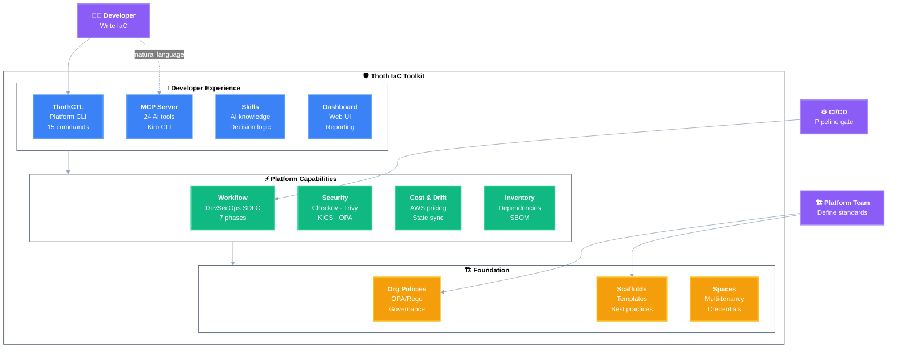

# Thoth IaC Toolkit

> The complete developer experience for Infrastructure as Code — from first commit to production monitoring.

## What Is It?

The Thoth IaC Toolkit is an integrated set of tools, policies, skills, and templates that enables DevSecOps for Infrastructure as Code. It combines a CLI platform, AI assistance, and organizational governance into a cohesive developer workflow.



## 3 Minutes to First Scan

```bash
# 1. Install (30 seconds)
pip install thothctl

# 2. Navigate to your IaC project
cd my-terraform-project

# 3. Run security scan (2 minutes)
thothctl workflow devsecops --phase secure
```

That's it. You get:
- Checkov scan (CIS benchmarks, AWS best practices)
- Trivy scan (CVEs in modules)
- OPA policy check (organization rules)
- Consolidated HTML report in `Reports/`

## Toolkit Components

### 1. ThothCTL — Platform CLI

The core tool. Install once, use everywhere.

```bash
pip install thothctl
```

| Category | Commands |
|----------|----------|
| **Workflow** | `workflow devsecops --phase all` |
| **Security** | `scan iac -t checkov -t trivy -t opa` |
| **Validation** | `check environment`, `check project iac`, `check iac -type blast-radius` |
| **Cost** | `check iac -type cost-analysis` |
| **Inventory** | `inventory iac --check-versions --check-provider-versions` |
| **Drift** | `check iac -type drift` |
| **Documentation** | `document iac` |
| **Dashboard** | `dashboard launch` |

📖 [Full Command Reference](framework/commands/)

---

### 2. Workflow Engine — One-Command Pipeline

Chains individual commands into cohesive SDLC phases:

```bash
# Full pipeline
thothctl workflow devsecops --phase all

# Pre-deployment gate (blocks on violations)
thothctl workflow devsecops --phase pre-deploy --enforcement hard

# Individual phases
thothctl workflow devsecops --phase plan       # 📋 Cost + blast radius
thothctl workflow devsecops --phase develop    # 💻 Environment + structure
thothctl workflow devsecops --phase build      # 🔨 Inventory + versions
thothctl workflow devsecops --phase test       # ✅ Plan validation
thothctl workflow devsecops --phase secure     # 🔒 Security scanning
thothctl workflow devsecops --phase deploy     # 🚀 Enforcement gate
thothctl workflow devsecops --phase monitor    # 📊 Drift detection
```

📖 [Workflow Documentation](framework/commands/workflow/workflow_devsecops.md)

---

### 3. Organization Policies — Centralized Governance

OPA/Rego policies distributed from a Git repository:

```bash
# Set org policy repo
export THOTH_ORG_POLICY=https://github.com/myorg/iac-policies.git@main

# Scans now enforce org rules automatically
thothctl scan iac -t opa
```

**What gets enforced:**
- Required tags (Environment, Owner, CostCenter)
- Naming conventions
- Approved regions
- Encryption requirements
- IAM least privilege

📖 [Policy as Code](framework/policy_as_code.md) | [org-iac-policies repo](https://github.com/thothforge/org-iac-policies)

---

### 4. Skills — AI Agent Knowledge

Teach AI agents how to drive DevSecOps workflows:

```
.kiro/skills/devsecops/
├── SKILL.md              # Decision logic + procedures
└── references/
    ├── sdlc_phases.md
    ├── command_reference.md
    ├── remediation_patterns.md
    ├── project_type_routing.md
    └── ci_cd_templates.md
```

**How it works:**
```bash
# Start Kiro CLI with ThothCTL agent
kiro-cli chat --agent thoth

# Natural language → AI executes the right workflow
> "Is my code ready for production?"
# AI runs: workflow devsecops --phase pre-deploy
# AI explains findings and provides specific fixes
```

📖 [DevSecOps Skill](https://github.com/thothforge/thothctl-devsecops-skill) | [AI-DLC Guide](framework/use_cases/ai_dlc.md)

---

### 5. Scaffolds — Start Right

Pre-configured project templates with governance built in:

```bash
# Create a new project from scaffold
thothctl init project --name my-infra --reuse --space my-space
```

**What you get out of the box:**
- `.kiro/skills/devsecops/` — AI skill pre-installed
- `.kiro/agents/thoth.json` — Agent configuration
- `.pre-commit-config.yaml` — Pre-commit hooks
- `.thothcf.toml` — Project configuration
- `docs/` — Documentation structure
- Layered architecture (foundation → platform → application)

**Official Scaffolds:**

| Scaffold | Use Case |
|----------|----------|
| [terraform-terragrunt-scaffold](https://github.com/thothforge/terraform_terragrunt_scaffold_project) | Multi-environment Terragrunt |
| [terraform-scaffold](https://github.com/thothforge/terraform_project_scaffold) | Standard Terraform |
| [terraform-module-scaffold](https://github.com/thothforge/terraform_module_scaffold) | Reusable modules |

---

### 6. MCP Server — AI Integration

24 tools exposed via Model Context Protocol for AI agents:

```json
{
  "mcpServers": {
    "thothctl": {
      "command": "thothctl",
      "args": ["mcp", "server", "--stdio"]
    }
  }
}
```

📖 [MCP Integration](framework/commands/mcp/)

---

### 7. Dashboard — Visual Reporting

Local web UI showing all analysis results:

```bash
# Run analysis first
thothctl workflow devsecops --phase all

# View results
thothctl dashboard launch
```

📖 [Dashboard Documentation](framework/commands/dashboard/dashboard_overview.md)

---

## Three Ways to Use

| Approach | Entry Point | Best For |
|----------|-------------|----------|
| **Manual** | Individual `thothctl` commands | Learning, debugging, custom flows |
| **Automated** | `thothctl workflow devsecops` | CI/CD pipelines, standardized gates |
| **AI-assisted** | `kiro-cli chat --agent thoth` | Exploration, remediation, context-aware help |

---

## CI/CD Quick Start

### GitHub Actions

```yaml
name: DevSecOps Gate
on: [pull_request]
jobs:
  validate:
    runs-on: ubuntu-latest
    steps:
      - uses: actions/checkout@v4
      - run: pip install thothctl
      - run: thothctl workflow devsecops --phase pre-deploy --enforcement hard
```

### Azure Pipelines

```yaml
steps:
  - script: pip install thothctl
  - script: thothctl workflow devsecops --phase pre-deploy --enforcement hard
    displayName: DevSecOps Gate
```

---

## Repository Map

| Repository | Purpose | Install |
|------------|---------|---------|
| [thothctl](https://github.com/thothforge/thothctl) | Platform CLI + Workflow + MCP + Dashboard | `pip install thothctl` |
| [org-iac-policies](https://github.com/thothforge/org-iac-policies) | Organization OPA/Rego policies | `export THOTH_ORG_POLICY=<url>` |
| [thothctl-devsecops-skill](https://github.com/thothforge/thothctl-devsecops-skill) | AI agent DevSecOps skill | Copy to `.kiro/skills/` |
| [terraform_terragrunt_scaffold](https://github.com/thothforge/terraform_terragrunt_scaffold_project) | Terragrunt project template | `thothctl init project --reuse` |
| [terraform_project_scaffold](https://github.com/thothforge/terraform_project_scaffold) | Terraform project template | `thothctl init project --reuse` |
| [terraform_module_scaffold](https://github.com/thothforge/terraform_module_scaffold) | Module template | `thothctl init project --reuse` |

---

## Learning Path

### Week 1 — Basics

```bash
pip install thothctl
thothctl check environment              # Verify tools
thothctl workflow devsecops --phase develop  # Validate project
thothctl workflow devsecops --phase secure   # First security scan
thothctl dashboard launch               # View results
```

### Week 2 — Integration

```bash
# Add org policies
export THOTH_ORG_POLICY=https://github.com/thothforge/org-iac-policies.git@main
thothctl workflow devsecops --phase secure  # Now enforces org rules

# Add to CI/CD
# → Copy pipeline template from ci_cd_templates reference
```

### Week 3 — AI-Assisted

```bash
# Configure Kiro CLI
# → Add .kiro/settings/mcp.json with thothctl server
# → Copy .kiro/skills/devsecops/ into project

kiro-cli chat --agent thoth
> "Run full audit and fix critical issues"
```

### Week 4 — Platform Engineering

```bash
# Create custom policies
# → Fork org-iac-policies, add team-specific rules

# Create custom scaffold
# → Fork scaffold, customize layers/modules/skills

# Distribute to team
# → Teams use: thothctl init project --reuse --space team-space
```

---

## Quick Reference Card

```mermaid
%%{init: {'theme':'base', 'themeVariables': {
  'primaryColor':'#3b82f6',
  'primaryTextColor':'#ffffff',
  'primaryBorderColor':'#2563eb',
  'lineColor':'#94a3b8',
  'secondaryColor':'#10b981',
  'tertiaryColor':'#8b5cf6',
  'background':'transparent',
  'mainBkg':'#3b82f6',
  'secondBkg':'#10b981',
  'tertiaryBkg':'#8b5cf6',
  'clusterBkg':'rgba(241, 245, 249, 0.05)',
  'clusterBorder':'#475569',
  'titleColor':'currentColor',
  'edgeLabelBackground':'transparent',
  'nodeTextColor':'#ffffff',
  'textColor':'currentColor',
  'nodeBorder':'#1e293b',
  'fontSize':'14px'
}}}%%
graph LR
    subgraph install["<b>Install</b>"]
        A["pip install thothctl"]
    end
    subgraph develop["<b>Develop</b>"]
        B["thothctl init project"]
        C["thothctl check environment"]
    end
    subgraph validate["<b>Validate</b>"]
        D["thothctl workflow devsecops<br/>--phase secure"]
        E["thothctl workflow devsecops<br/>--phase plan"]
    end
    subgraph deploy["<b>Deploy</b>"]
        F["thothctl workflow devsecops<br/>--phase pre-deploy<br/>--enforcement hard"]
    end
    subgraph monitor["<b>Monitor</b>"]
        G["thothctl dashboard launch"]
        H["thothctl workflow devsecops<br/>--phase monitor"]
    end

    install --> develop --> validate --> deploy --> monitor

    classDef installStyle fill:#8b5cf6,stroke:#a78bfa,stroke-width:2px,color:#fff
    classDef devStyle fill:#3b82f6,stroke:#60a5fa,stroke-width:2px,color:#fff
    classDef valStyle fill:#f59e0b,stroke:#fbbf24,stroke-width:2px,color:#fff
    classDef deployStyle fill:#10b981,stroke:#34d399,stroke-width:2px,color:#fff
    classDef monStyle fill:#ef4444,stroke:#f87171,stroke-width:2px,color:#fff

    class A installStyle
    class B,C devStyle
    class D,E valStyle
    class F deployStyle
    class G,H monStyle
```



---

## Next Steps

- [Quick Start Guide](quick_start.md) — Detailed installation and first steps
- [DevSecOps SDLC](framework/use_cases/devsecops_sdlc.md) — Complete phase-by-phase guide
- [Framework Architecture](framework/framework_architecture.md) — How the 4 layers work together
- [AI-Powered Development](framework/use_cases/ai_dlc.md) — Full AI integration guide
